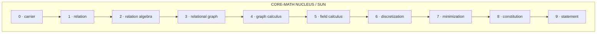
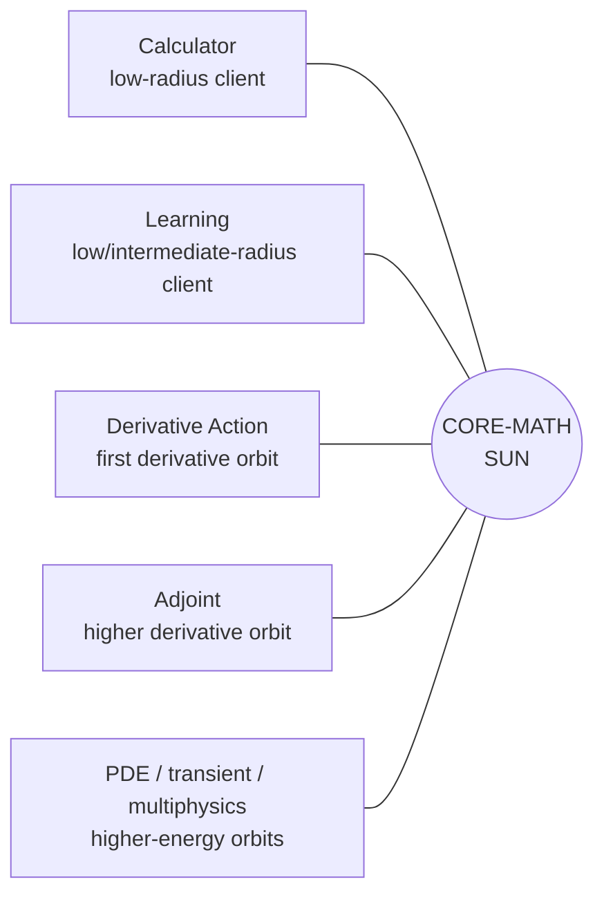
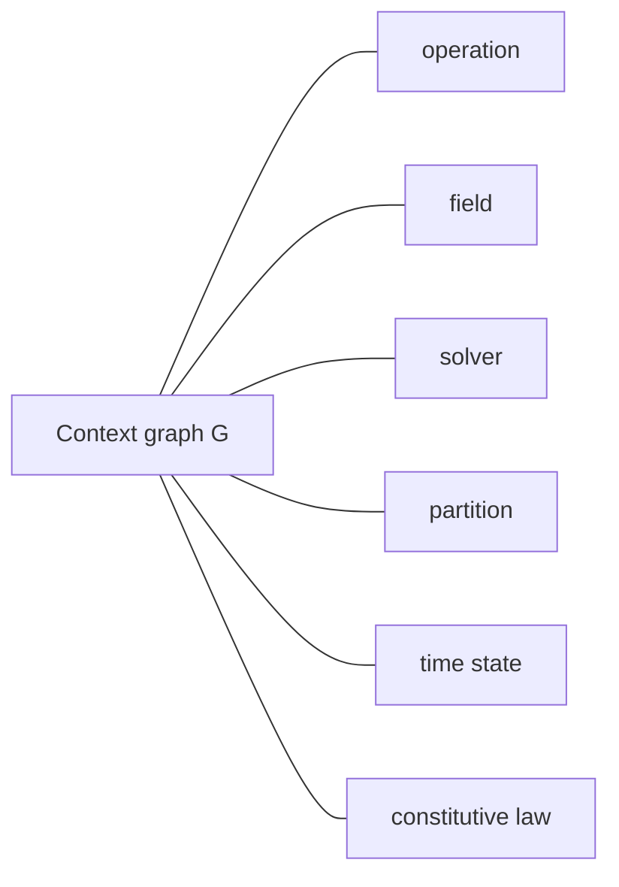
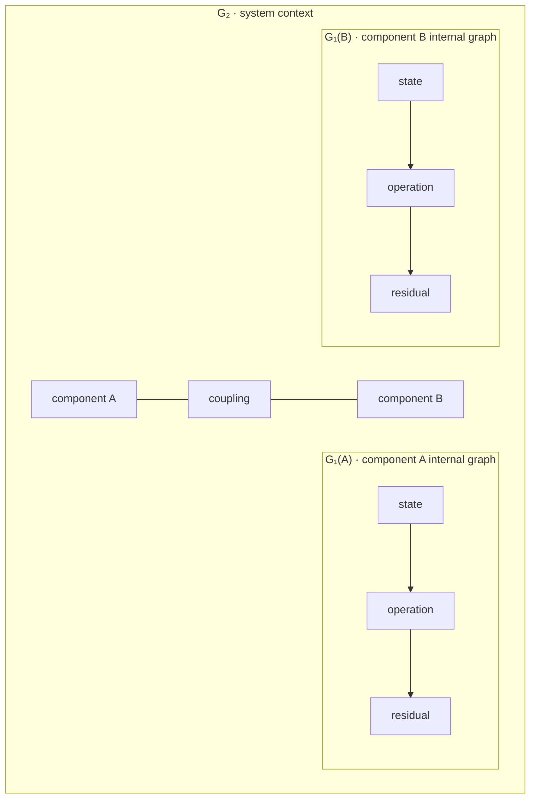
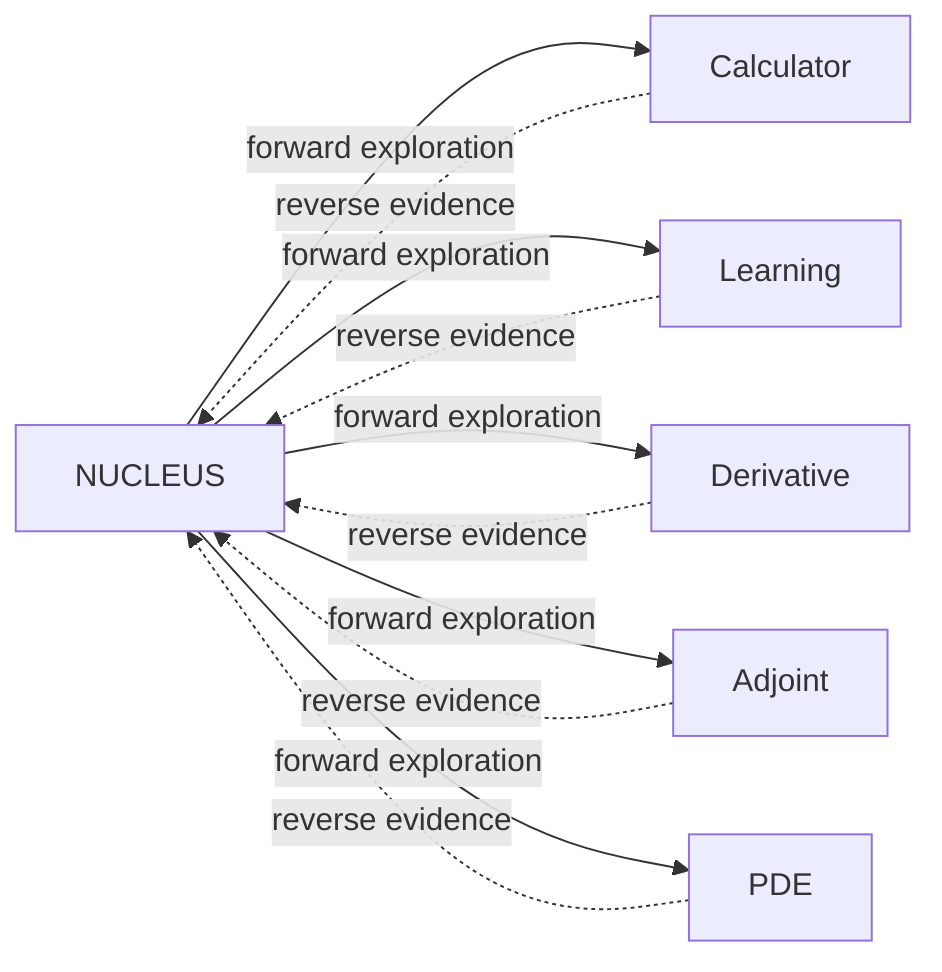
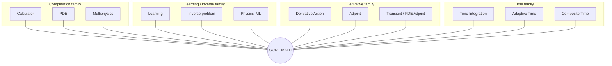
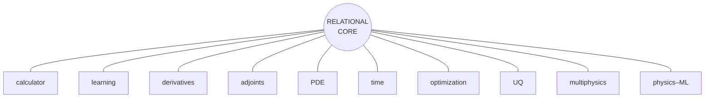

# FRACTAL-GRAPH-ARCHITECTURE

## Architectural Guidance for Radial, Hierarchical, and Self-Similar Graph Systems

> **Working principle**
>
> Local unnecessity does not imply global necessity.
> Local necessity and global necessity are independent axes.
> The framework must preserve all four possibilities until evidence collapses them.

---

## 1. Purpose

This document records a working architectural hypothesis for the graph framework:

\[
\boxed{\Gamma=(\mathcal S,\mathcal P)}
\]

is the most abstract structural object currently available to us, where:

- \(\mathcal S\) is a collection of member sets;
- \(\mathcal P\) is a collection of finite-arity typed relations among those sets.

(Where a view reads a graph as \((Q,R)\), \(R\) is that view of the residual. There is one graph ontology; the two-graph reservation is withdrawn. See AGENTS.md, "The graph ontology".)

The immediate goal is **not** to force every software object into one inheritance hierarchy.

The goal is to preserve the possibility that graph structure appears repeatedly, at many contextual radii, because graphs provide a uniquely flexible language for:

- internal organization;
- external participation;
- cross-scale coupling;
- contextual traversal;
- dependency;
- composition;
- duality;
- hierarchy without strict parenthood;
- overlapping ownership;
- lateral and radial interaction.

The architecture should therefore be developed as a **fractal graph network**: graph structure may recur at multiple scales, and an entity may simultaneously participate in a graph, expose itself as a graph, and contain another graph.

This is a hypothesis to be tested by increasingly sophisticated application towers.

It is not a doctrine that tests must be made to obey.

---

# 2. The nucleus and the orbital towers

The existing mathematical tower is the **nucleus** or **sun**.



Application towers orbit the nucleus.

They are not replacements for the nucleus. They are **radial probes** that ask whether progressively more sophisticated mathematics can inhabit the same core.



The metaphor is deliberate:

- the **tower level** measures vertical mathematical capability;
- the **orbital radius** measures contextual sophistication around the core;
- the **orbital energy** measures how much already-earned structure must be composed for that application to exist.

For example:

\[
E(\text{derivative action})
<
E(\text{adjoint})
<
E(\text{PDE adjoint})
<
E(\text{multiphysics adjoint}).
\]

A higher-energy orbit should not imply a different foundational ontology. It should stress the existing one more strongly.

---

# 3. Radius is contextual, not geometric

Let \(r\) denote architectural radius.

At radius \(r=0\), an object is examined almost in isolation.

Examples:

- a field on one member set;
- a scalar residual operation;
- a simple relation;
- a local derivative action.

At radius \(r=1\), the same object is considered in a surrounding computational context.

Examples:

- a field participates in an operation;
- an operation participates in a dependency graph;
- a relation participates in a relational graph;
- a derivative action participates in a chain.

At radius \(r=k\), the object may participate in a larger network containing:

- other graphs;
- solvers;
- time histories;
- partitions;
- coupled physics;
- optimization;
- uncertainty;
- learned components;
- nested discretizations.

Therefore:

\[
\boxed{
\text{what is unnecessary at radius }0
\text{ may become meaningful at radius }k
}
\]

but the converse is not guaranteed.

Radius is a **context variable**.

It must not be collapsed into a yes/no property of the object.

---

# 4. Local necessity and global necessity are independent axes

For a concept or dependency \(X\), define:

\[
L(X)=\text{\(X\) is necessary locally},
\]

\[
G(X)=\text{\(X\) is necessary globally}.
\]

Then four cases exist:

| | Globally necessary \(G\) | Globally unnecessary \(\neg G\) |
|---|---:|---:|
| **Locally necessary \(L\)** | \(L\land G\) | \(L\land\neg G\) |
| **Locally unnecessary \(\neg L\)** | \(\neg L\land G\) | \(\neg L\land\neg G\) |

This is structurally analogous to distinguishing relation signatures such as:

\[
R_{AA},\qquad
R_{AB},\qquad
R_{BA},\qquad
R_{BB}.
\]

The axes must remain independent until evidence shows otherwise.

## 4.1 The four architectural cases

### Case I — locally necessary, globally necessary

The object needs the concept for its own operation and for larger composition.

Example pattern:

```text
local computation
    needs G
        ↓
larger coupled computation
    also needs G
```

This is the strongest evidence for a first-class contract.

---

### Case II — locally necessary, globally unnecessary

The concept is required internally but disappears at the enclosing scale.

Example:

```text
component
├── internal graph needed
└── enclosing system sees only the component contract
```

This strongly suggests **composition**:

\[
\boxed{\text{HAS-A graph}}
\]

without necessarily exposing that graph globally.

---

### Case III — locally unnecessary, globally necessary

This is the case most likely to be accidentally destroyed by radius-0 simplification.

Example:

```text
scalar operation
    does not need surrounding graph to compute
                │
                ▼
coupled / partitioned / nested system
    needs graph context to locate,
    connect, traverse, assemble, or govern it
```

The graph may therefore be unnecessary as an **operand** but necessary as **context**.

This case is why:

\[
\boxed{
\text{local unnecessity}
\not\Rightarrow
\text{global unnecessity}
}
\]

and also why local unnecessity does not prove global necessity.

Both must be tested.

---

### Case IV — locally unnecessary, globally unnecessary

The dependency is genuinely accidental.

Repeated evidence from independent towers may justify removal.

This is the only case in which architectural deletion becomes strongly supported.

---

# 5. The graph-host question must remain open

Calculator and learning exposed an immediate observation:

> For some radius-0 operations, a mandatory graph host appears computationally irrelevant.

That observation is real.

But its correct interpretation is **not yet**:

```text
graph host is wrong
```

The correct interpretation is:

```text
at the tested radius,
the graph host was not required as a numerical operand
```

The next questions are different:

1. Is the graph a context?
2. Is it an owner?
3. Is it a coordinate system?
4. Is it a surrounding topology?
5. Is it an environment?
6. Does it provide cross-radius navigation?
7. Does it connect the operation to neighboring structures?
8. Does it become necessary under partitioning, time, coupling, differentiation, or multiphysics?

Therefore future review must distinguish:

\[
\boxed{
\text{graph as operand}
\neq
\text{graph as context}
\neq
\text{graph as ownership environment}
}
\]

A graph argument that contributes no arithmetic may still contribute architecture.

---

# 6. Graphs as contextual environments

At sufficiently large radius, the graph may stop looking like an ordinary function argument.

Instead it may become the **environment in which an object has meaning**.



This suggests an architectural possibility:

\[
\boxed{
\text{graph is not merely passed into the computation;
graph defines the computational context}
}
\]

Whether that eventually means an explicit argument, stored reference, inherited contract, contextual object, or view is an implementation question.

The towers must earn that decision.

---

# 7. Fractal graph networks

The central hypothesis is recursive.

A graph at one radius may itself participate as an object in another graph at a larger radius.

Conceptually:

\[
G_0
\rightsquigarrow
G_1
\rightsquigarrow
G_2
\rightsquigarrow
\cdots
\]

where each \(G_k\) may describe organization appropriate to its radius.

A useful schematic is:



The important feature is not visual nesting.

It is that navigation may occur:

- **within** \(G_k\);
- **across** peers at radius \(k\);
- **inward** toward \(G_{k-1}\);
- **outward** toward \(G_{k+1}\).

This gives four broad traversal directions:

```text
same radius:
    lateral traversal

toward smaller radius:
    inward / refinement traversal

toward larger radius:
    outward / contextual traversal

across interpretations:
    view / dual / profile traversal
```

A tree is excellent for unique parent-child ownership.

A graph is more flexible when:

- one object belongs to multiple contexts;
- relationships overlap;
- components have multiple parents;
- coupling is lateral;
- cycles exist;
- dual interpretations exist;
- hierarchy is not strictly nested;
- context itself is relational.

That flexibility is the motivation for keeping graph structure available rather than replacing it prematurely with narrower concepts.

---

# 8. A graph may be both interior and exterior structure

For an entity \(X\), there are at least two different graph relationships.

## 8.1 Exterior graph

\(X\) participates in a graph describing how it relates to other entities:

\[
X\in \text{context}(G_{\text{outer}})
\]

in an architectural sense.

This describes **participation**.

---

## 8.2 Interior graph

\(X\) contains or governs an internal graph:

\[
X \supset G_{\text{inner}}.
\]

This describes **organization**.

---

## 8.3 Both simultaneously

An entity may therefore be:

```text
X
├── participates in G_outer
└── contains G_inner
```

or, more suggestively:

\[
G_{k-1}
\longrightarrow
X_k
\longrightarrow
G_{k+1}.
\]

The same object can be externally atomic and internally structured.

That is the essence of the fractal interpretation.

---

# 9. `IS-A graph` and `HAS-A graph`

Two implementation mechanisms should remain alive.

## 9.1 `IS-A graph`

Inheritance or conformance:

```text
X IS-A graph
```

Meaning:

> \(X\) itself exposes graph structure as part of its public mathematical identity.

This may be appropriate when the graph structure is intrinsic to what \(X\) is.

Possible future examples:

- mesh;
- time graph;
- dependency graph;
- multigrid hierarchy;
- coupled system;
- computational statement.

---

## 9.2 `HAS-A graph`

Composition:

```text
X HAS-A graph
```

Meaning:

> \(X\) contains graph structure used to organize itself, but need not expose the whole graph contract as its identity.

Possible examples:

- solver with an internal dependency graph;
- operation with an internal execution graph;
- material model with state-transition structure;
- model containing a graph of submodels.

---

## 9.3 Both

Nature and complex software often sustain behavior through multiple mechanisms.

Therefore do not assume:

\[
\text{inheritance} \oplus \text{composition}
\]

as an exclusive choice.

Allow the possibility:

\[
\boxed{
\text{IS-A graph}
\;\land\;
\text{HAS-A graph}
}
\]

where the two graphs represent different radii or different structural roles.

---

## 9.4 Neither

Some objects may ultimately require neither.

The architecture must preserve that possibility too.

Thus there is another four-case matrix:

| Entity \(X\) | HAS-A graph | Does not HAVE-A graph |
|---|---:|---:|
| **IS-A graph** | recursive/fractal graph entity | externally graph-like only |
| **not IS-A graph** | internally graph-organized | graph-independent object |

The framework should discover these classifications empirically.

It should not decide them all in advance.

---

# 10. Mathematical graphhood is weaker than software inheritance

This distinction is critical.

The statement:

\[
\boxed{
\text{every object may admit a graph representation}
}
\]

is weaker than:

```fortran
type, extends(graph) :: everything
```

The first is mathematical.

The second is a specific software mechanism.

Possible realizations of graphhood include:

- inheritance;
- composition;
- view;
- adapter;
- reference;
- generated relation;
- graph profile;
- contextual embedding.

Therefore:

> Preserve universal graph **interpretability** longer than universal graph **inheritance**.

If several high-radius towers independently show that inheritance is the right mechanism, promote it then.

Until then, do not confuse ontology with implementation.

---

# 11. The relational graph remains the neutral nucleus

The generic graph is:

\[
\boxed{
\Gamma=(\mathcal S,\mathcal P)
}
\]

not:

\[
(V,E).
\]

This matters strongly for fractal architecture.

At one radius, member sets may represent:

```text
values
operations
ports
```

At another:

```text
cells
faces
materials
boundary regions
```

At another:

```text
physics
solvers
time windows
subsystems
```

At another:

```text
models
experiments
objectives
uncertainties
```

Finite-arity relations can connect these heterogeneous sets without forcing them into one vertex/edge vocabulary.

Thus contextual hierarchy itself can be represented relationally.

---

# 12. Relation signatures are contextual coordinates

The solar-level-0 distinction among relations such as

\[
R_{AA},\quad
R_{AB},\quad
R_{BA},\quad
R_{BB}
\]

provides a useful general lesson:

> Never collapse independent structural axes merely because one example makes them look correlated.

This applies to:

- local/global necessity;
- inner/outer graph;
- IS-A/HAS-A;
- primal/dual;
- state/computed;
- known/unknown;
- source/target;
- radius \(k\)/radius \(k+1\).

A relation signature records **where a fact lives**.

Likewise, architectural metadata should preserve **which contextual axis gave rise to a dependency**.

---

# 13. Radial interfaces

Eventually, objects at one radius need contracts for communicating with the nucleus and with adjacent radii.

Let:

\[
C_k
\]

denote a contextual contract at radius \(k\).

Then:

\[
G_k
\xleftrightarrow{C_k}
\text{core mathematics}.
\]

We should expect several kinds of radial contract.

## 13.1 Inward contract

What lower-radius structure does this object expose?

```text
component
    ↓ inward
member sets + relations
```

---

## 13.2 Outward contract

How does this object participate in a larger context?

```text
component
    ↑ outward
system relation / coupling / ownership
```

---

## 13.3 Lateral contract

How does it interact with peers?

```text
component A ← relation → component B
```

---

## 13.4 View contract

How may the same structure be interpreted differently?

Examples:

- ordinary directed graph view;
- dual view;
- dependency view;
- incidence view;
- primal/reverse view.

These should preferably reinterpret structure rather than duplicate it.

---

# 14. Forward architectural mode

The current development process is **forward mode**.

We move outward from the nucleus:

\[
N
\rightarrow
T_1
\rightarrow
T_2
\rightarrow
T_3
\rightarrow\cdots
\]

where each orbital tower asks:

> Can this application be expressed using the existing nucleus?

Calculator and learning are early examples.

Derivative Action and Adjoint will probe a new orbital family.

The rules of forward mode are:

1. choose the smallest meaningful application;
2. walk through every nucleus level;
3. add exactly one new truth per level;
4. prefer reuse of existing production abstractions;
5. avoid speculative production abstractions;
6. record every architectural friction;
7. do not immediately fix every friction;
8. preserve lower towers as acceptance oracles.

---

# 15. Reverse architectural mode

Eventually the project must reverse direction.

We then move:

\[
T_n,T_{n-1},\ldots,T_1
\rightarrow
N.
\]

The goal becomes:

> What repeated evidence from the orbital towers should refine the nucleus?

This is architectural reverse propagation.



In reverse mode we may:

- remove accidental dependencies;
- generalize contracts;
- split conflated concepts;
- merge duplicated mechanisms;
- promote repeated local fixtures into production abstractions;
- refine ownership;
- refine graph context;
- simplify inheritance;
- expose views;
- tighten performance.

The towers must remain green throughout.

---

# 16. Evidence, not aesthetics, changes the nucleus

A core change should be driven by repeated orbital evidence.

Use this rough scale:

```text
one tower:
    observation

two unrelated towers:
    recurring seam

three or more independent towers:
    strong architectural evidence

high-radius tower exposes failure:
    high-value evidence

multiple high-radius towers expose same failure:
    nuclear refactor candidate
```

A radius-0 annoyance should not automatically outrank a radius-4 necessity.

Likewise, a high-radius use should not automatically justify burdening every radius-0 caller.

The correct contract may instead be a view, adapter, optional context, composition boundary, or split interface.

---

# 17. Nucleus observation ledger

Every future tower review gate should maintain a sharp architectural ledger.

Recommended format:

```text
NUCLEUS OBSERVATION N
├── tower
├── orbital family
├── tower level
├── contextual radius
├── symptom
├── exact caller
├── mathematical concept underneath
├── local necessity
│   ├── yes/no/unknown
│   └── evidence
├── global necessity
│   ├── yes/no/unknown
│   └── evidence
├── graph role
│   ├── operand?
│   ├── context?
│   ├── owner?
│   ├── environment?
│   ├── internal organization?
│   └── outward participation?
├── current workaround / compatibility debt
├── suspected nucleus contract
├── confirmed by other towers?
├── performance consequence
├── confidence
└── action
    ├── observe
    ├── test at larger radius
    ├── create dedicated tower
    ├── reverse-mode refactor candidate
    └── reject
```

The important discipline is:

\[
\boxed{
\text{observation}
\neq
\text{immediate refactor}
}
\]

---

# 18. Quiver-style observations

Observations should be short, directional, and composable.

Think of them as architectural arrows.

Examples:

```text
radius-0 scalar operation
    ──does not numerically consume──▶ graph host
```

```text
learning statement
    ──needs graph-owned dependency──▶ execution order
```

```text
Level-6 dependency
    ──transpose view──▶ reverse structure
```

```text
computed field role
    ──does not require──▶ fabricated storage
```

```text
future distributed operation
    ──may require──▶ graph context
```

As more arrows accumulate, the core architecture becomes a graph of evidence.

That is appropriate: the framework should use its own mathematical worldview to understand its evolution.

---

# 19. Fractal graph traversal

A mature fractal graph system should eventually be able to traverse multiple contextual directions.

Let an object \(x_k\) live at radius \(k\).

Potential traversals include:

\[
\operatorname{inside}(x_k)
\rightarrow G_{k-1},
\]

\[
\operatorname{context}(x_k)
\rightarrow G_k,
\]

\[
\operatorname{parent}(G_k)
\rightarrow G_{k+1},
\]

\[
\operatorname{peers}(x_k)
\rightarrow \{y_k\},
\]

\[
\operatorname{view}(G_k,\pi)
\rightarrow G_k^{(\pi)}.
\]

Do not add these APIs now.

They are conceptual coordinates.

Future towers should determine which of these are real generators and which are merely compositions.

---

# 20. Fractality does not imply infinite object nesting

The architecture should not literally create:

```text
graph contains graph contains graph contains graph ...
```

everywhere.

Fractality means **self-similar structural principles recur across scales**.

Implementation may compress this using:

- references;
- views;
- identities;
- parent contexts;
- relation-valued members;
- graph profiles;
- external registries;
- lazy construction.

The mathematical model may be recursive even when runtime storage is not.

This distinction is essential for HPC.

---

# 21. General semantics, specialized storage

Fractal graph semantics must not imply one universal expensive runtime representation.

Keep:

\[
\boxed{\text{general semantics}}
+
\boxed{\text{specialized implementations}}.
\]

For example:

```text
semantic object:
    relation

possible storage:
    CSR
    dense
    implicit
    generated
    view
    distributed
    cached adjacency
```

Likewise:

```text
semantic object:
    graph

possible representation:
    owned relational graph
    ordinary graph view
    incidence storage
    dual view
    hierarchical graph
    distributed graph
```

The fractal architecture is primarily an ontology and contract discipline.

Performance-critical storage remains specialized.

---

# 22. Graphs are structural

Preserve the existing core law:

> Graphs carry structure.

A graph should not become a dumping ground for:

- field values;
- physical coefficients;
- solver state;
- objective values;
- derivative numbers;
- arbitrary mutable application state.

Fractal graph architecture does **not** mean:

```text
everything goes inside graph
```

It means:

```text
structural relationships may recur graphically at many radii
```

Values remain fields on domains.

Algorithms remain external unless a future contract earns another arrangement.

Physical meaning remains constitution.

---

# 23. Immutability becomes more important with radius

As graphs become contextual anchors, mutable topology becomes increasingly dangerous.

If \(G_k\) is used simultaneously by:

- execution;
- derivatives;
- partitioning;
- solver attachment;
- adjoints;
- optimization;
- outer graph contexts,

then silent structural mutation can invalidate several radii at once.

Prefer:

\[
\boxed{\text{immutable graph structure}}
\]

plus new graphs/transforms/views when topology changes.

A graph transformation should create a new structural truth rather than invisibly rewrite the old one.

---

# 24. Primal and dual fit naturally into fractal structure

The incidence work already points toward:

\[
G=(A,B,I),
\qquad
G^\ast=(B,A,I^T).
\]

More generally, primal and reverse views should reuse the same underlying structure whenever possible.

For derivative architecture:

```text
forward dependency
       │
       │ transpose / reverse interpretation
       ▼
reverse dependency
```

The derivative-action tower should therefore test the lowest-energy numerical realization of:

\[
Jv
\qquad\text{and}\qquad
J^T\bar y
\]

while preserving the structural duality already exposed by relation transpose.

The adjoint tower should then occupy the next derivative orbit.

---

# 25. Orbital families

Not every tower belongs on one linear radius.

There may be several orbital families around the same sun.



A sophisticated application may couple multiple orbital families.

For example:

\[
\text{inverse PDE}
=
\text{PDE orbit}
+
\text{learning orbit}
+
\text{adjoint orbit}.
\]

That is exactly where fractal graph context may become especially valuable.

---

# 26. Interfaces between planet and sun

Eventually each orbital tower should connect to the nucleus through explicit contracts rather than accidental imports.

A provisional map is:

| Nucleus level | Radial question |
|---|---|
| Carrier | What domains exist at this radius? |
| Relation | What facts connect them? |
| Relation algebra | What new structure is derived? |
| Relational graph | What structure belongs together? |
| Graph calculus | What interpretation/traversal is selected? |
| Field calculus | What values inhabit which domains? |
| Discretization | What equation/dependency layout emerges? |
| Minimization | What is allowed to vary to satisfy what? |
| Constitution | What numerical/physical laws give symbols meaning? |
| Statement | What complete problem is being asked? |

These are not application-specific APIs.

They are **questions each orbit must answer**.

A mature framework may eventually expose small explicit contracts corresponding to them.

---

# 27. What not to do

## 27.1 Do not remove graphs because radius-0 tests do not consume them

That destroys Case III prematurely:

\[
\neg L \land G.
\]

---

## 27.2 Do not preserve graphs merely because the philosophy likes graphs

That protects accidental Case IV dependencies:

\[
\neg L \land \neg G.
\]

---

## 27.3 Do not force inheritance before evidence

Universal graph interpretability does not yet prove universal graph inheritance.

---

## 27.4 Do not replace graph context with a tree hierarchy by default

Trees lose:

- overlapping contexts;
- multiple parents;
- cycles;
- lateral interaction;
- duality;
- relation-rich cross-scale structure.

Use a tree only when the mathematical structure is actually a tree.

---

## 27.5 Do not encode radius into a giant type hierarchy

Radius is context.

It should not automatically produce:

```text
radius0_graph
radius1_graph
radius2_graph
...
```

---

## 27.6 Do not make graph a universal mutable bag

Graph means structure.

Keep values, laws, algorithms, and state separated.

---

# 28. Decision procedure for a suspicious graph dependency

When an application says:

> “Why do I need this graph?”

do not immediately remove it.

Ask:

```text
1. Is the graph used numerically at this radius?
2. Is the graph used structurally at this radius?
3. Does it identify the object's domain/context?
4. Does it connect the object to peers?
5. Does it connect the object to an outer graph?
6. Does it contain an inner graph?
7. Is it needed for traversal?
8. Is it needed for ownership?
9. Is it needed for partition/distribution?
10. Is it needed for differentiation/reverse traversal?
11. Is it needed by a higher-radius tower?
12. Can the same purpose be expressed more cleanly as a view,
    reference, composition, or smaller context contract?
13. Have independent towers observed the same issue?
```

Then classify:

```text
KEEP
    graph is genuinely required

SPLIT
    graph currently carries several roles that should be separated

VIEW
    object needs an interpretation, not ownership

COMPOSE
    object needs an internal graph but is not itself graph-like

INHERIT
    graph structure is intrinsic to the object's public identity

DEFER
    radius is too small to decide

REMOVE
    repeated evidence says the dependency is accidental
```

---

# 29. Acceptance discipline for fractal architecture

Fractal ideas are broad enough to become unfalsifiable unless constrained by tests.

Therefore every claimed graph role must eventually be supported by a tower.

Examples:

```text
claim:
    graph context is required for distributed operations

required evidence:
    distributed tower exposes a concrete need
```

```text
claim:
    an adjoint is naturally a reverse graph traversal

required evidence:
    adjoint tower derives numerical reverse action from
    the same structural dependency
```

```text
claim:
    a solver IS-A graph

required evidence:
    a tower requires graph behavior intrinsic to solver identity,
    not merely an internal dependency graph
```

The rule is:

\[
\boxed{
\text{architectural intuition proposes;
towers dispose}
}
\]

---

# 30. Current evidence

The sealed calculator tower established that the architecture can move through:

```text
carrier
→ relation
→ relation algebra
→ relational graph
→ graph calculus
→ field calculus
→ discretization
→ minimization
→ constitution
→ statement
```

without reducing the graph ontology to ordinary vertices and edges.

The sealed learning tower then reused the same substrate for a materially different vertical client.

This is evidence that the nucleus is not calculator-specific.

It is not yet evidence for every fractal claim in this document.

The current fractal claims should therefore be labeled:

```text
ESTABLISHED
    heterogeneous relational graph Gamma=(S,P)
    graph views/interpretations
    derived dependency
    structural transpose/reverse views
    tower stratification
    multiple vertical clients

STRONG WORKING HYPOTHESIS
    graph context becomes more valuable at larger radius
    IS-A + HAS-A may coexist
    graph structures recur across scales
    orbital towers should feed reverse evidence into nucleus

OPEN
    universal graph inheritance
    exact radial interface
    graph-as-environment representation
    nested graph storage model
    common constitution abstraction
    hierarchy traversal API
```

---

# 31. Immediate guidance for the derivative tower

The next tower is **Derivative Action**, the lowest-energy derivative orbit.

Its purpose should not merely be to calculate a derivative.

It should test whether:

1. structural dependency determines where derivative action may exist;
2. numerical constitution provides local derivative actions only when earned;
3. forward action \(Jv\) follows primal dependency;
4. reverse action \(J^T\bar y\) follows the transpose/reverse structure;
5. the duality identity holds:

\[
\boxed{
\langle \bar y,Jv\rangle
=
\langle J^T\bar y,v\rangle
}
\]

6. derivative values are not confused with dependency structure;
7. graph context is observed carefully at every radius;
8. no adjoint solve is introduced yet.

At every derivative-tower level, append a **NUCLEUS OBSERVATIONS** section.

Especially watch:

```text
graph_operation host
relation transpose
field domains
local derivative law
forward/reverse traversal
ownership of primal structure
whether reverse needs a new graph or only a view
where context first becomes genuinely necessary
```

Do not resolve these questions prematurely.

The derivative tower should collect evidence.

---

# 32. Long-term architectural picture

The framework is not intended to become:

```text
a calculator library
+
an ML library
+
an adjoint library
+
a PDE library
+
a time library
```

with parallel infrastructures.

The intended direction is closer to:



and eventually:

```text
orbit talks to orbit
orbit contains lower-radius graphs
orbit participates in higher-radius graphs
all remain anchored to the same relational nucleus
```

That is the fractal graph architecture.

---

# 33. Development maxim

The project can be summarized by the forward/reverse joke as an architectural method:

> **Forward mode:** make simple applications complicated enough to expose the real mathematics.
>
> **Reverse mode:** use the accumulated evidence to make the complicated core simple.

Or symbolically:

\[
\boxed{
\text{simple examples}
\xrightarrow{\text{forward towers}}
\text{architectural evidence}
\xrightarrow{\text{reverse refinement}}
\text{simple nucleus}
}
\]

The first arrow explores.

The second compresses.

Both are necessary.

---

# 34. Final architectural law

The central discipline of this document is:

\[
\boxed{
\text{Do not confuse what an object needs locally
with what the architecture needs globally.}
}
\]

Preserve independent axes.

Preserve graph context until evidence resolves its role.

Use graphs where they buy structural freedom.

Reject them where repeated evidence says they buy nothing.

Let increasingly sophisticated orbital towers determine which mechanisms are fundamental.

And when enough towers have spoken, reverse direction and refine the sun.
