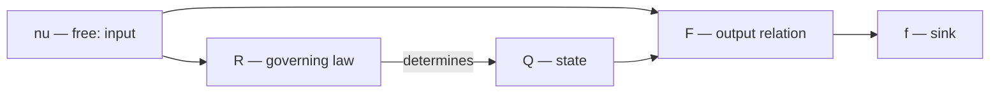
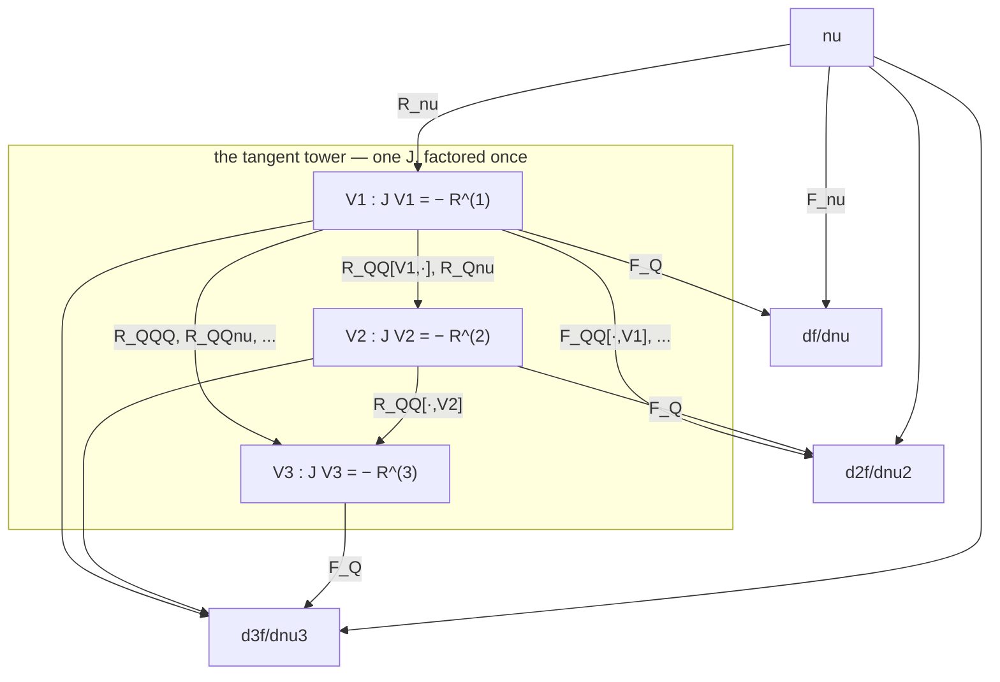
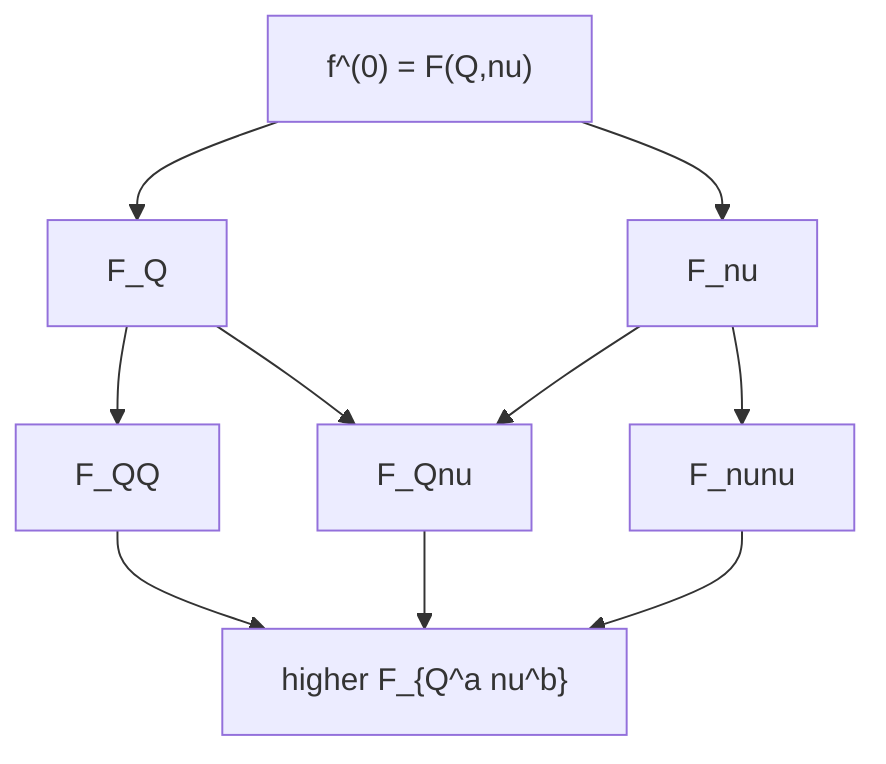
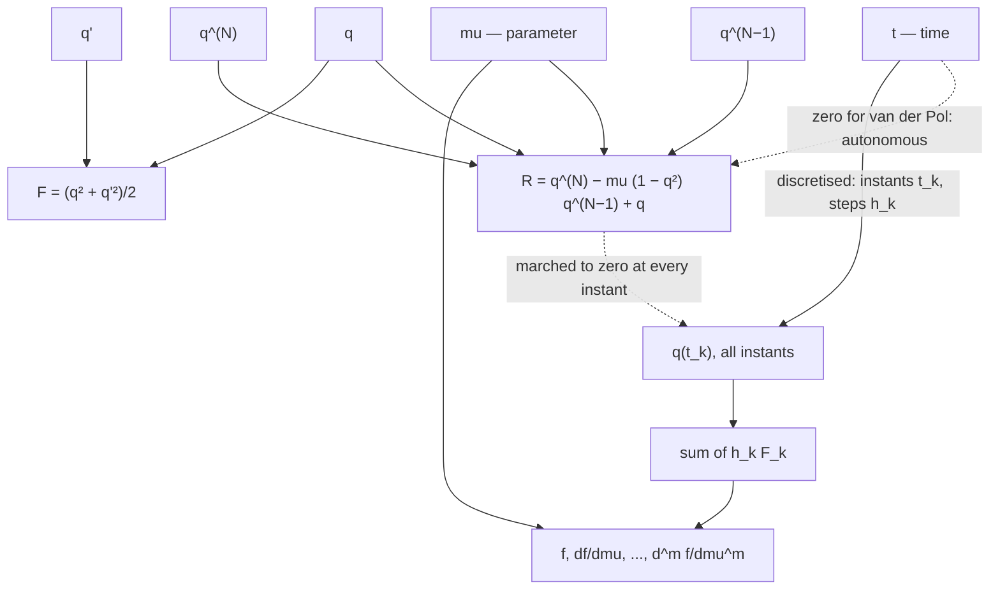

$R$ is the imbalance in physical constraints governing a system.

The linear system

$\left[ \frac{d R}{d Q} \right] \Delta Q = -R(Q)$

is solved repeatedly until $R(Q) = 0$.

Here $Q := Q(\nu)$, and $R:= R(Q(\nu); \nu)$ and $F:= F(Q(\nu); \nu)$, where these are $C^n$ with respect to $\nu$.

The augmented Lagrangian is $\mathcal{L} = F(Q) + \lambda(Q) \cdot R(Q)$ is a functional in $\mathcal{Q}$ domain. 

Differentiating it with respect to $\nu$ yields the relation

$\frac{d \mathcal{L}}{d \nu} = \frac{d F}{d \nu} + \lambda \cdot \frac{d R}{d \nu} + \frac{d \lambda}{d \nu} \cdot R$

Differentiating one more time with respect to $\nu$ yields the relation

$$\frac{d^2 \mathcal{L}}{d\nu^2} = \frac{d^2 F}{d \nu^2} + \lambda \cdot \frac{d^2 R}{d \nu^2} + 2\frac{d \lambda}{d \nu} \cdot \frac{d R}{d \nu} + \frac{d^2 \lambda}{d \nu^2} \cdot R$$

Differentiating one more time with respect to $\nu$ yields the relation

$$\frac{d^3 \mathcal{L}}{d\nu^3} = \frac{d^3 F}{d \nu^3} + \lambda \cdot \frac{d^3 R}{d \nu^3} + 3\frac{d \lambda}{d \nu} \cdot \frac{d^2 R}{d \nu^2} + 3\frac{d^2 \lambda}{d \nu^2} \cdot \frac{d R}{d \nu} + \frac{d^3 \lambda}{d \nu^3} \cdot R$$

Differentiating one more time with respect to $\nu$ yields the relation

$$\frac{d^4 \mathcal{L}}{d\nu^4} = \frac{d^4 F}{d \nu^4} + \lambda \cdot \frac{d^4 R}{d \nu^4} + 4\frac{d \lambda}{d \nu} \cdot \frac{d^3 R}{d \nu^3} + 6\frac{d^2 \lambda}{d \nu^2} \cdot \frac{d^2 R}{d \nu^2} + 4\frac{d^3 \lambda}{d \nu^3} \cdot \frac{d R}{d \nu} + \frac{d^4 \lambda}{d \nu^4} \cdot R$$

The recurrence is written in compact form as 

$$\frac{d^n \mathcal{L}}{d\nu^n} = \frac{d^n F}{d \nu^n} + \sum_{k=0}^{n} \binom{n}{k} \frac{d^k \lambda}{d \nu^k} \cdot \frac{d^{n-k} R}{d \nu^{n-k}}$$

where the the term $\frac{d^n(\lambda \cdot R)}{d\nu^n}$ admits binomial expansion as $\sum_{k=0}^{n} \binom{n}{k} \frac{d^k \lambda}{d \nu^k} \cdot \frac{d^{n-k} R}{d \nu^{n-k}}.$ There are $n+1$ coefficients, and for each coefficient the term's sum total of the degrees would equal $n$.

### Adjoint and Tangent Sensitivities

Along the march $R(Q(\nu);\nu) = 0$ holds identically.
Every total derivative $\frac{d^m R}{d\nu^m}$ is then zero.
The recurrence collapses to $\frac{d^n \mathcal{L}}{d\nu^n} = \frac{d^n F}{d\nu^n}$ for any $\lambda(\nu)$.
The binomial terms contain information only when one derivative is taken explicitly, with every derivative of the state held fixed.
Write $\partial_\nu$ for that derivative.
Write $F^{(m)}$ and $R^{(m)}$ for the total derivatives of order $m$ along the solved path, functions of $Q, Q^{(1)}, \ldots, Q^{(m)}$ and $\nu$.
Write $\lambda^{(k)}$ for the costate of order $k$, the solution of the transposed block whose right-hand side is built from the costates below it.
Then

$$\frac{d^n F}{d\nu^n} = \partial_\nu\left[ F^{(n-1)} - \sum_{k=0}^{n-1}\binom{n-1}{k}\, \lambda^{(k)} \cdot R^{(n-1-k)} \right].$$

The term $\lambda^{(0)} \cdot \partial_\nu R^{(n-1)}$ is the tangent term.
It pairs the first costate with the explicit derivative of the highest residual derivative available, and it replaces the solve of $Q^{(n)}$.
The terms $\lambda^{(k)} \cdot \partial_\nu R^{(n-1-k)}$ for $k \geq 1$ are the adjoint terms.
Each pairs a higher costate with a lower residual derivative, weighed by $\binom{n-1}{k}$.
The term $\partial_\nu F^{(n-1)}$ is the functional's own explicit dependence.

The reverse pass of `gti_chain` (`lagrangian_term`) forms $L = F - \langle \lambda, R \rangle$ as `inner_product(costate, residual, active=.not. fixed_rows)` (`src/util_derivative_terms.f90`), the same reduction `dot_product` performs on real arrays, taken here over `derivative_terms`.
$\lambda_{\text{row}}$ and $R_{\text{row}}$ are `derivative_terms` over $n$ directions: $n-1$ store the state's derivatives, one stores $\nu$ alone, and $\lambda$ is constant along that one.
The product rule on subsets (`terms_times` in `src/util_derivative_terms.f90`) is the binomial expansion: a subset of size $k$ of the $n-1$ implicit directions represents $\binom{n-1}{k}$ once.
`leibniz_parts` reads the product by the order of the costate's factor.
The coefficient of a smaller subset containing the explicit direction is the entry of a lower order.
One reverse pass at order $N$ therefore reads every order $1..N$ from the same products (`chain_derivative`, `by_order` on the reverse pass).

What is not single: the costates $\lambda^{(k)}$ come from $N$ transposed solves and the state derivatives $Q^{(k)}$ from $N-1$ forward solves.
The one product is the assembly, not the solves.

Measured by `--demo=lagrangian_expansion` (BDF 3 over a Crouzeix start, van der Pol, $\nu = 0.8$, 21 instants, relative tolerance $10^{-12}$):
every order $0..4$ from one reverse pass agrees with the forward pass to at most $4.3 \times 10^{-15}$ relative;
the terms summed agree with the table to at most $7.1 \times 10^{-15}$ against floors of $10^{-13}$ to $3 \times 10^{-11}$;
for the energy at order 4 the terms read $\lambda^{(0)} \cdot \partial_\nu R^{(3)} = 5.641$, $3\lambda^{(1)} \cdot \partial_\nu R^{(2)} = -0.242$, $3\lambda^{(2)} \cdot \partial_\nu R^{(1)} = -0.643$, $\lambda^{(3)} \cdot \partial_\nu R^{(0)} = 13.629$, $\partial_\nu F^{(3)} = 0$, and the sum $18.384$ is $\frac{d^4 F}{d\nu^4}$ by the forward pass.

### The Taylor State March

The forward pass solves, at each block, the tower of the state's derivatives in the design,

$$R_{n,0}(Q_{n,0}) = 0, \qquad A_n\,Q_{n,\alpha} = -B_{n,\alpha}, \quad 1 \le |\alpha| \le p,$$

with $A_n$ the block's own Jacobian, factorised once, and $B_{n,\alpha}$ the $\alpha$ coefficient of the residual over `derivative_terms` with $Q_{n,\alpha}$ withheld.
The multisets of designs of size $k \le p$ are the multi-indices $|\alpha| \le p$, $\binom{r+p}{p}$ in all.
A block's tower is read by the blocks whose given instants lie in it and by no later block.
`chain_derivative` therefore runs block outer and order inner, accumulates each block's contribution to every table during the traversal, and releases a tower once its last reader has been solved (`tangent_tower`, `last_reader`, `tower_storage`).
The live storage is the reach in blocks, independent of the horizon.
The reverse pass reads every tower during the reverse traversal and retains them all.
The former route names are now pass names.

Measured by `--demo=taylor_state` (BDF 3 over a Crouzeix start, van der Pol, 40 instants, order 4, one design), the same horizon marched in 1, 2, 4 and 8 blocks:
tower numbers allocated at once are at most $876, 636, 516, 456$ against $876, 912, 984, 1128$ in all, each equal to the largest pair of consecutive towers;
the tables depart from the one-block tables by at most $10^{-15}$ relative;
the reverse pass over the eight-block chain retains $846$ of $846$.
The primal states of every block are still stored by the chain; streaming those is the fusion of this loop into the march the driver evaluates, with `released_after` releasing states and towers alike.
The pipelined march removes that: `march_chain` given `functionals` and a `derivative_order` solves each block's tower as soon as the block is solved (`taylor_context`, `taylor_block`, called at the end of the block rule), accumulates the tables block by block, and releases states and towers past their last reader inside the march itself.
A block may add a single instant where its family reaches back one instant or none - a first-order-history or multistage family - so a horizon pipelines step by step at the family's own order; the first block still carries the initial instant and one step, and a deeper family still adds more instants than it reaches back over (`horizon_bounds`).
One design, the physics' parameter; a designed grid is refused.

Measured by `--demo=taylor_state` (Crouzeix three-stage DIRK, order 3, one instant per block, derivatives to order 4): over horizons of 20, 40 and 80 instants the live storage is 120 tower numbers and 30 state numbers at every horizon, exactly, while the totals grow 1140, 2340, 4740 and 285, 585, 1185; the tables agree with the whole-horizon march to at most $1.7 \times 10^{-15}$ relative.
Memory is flat in the horizon; the cost is in the design dimension, $\binom{r+p}{p}$ coefficients per retained step.

Generic Chain Rule Structure (Faà di Bruno's Formula):

For $u = u(Q(\nu))$ depending on $\nu$ only through $Q$:

$$\frac{d^n u}{d\nu^n} = \sum_{m=1}^{n} \frac{\partial^m u}{\partial Q^m} \cdot B_{n,m}\left(\frac{dQ}{d\nu}, \frac{d^2Q}{d\nu^2}, \ldots, \frac{d^{n-m+1}Q}{d\nu^{n-m+1}}\right)$$

where $B_{n,m}$ are partial Bell polynomials (encode all multivariate partitions of $n$ into $m$ parts).

---

Specialization to $\lambda(Q(\nu))$:

Since $\lambda$ has implicit dependence only:

$$\frac{d^k\lambda}{d\nu^k} = \sum_{m=1}^{k} \frac{\partial^m\lambda}{\partial Q^m} \cdot B_{k,m}\left(\dot{Q}, \ddot{Q}, \ldots, Q^{(k-m+1)}\right)$$

Each Bell term $B_{k,m}$ expands into a sum of products of $Q$-derivatives, weighted by multinomial coefficients. For example:
- $B_{k,1} = Q^{(k)}$ (pure $k$-th derivative of $Q$)
- $B_{k,2} = \sum_{\text{partitions of } k \text{ into 2}} \text{(product of two } Q\text{-derivatives)}$

---

Specialization to $R(Q(\nu); \nu)$:

Since $R$ has implicit + explicit dependence:

$$\frac{d^{n-k}R}{d\nu^{n-k}} = \underbrace{\sum_{j=0}^{n-k} \binom{n-k}{j}\frac{\partial^j R}{\partial \nu^j}}{\text{explicit derivatives}} + \underbrace{\sum{m=1}^{n-k} \sum_{j=0}^{n-k-m} \binom{n-k-m}{j} \left[\frac{\partial^m R}{\partial Q^m}\frac{\partial^j R}{\partial \nu^j}\right] B_{n-k-m,m}\left(\dot{Q}, \ddot{Q}, \ldots\right)}_{\text{mixed: implicit chain rule on mixed partials}}$$

Two layers:
1. Pure explicit: $\frac{\partial^j R}{\partial \nu^j}$ (holding $Q$ fixed)
2. Implicit chain rule: Bell polynomials applied to $\frac{\partial^m R}{\partial Q^m}$ (and mixed partials $\frac{\partial^m R}{\partial Q^m \partial \nu^j}$)

---

Within the binomial:

On substitution into the recurrence:

$$\frac{d^n\mathcal{L}}{d\nu^n} = \frac{d^nF}{d\nu^n} + \sum_{k=0}^{n}\binom{n}{k} \left[\text{Bell-expanded } \frac{d^k\lambda}{d\nu^k}\right] \left[\text{Bell-expanded } \frac{d^{n-k}R}{d\nu^{n-k}}\right]$$

Each product in the binomial is a full cross-product of the two Bell expansions; that cross-product is the source of the additional complexity.

The formulas are correct if and only if the $Q(\nu)$ dependence is accounted for implicitly. Given $R(Q(\nu); \nu) = 0$ on the solution path (constraint satisfied at each $\nu$), the total derivative is:

$$\frac{dR}{d\nu} = \frac{\partial R}{\partial Q}\frac{dQ}{d\nu} + \frac{\partial R}{\partial \nu} = 0$$

By the implicit function theorem:

$$\frac{dQ}{d\nu} = -\left[\frac{\partial R}{\partial Q}\right]^{-1}\frac{\partial R}{\partial \nu}$$

If $\lambda(Q)$ satisfies an optimality condition that makes the bracket term $\left[\frac{\partial F}{\partial Q} + \lambda \frac{\partial R}{\partial Q}\right] = 0$ (stationarity), then this term vanishes and does not contribute to $\frac{d\mathcal{L}}{d\nu}$, leaving only the explicit partials.

Open query: is $\lambda$ implicitly assumed to be the adjoint costate satisfying optimality at each $\nu$? If so, that assumption is to be stated explicitly: it is the assumption on which the recurrence as written depends. Without it, the chain rule would leave hidden $\frac{dQ}{d\nu}$ terms inside the apparent "explicit" partials.

Alternatively, if $Q(\nu)$ is externally prescribed (not determined by $R$), then the query does not arise: but then $R(Q(\nu); \nu)$ is not generally zero.

Using $\frac{d}{d\nu}$ throughout makes the formulas exact at the formal level. The Leibniz rule then applies directly:

$$\frac{d^n\mathcal{L}}{d\nu^n} = \frac{d^nF}{d\nu^n} + \sum_{k=0}^{n}\binom{n}{k}\frac{d^k\lambda}{d\nu^k}\frac{d^{n-k}R}{d\nu^{n-k}}$$

Caveat: evaluating each term requires recursive application of the chain rule to the $Q(\nu)$ dependence. For example:

$$\frac{d^2F}{d\nu^2} = \frac{\partial^2F}{\partial Q^2}\left(\frac{dQ}{d\nu}\right)^2 + \frac{\partial F}{\partial Q}\frac{d^2Q}{d\nu^2} + 2\frac{\partial^2F}{\partial Q\partial\nu}\frac{dQ}{d\nu} + \frac{\partial^2F}{\partial\nu^2}$$

The hidden chain-rule terms (involving $\frac{dQ}{d\nu}$ and $\frac{d^2Q}{d\nu^2}$) are implicit in the notation but must be computed.

Simplification: on the constraint manifold where $R(Q(\nu); \nu) \equiv 0$ identically, $\frac{d^nR}{d\nu^n} = 0$ for all $n$, and the recurrence reduces to:

$$\frac{d^n\mathcal{L}}{d\nu^n} = \frac{d^nF}{d\nu^n}$$

# The graph time integrator

The main program, `graph_time_integrator`, is built from a single
source, `module_graph_time_integrator.f90`, over the library in
`../src`.

# Mathematics and Architecture

**Pass 1 — steady: no time, a point domain.**

For the design state nu, the physical field Q must satisfy the
governing law R without residue, while producing an output f read on
the design. For example, given the airfoil shape, the flow state
variables must satisfy the conservation laws without residue to
produce the lift that sustains the required maneuver. The
correspondence graph between f and nu is drawn below:

A control parameter is changed to pitch the airfoil; higher-order
information about the change of lift with the pitch input is of
high value. A high-fidelity computation of the lift and its m-th
rate with respect to the design is non-trivial because of the
complexity of the framework that simulates the output: the larger the
codebase, the harder it becomes to extend the output's derivative
order - a code entropy barrier that limits the pace of technology
advancement.

The remedy is a separation of concerns into basis and coefficients:
the basis is the topology of the graph - which vertex reads which,
fixed once by the statement of the problem - and the coefficients are
the numbers stored on its edges, the partials the arithmetic evaluates.
The rate df/dnu is then not code but a coefficient of the graph: it
is the rate of change of the output along the one free vertex, and the
m-th rate is reached by adding levels to the derivative tower below,
never by writing new code paths. That is what removes the barrier by
construction: the derivatives are properties of the graph, not code
to be written.

In this pass every vertex is defined on a point domain: that is what
steady means in this pass, and it is why discretisation has
nothing to act on here and the square's vertical arrows are
identities. The model is
a relation between control parameter and state:

    R(Q; nu) = 0,        f = F(Q; nu).

Which vertex is the input is not a convention but an accounting: the
input is whatever the constraints leave free; everything else is
determined, and the determined vertices split into the state - read
again downstream - and the outputs, read by nothing. R is square
against Q and consumes exactly its freedom; no constraint determines nu;
so nu is the source, Q interior, f a sink. Where no model connects two
vertices, the identity relation Q = I(nu) is the default operator
between them. An edge is a read and represents the relation, never a
rate: the partials are not edges but the weights the linearised
traversal assigns to these same edges.

**The derivative tower.** The rates of change are not a chain appended
to f; they are a second layer of vertices over the same topology,
with known connectivity. Writing V^(s) = d^s Q / dnu^s and
differentiating the one functional R(Q(nu); nu) = 0 repeatedly along
the design, every level obeys the same equation:

    J V^(s) = - R^(s),        s = 1, ..., m,

with J = R_Q the one operator, factored once, and R^(s) the s-th
design-derivative of the residual taken with the highest tangent
V^(s) withheld - not a new functional at any level, but R
differentiated. The first few, written out, show every entry to be a
partial of R contracted against the lower tower:

    R^(1) = R_nu
    R^(2) = R_QQ[V1, V1] + 2 R_Qnu[V1] + R_nunu
    R^(3) = R_QQQ[V1, V1, V1] + 3 R_QQ[V1, V2] + ...           (Faa di Bruno)

The structure is strictly lower triangular and dense below the
diagonal, not diagonal: V^(s) reads all of V^(1..s-1), never its
predecessor alone. The outputs are parallel sinks over the shared
tower - f^(m) reads V^(1..m) and nu, and no output reads another
output. The edges now store their weights, on the
vertices they belong to:

**Three systems, one after another.** U is the primal state (Q of
section 2, written U here to be placed beside its own derivatives), V the
tangent, W the adjoint. Only the first is nonlinear.

    nonlinear (state U, Newton):
    
    J^k dU  =  - R(U^k; nu),        U^(k+1) = U^k + dU,        J^k = R_U(U^k; nu)

One linearisation per iterate, solved and discarded, until R(U; nu)
falls to tolerance; J at the converged U is the one operator every
later system reuses, unrefactored.

    tangent (V, forward substitution):
    
    [ J              ] [ V^(1) ]      [ R^(1) ]
    [ L21  J         ] [ V^(2) ]  = - [ R^(2) ]
    [ L31  L32  J    ] [ V^(3) ]      [ R^(3) ]
    
    adjoint (W, back substitution - the transpose):
    
    [ J^T  L21^T  L31^T ] [ W^(1) ]     [ g^(1) ]
    [      J^T    L32^T ] [ W^(2) ]  =  [ g^(2) ]
    [             J^T   ] [ W^(3) ]     [ g^(3) ]

with the L's the partial-of-R couplings drawn above, and g^(s) the
seed the functional supplies at order s - the F-partials read into
V^(s) in the tower diagram above. Back substitution reads the upper
system bottom row first: J^T W^(3) = g^(3), then
J^T W^(2) = g^(2) - L32^T W^(3), then
J^T W^(1) = g^(1) - L21^T W^(2) - L31^T W^(3) - the same J,
transposed, at every level, exactly as the forward system reused it
untransposed, and exactly the J the nonlinear solve above already
factored once.

The last two are the generalized sensitivity statement: one matrix,
its two triangles the two traversal directions. Each output is evaluated
either way - as the contraction g . V along the tower (tangent), or
as W . (-R) along the seeded column (adjoint) - and the two are the
two evaluations of one bilinear form, W^T (block matrix) V. In the
code this is direct: one operator, one boolean naming the
orientation, and their agreement to round-off is what
`check = passes` measures.

In linear-algebra terms, this is an LU solve whose
factorisation was performed by causality: the time ordering of the
graph is an elimination ordering, so the space-time operator is
already triangular - the march is the forward substitution, the
adjoint the back substitution of the transpose, as in a Cholesky
solve where one factor serves both directions. And what the two
substitutions compute is an entry of the inverse: every sensitivity
is the bilinear form g . T^-1 r, evaluated either as a column of the
inverse (tangent, one solve per input) or as a row (adjoint, one
solve per output - the discrete Green's function of the functional).
The pass check selects rows or columns of an inverse never
formed, and the passes check is, in classical language, a reciprocity
test: g . (T^-1 r) = (T^-T g) . r.

The inverse itself is never the object to compute - it costs a
factorisation but applies with worse rounding and fills the sparsity
in - and what replaces it is the factorisation of J, stored under
a version and reused exactly across every level of the tower, the
adjoint included, since they share J to the last bit. Where J drifts,
the old factors become a preconditioner rather than an exact solve, and
each drift corresponds to a saving: frozen factors across Newton iterates,
factors retained from one step to the next until the inner iteration
count degrades, factors retained from one design to the neighbouring
one. And preconditioning the whole space-time matrix T is meaningful
in exactly one circumstance - when the causal order is deliberately
broken to solve across time in parallel, an approximate triangular
solve preconditioning the exact one; that is the mathematical content
of parallel-in-time iteration, and the sequential march is the limit
in which the preconditioner is exact and one sweep suffices.

The functional has the same triangle - F_Q repeated on its diagonal,
the higher F-partials below - but where the R-tower is solved, the
F-triangle is only ever applied: nothing in an output is implicit.
The framework therefore never assembles it; it forms its action by
evaluation - the tower is loaded into the arithmetic's subsets, the
functional's expression is evaluated over them, and the coefficient
returned is one block-row already contracted. In the joint
matrix of states and outputs the observation rows have the identity
on their diagonal, which is the precise sense in which outputs are
sinks - their costate equation is trivial, the functional's own
multiplier is one - and why assembling the F-triangle would be
assembling rows whose solves require no operations.

**The functional as one more state.** The same fact, written
implicitly so that one structure serves both inputs: make the output
an unknown y with a residual in R's own form,

    R_aug(Q, y; nu) = [ R(Q; nu), y - F(Q; nu) ] = 0,
    
    J_aug = [ J     0 ]
            [ -F_Q  I ]

The diagonal of the y-rows is the identity - a zero diagonal would be
singular; the structural zero is the upper block, R never reading y,
which is "outputs are sinks" stated in algebra and what keeps J_aug
triangular, so the augmentation costs no additional solve: the tower recursion on J_aug
delivers V^(s) and f^(s) together, and the adjoint seeded with e_y
gives W_y = 1 by the identity block - the functional's
multiplier held at one is the trivial back-substitution. In time the
y-row is a running sum, y_k - y_(k-1) - h_k F_k = 0: a scheme row of
the most degenerate family, one-step reach, the quadrature weights
its coefficients. Both R and F already enter as expressions; what the
uniform treatment costs is exactly the several-unknowns extension,
so that (q, y) share a slice - after which the functional's separate
code path merges into the ordinary rows, the terminal seed on y
replaces g, and the sinks check verifies the functional rows with no
new code. The extension deletes a code path rather than adding one.

The continuous statement and its discrete image commute: discretising
the state and discretising the model are the two sides of one square,

    Q  ———————  R          (continuous)
    |           |
    Q̄  ———————  R̄          (discretised)

and the program is defined on the bottom row. Every derivative it reports
is exact with respect to the bottom row — the discrete problem — not
an approximation of the top one.

**Pass 2 — unsteady: time, a line domain.**

The time-dependent model is substituted into the same graph, and the
one rule of a pass is applied to *every* vertex: expand it into its members.

The control parameter expands, and each member has its own domain. What was the
point {nu} is now the set

    {nu}  <——  { mu, t },        mu on a point domain, t on the line [0, T],

mu the van der Pol parameter and t the independent variable, with R
stated over both:

    R(Q; mu, t) = 0        on  [0, T].

The domain of a member decides everything that follows. A point domain
carries one value and needs no grid, so mu passes to the discrete row
unchanged. A one-dimensional domain must be discretised, so t is the
member the grid acts on: it expands into the instants {t_1, ..., t_n},
equivalently the steps {h_k}, which is precisely how the domain joins
mu as a design (`designs = grid`) and why T is not the only parameter.
For van der Pol the edge from t into R carries zero — the equation is
autonomous — but the vertex is there systematically. The state q is a
field over t's line, so it expands twice: degree-wise here, instant-wise
under the grid. And f completes the graph: the integral collapses the
line back to a point, so the output is defined where the parameter mu is —
which is what makes df/dmu a number.

The state expands. What was the point {Q} is now the set, ordered lowest
degree to highest,

    {Q}  <——  { q, q', ..., q^(N) },      N = state_degree,

with the edges storing the scheme's coefficients that relate the
members: along the instants the derivatives are unknowns, and the
integration stencil of the configured family and order connects them.

The output expands. What was the value f is now the time functional and
its derivatives in the expanded parameter,

    f(mu) = integral over [0, T] of  F( q, q', ..., q^(N-1) ; mu ) dt,

and the residual and the functional are two trees over the same
leaves:

The program discretises [0, T], marches the equation with every scheme
the configuration names, and computes

    f,  df/dmu,  d^2 f/dmu^2,  ...,  d^m f/dmu^m,      m = max_derivative_degree,

and, when the steps are designs, df/dh_k beside them. Every derivative
is exact with respect to the discrete problem: the residual and the
functional are stated as expressions over the state's components and
the parameter's — mu is a leaf of both trees, t a leaf of R — and their
partials of any order are obtained by evaluating those expressions
over an arithmetic that propagates mixed derivatives. No derivative is
written out explicitly and nothing is differenced. In the
configuration's flat vocabulary the one physics parameter mu is the
key `design`, written nu in the code.

## Building

    cd ..            # the repository root
    ./build.sh       # the library, into lib/
    cd application
    ./build.sh       # the program

`PRECISION=quad ./build.sh`, at both levels, builds the tower over
real128 into `lib_quad/` and places the binary in `quad/`; the two
builds coexist.

## Running

    ./graph_time_integrator                          # config/homogeneous.cfg, the default
    ./graph_time_integrator --config=uniform         # config/uniform.cfg
    ./graph_time_integrator --config=uniform instants=41 "families=bdf dirk"

A configuration is named, not pathed. Every later `key=value` argument
overrides one setting; a value holding blanks is quoted whole. An
argument naming no setting stops the program: the input language has
no silently ignored word.

| configuration | what it states |
|---|---|
| `homogeneous` | every family alone, the default |
| `heterogeneous` | chains whose blocks change family along the horizon |
| `uniform` | the same schemes on the uniform partition |
| `linear` | the linear physics of a spatial field |
| `field` | a two-dimensional field: mesh, operator, march |
| `visual` | that field on a mesh resolved for paraview, the state alone |
| `accounting` | the cost of each derivative order, measured |

## The objects of a run, and the keys that state them

Each key states one member of the problem graph, and the member's
domain decides its treatment: a point passes to the discrete row
unchanged, an extended domain is discretised by a grid, and an
operator is discretised by the scheme or stencil that binds it to that
grid's arithmetic.

**The equation.** `physics = vanderpol`, `state_degree = N`,
`design = nu`. The residual is one expression, stated once in the
module `gti_physics`:

    r = stated( derivative(q, N)
              - nu * (1 - derivative(q, 0)**2) * derivative(q, N-1)
              + derivative(q, 0),  N, 'van der pol residual' )

`derivative(q, d)` is the state's component of degree d - along the
instants the derivatives are unknowns the scheme relates, so the
symbol selects and does not differentiate. A new equation is a new
function beside this one, built from the components, the design,
constants, the four arithmetic operations, integer and real powers,
and sin, cos, exp, log, sqrt. The functionals F are expressions of the
same kind.

**The initial state.** `initial_state` lists q(0), q'(0), ...,
q^(N-1)(0) as blank-separated words, short lists padded with zeros.
The highest component q^(N)(0) is then solved from R itself, so the
initial state satisfies the equation rather than approximating it. In
the graph this is the degenerate junction: the boundary with the empty
past, treated by the same mechanism as the junction between two
blocks, not by a separate one.

**The grid.** The grid is the data-side vertical arrow of the square,
acting on the one extended domain the ODE problem has: t's line. It is
the discretisation of the coordinate [0, T] — a finite measure, points
t_k and weights h_k — and nothing else; the operator is discretised
separately, by the scheme. `grid` is

| kind | the measure |
|---|---|
| `uniform` | h_k = T/(n-1), the instants equidistant |
| `random` | a reproducible drawn spacing from `seed`, each weight within [1/2, 3/2] of uniform |
| `adaptive` | the steps an error-controlled march discovers to `tolerance`, then frozen; `instants` is set by the result |

with n = `instants`. When `designs` names `grid`, the weights h_k join
nu as designs and the table reports df/dh beside df/dnu, together with
the identity sum over k of h_k df/dh_k = 0, the steps being
homogeneous of degree zero in their weights. The same map carries a
quadrature kind in the library — the Gauss rule's points and weights,
exact on polynomials of degree below 2n, demonstrated in
`assembled_tower` — which is the measure a parameter would take were its
point domain extended to an axis with a distribution: the third pass
this document does not yet describe.

**The schemes.** The scheme is the operator-side vertical arrow of
the square: R bound to the grid's arithmetic. Its exactness class is
what the order p names — the square commutes identically on the
polynomials the scheme reproduces (`constraint_rows` shows the derived
rows vanish there) and to order h^p off them (`marched_block` shows
the defect fall as 2^p under halving). `families = bdf adams dirk`,
orders up to
`max_discretization_order`: backward differences and Adams-Moulton at
any order, diagonally implicit Runge-Kutta at orders two to four (the
implicit midpoint rule and the two Crouzeix tableaux).
`combinations = 1 2 3` builds chains of that many windows, joined at
their shared instants: one window is a single family over the whole
horizon, and more than one changes family along it. Any count may be
requested, and the counts are surveyed in the order written. A
surveyed chain gives each window a family of its own, so a count above
the number of families named yields no chain.

`chain = bdf:2 dirk:3 adams:3 bdf:2` names one chain outright, a
window per word, each specifying a family and the order requested of it.
Any length is admitted and a family may be placed at more than one window,
neither of which a survey over window counts can express. The row is
built beside the surveyed ones; unlike them it is not silently skipped,
so a window too short for the family placed at it, or an
order the family has no scheme at, is reported and stops the run.

A family whose constraint reaches back over r > 1 instants is started
by a stage block over steps refined by `startup_refinement`, so every
row integrates the same initial-value problem.

**The functionals and their derivatives.**
`functionals = energy dissipation`, `designs = physics [grid]`,
`max_derivative_degree = m`. The derivatives are computed by a forward
expansion in the design; with several designs the tangent and adjoint
passes are chosen by counting sources against sinks - the tangent
sweeps forward from the free vertices and costs one solve per design,
the adjoint sweeps backward from the outputs and costs one per
functional - and either can be checked against the other, the two
being the same linearised operator traversed with and against its
edges. `check` names a comparison against a known quantity:

| check | the statement verified |
|---|---|
| `passes` | the tangent and adjoint passes agree over the whole derivative table |
| `sinks` | J_ii lambda_i = g_i on every unknown no row reads, at every degree |
| `ode` | a field at kappa = 0 equals one node's ordinary equation |
| `mode` | a rectangle at nu = 0 against the separated solution of the heat equation |
| `operator` | the fitted balance against kappa times the laplacian of the mode |

**The solvers.** Newton drives every block; `linear_solver` is
`direct` or `iterative` (GMRES), refined by `assembly`, `storage`,
`multigrid`, `krylov_restart`, `smoothing_sweeps`,
`max_linear_iterations`. `tolerance` with
`tolerance_criterion = relative | absolute` and
`iteration_criterion = by_rate | by_count` govern every stopping
criterion: each tolerance is relative or declared absolute, each iteration limit
by rate or by count, and no threshold is a chosen number.

**A spatial field.** `spatial_counts = n1 n2` above zero widen the
state's domain a second time: beside t's line, two parametric lines
xi and eta, discretised by the same grid procedures — extended
domains get grids, points pass through — and mapped into the plane by
`spatial_geometry` (`cartesian | circular | elliptical`), whose
mapping pushes the parametric measure forward into cell volumes. The
operator side follows its own arrow: the diffusion operator
is a fitted polynomial balance of degree `spatial_order` with
conductivity `diffusion`, bound to that mesh.
`space = coupled | sequential` and `time = coupled | sequential` state
the two dimensions apart. A coupled dimension keeps every member in
one system; a sequential one solves the members in turn, time in the
order its own discretisation couples the moments. Coupled in both is
the whole block at once; coupled in space and sequential in time is
the implicit march, one instant at a time, and is the default.
Sequential in time is exact rather than approximate: the scheme reads
only earlier moments, so solving them in order returns what solving
them together returns.
`export = paraview` writes one `.vtu` per instant to `export_path`.

**Accounting.** `accounting = T` records the cost of the run -
`measurements` among elapsed_time, primal_loops, tangent_loops,
adjoint_loops, newton_solves, linear_solves, factorisations - under
the level of the hierarchy it was incurred in (expansion, horizon, block,
stage) and the derivative order, with a model-against-count table for
the sensitivity substitutions.

## The demonstrations

Each former standalone driver is retained inside the program as a
demonstration. Each prints the quantity it checks and the measured
departure beside the floor it is held to; every floor is derived from
the arithmetic, none is chosen. Arguments after the demonstration's
name pass through to it.

    ./graph_time_integrator --list-demos

| demonstration | what it verifies | how to run |
|---|---|---|
| `adaptive_grid` | step-doubling grids at four tolerances; the step count scales as tol^(-1/(p+1)) and the two sensitivity routes agree on every grid | `./graph_time_integrator --demo=adaptive_grid` |
| `assembled_tower` | the expansion graph assembled and read back whole; the designed grid's partials; the Gauss rule exact on every power below 2n | `./graph_time_integrator --demo=assembled_tower` |
| `chained_horizon` | a chain across families: each derivative of the functional against a difference of the one below | `./graph_time_integrator --demo=chained_horizon` |
| `constraint_rows` | one block's rows; the physics partials against their closed form and a central difference | `./graph_time_integrator --demo=constraint_rows` |
| `coupling_relation` | the relations a scheme's coupling carries, and the weights on them | `./graph_time_integrator --demo=coupling_relation` |
| `expansion_check` | the expansion's derivatives to fourth order, each against a difference of the one below | `./graph_time_integrator --demo=expansion_check` |
| `family_coefficients` | multistep coefficients on non-uniform steps against the Lagrange functionals | `./graph_time_integrator --demo=family_coefficients` |
| `function_identities` | the exact arithmetic's elementary functions: fifty-five identities to five directions | `./graph_time_integrator --demo=function_identities` |
| `grid_design_check` | derivative tables in the step weights, checked three ways at every order | `./graph_time_integrator --demo=grid_design_check` |
| `transfer_offsets` | where one block's values are placed inside another's state, determined before building against the layout built | `./graph_time_integrator --demo=handover_offsets` |
| `jacobian_shape` | how far a block's rows reach, and how much of the square is empty | `./graph_time_integrator --demo=jacobian_shape` |
| `level_maps` | what each level of the tower stores, read back by one traversal | `./graph_time_integrator --demo=level_maps` |
| `level_shape` | two blocks built through the level storage and read back through the level view | `./graph_time_integrator --demo=level_shape` |
| `marched_block` | one block against the cosine of the harmonic oscillator; steps halved, the observed order against 2^p | `./graph_time_integrator --demo=marched_block` |
| `marched_horizon` | a horizon marched and its sensitivities, tangent against adjoint | `./graph_time_integrator --demo=marched_horizon` |
| `marched_stages` | a stage block against the cosine, order observed under halving | `./graph_time_integrator --demo=marched_stages` |
| `memory_shape` | the peak memory of one part of the representation: none, vertices, edges, field or block | `./graph_time_integrator --demo=memory_shape block 41` |
| `randomized_checks` | the splitting, pass and order invariants over drawn parameters | `./graph_time_integrator --demo=randomized_checks 7 2` |
| `read_write_graph` | the order the read and write arcs imply, recovered by the projection when it differs from the numbering | `./graph_time_integrator --demo=read_write_graph` |
| `scheme_weights` | a row's weights against the polynomial the scheme reproduces | `./graph_time_integrator --demo=scheme_weights` |
| `sensitivity` | df/dnu by tangent, by adjoint, and by difference | `./graph_time_integrator --demo=sensitivity` |
| `solve_cost` | what one formation and one solve cost | `./graph_time_integrator --demo=solve_cost` |
| `tolerance_form` | where a march's tolerance floor lies: eps times the norms the solve uses | `./graph_time_integrator --demo=tolerance_form` |

`memory_shape` takes a part and an instant count, `block` and 41 unless
given; `randomized_checks` takes a seed and a case count, 7 and 2 unless
given.
