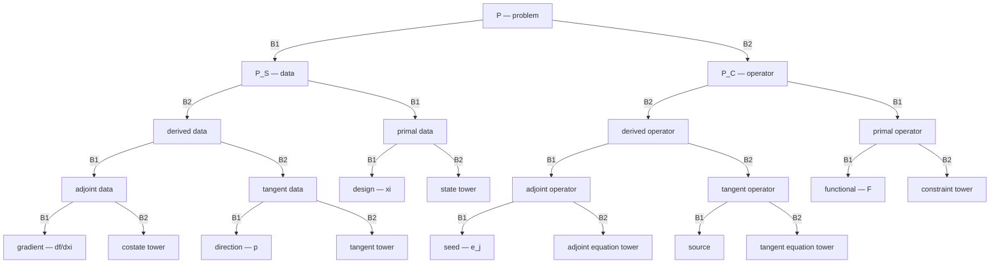
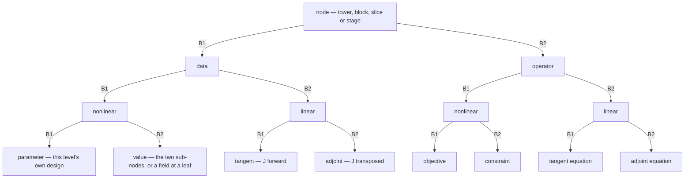
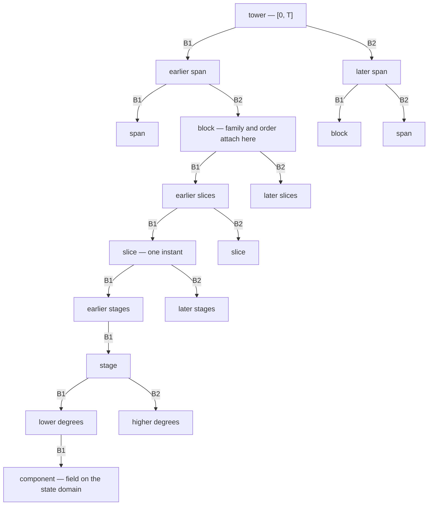
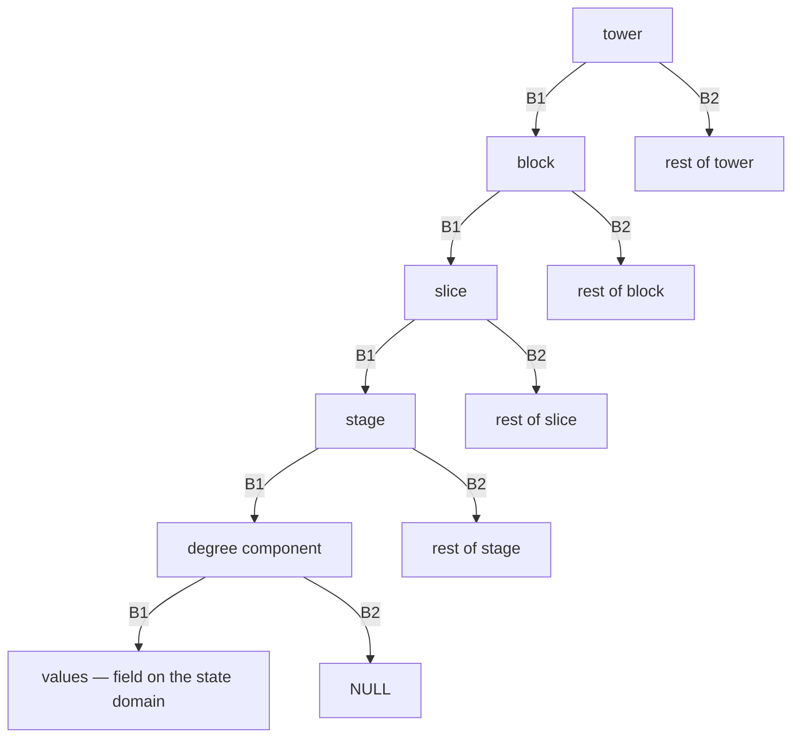
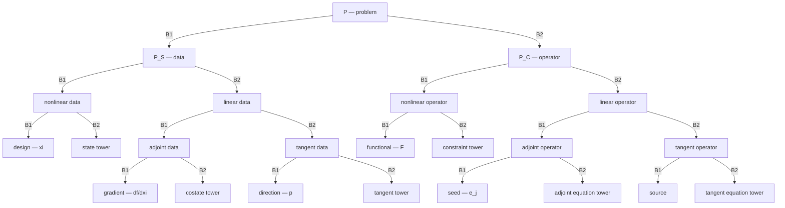
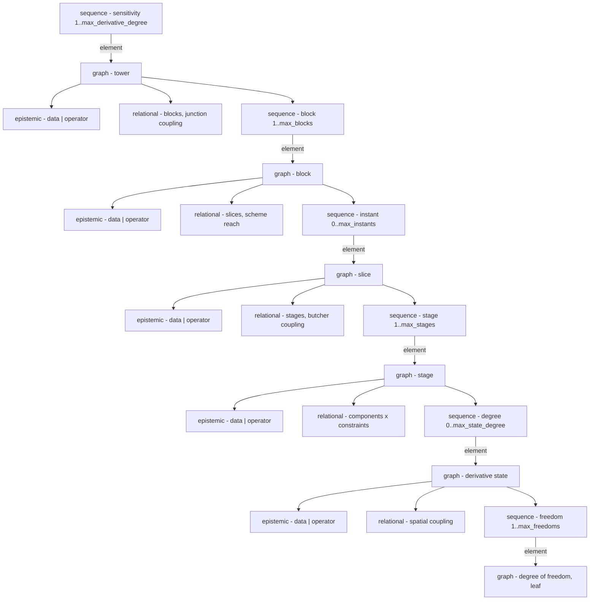
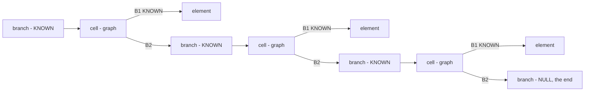
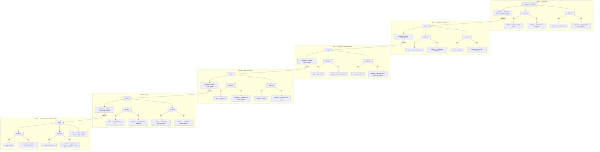
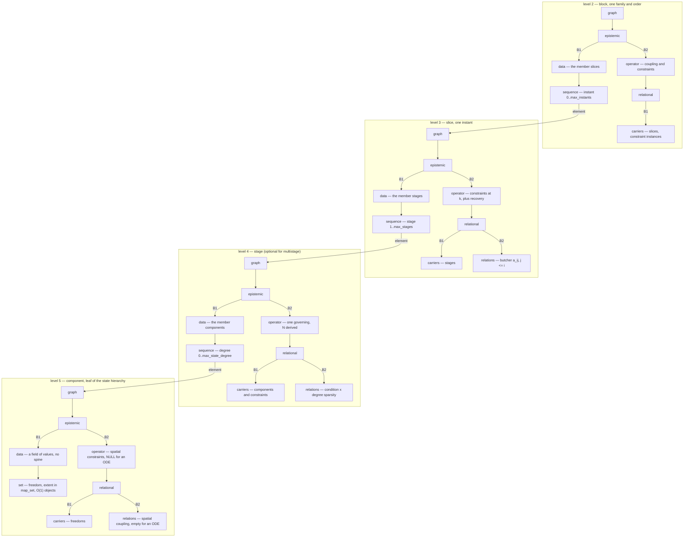

What is being built

Two files under maths/demo and a set of configuration files. physics_vanderpol.f90 supplies the residual integrand R and the functional integrand F with their state and design partials, for a Van der Pol system generalised to degree N as q^(N) − ν(1−q²)q^(N−1) + q = 0. graph_time_integrator.f90 assembles what src/ provides and prints one table, selected by --config=test_homogeneous and similar. Columns run f, df/dν, … to the configured derivative degree; rows are the homogeneous primitives, then ordered pairs, then ordered triples of BDF, ABM and DIRK, at one order or across orders as the configuration asks. No test suite is kept; a demonstration that runs is the check. Three further demonstrations follow: grid design, coefficient design, and the two together.

Structure

type(graph) is the only permitted structure, so a scheme is built from supplied vertices and edges. The hierarchy is self-similar at every zoom:

  tower      B_1 =====> B_2 =====> B_3        blocks, one family and order each
  block      G_0 --> G_1 --> ... --> G_m      slices, one instant each
  slice      G_k = ( G_k^S , G_k^C )          state first, constraint second
  sub-deck   G_k,1 --> ... --> G_k,s          one slice when not multistage
  degree     [ q , q' , ... , q^(N) ]

with G^S = (primal_state, (adjoint_state, tangent_state)) and G^C the same shape over the equations. That nesting records a real distinction: the primal traversal is nonlinear, while adjoint and tangent are both linear in the operator assembled at the converged primal state. At the top, P^S = (design, state deck) and P^C = (functional, constraint deck), which keeps the count square — N+2 data blocks against N+2 operators — with the design never solved and the functional's multiplier held at one, exactly as Figure 2 of the 2017 paper draws it. The pair order is (data, operator) to match view_epistemic.

A block is homogeneous in family and order; the tower above it is heterogeneous. Boundaries between blocks carry the state forward and the costate backward, and the tower's outer boundaries are the initial and terminal conditions, so those are the degenerate case of a junction rather than a separate mechanism. Only a multistage block may be first. With automatic_order_conservation = .true. a multistage startup block is prepended before a multistep block — 2P slices for BDF of order P, P−1 for ABM — so the order is preserved; .false. is unimplemented and stops. Every family carries a stage sub-deck, degenerate at one stage for BDF and ABM, so that all families are traversed by identical code; that identity is the evidence the abstraction is correct, and it also collapses the per-stage quadrature h_k Σ β_i F_ki to h_k F_k without a family test.

Indexing and the two linear systems
Fortran folds case, so distinct words are used rather than Q against q.
  max_state_degree           degree      0 .. max_state_degree   components, tangents                                                                                                                                                 condition   0 .. max_state_degree   constraints, costates  max_discretization_order   --                                  scheme order  max_derivative_degree      sensitivity 1 ..                    tangent order  max_stages                 stage       1 ..  max_outputs                output      1 ..                    functionals, costate  max_parameters             parameter   1 ..                    design components  max_instants               instant     0 ..  max_blocks                 block       1 ..
degree and condition share a bound because the block is square. The primal system has rows indexed by constraint and columns by component; the adjoint is that same matrix transposed, rows by component and columns by constraint. λ, ψ and φ are dual to R, S and T; q, q̇ and q̈ are dual to tons. The generic (N+1)m block is solved rather than its Schur complement, and thereduced Newton system of the 2017 paper is recovered exactly by eliminating the derived rows. Multiplication by ones and addition of zeros are accepted, the purpose being characterisation rather than speed. operation's existing max_degree is a different quantity from max_state_degree and must not be conflated.
                                                                                                                                                                                                  The scheme as a productEvery weight separates as α(θ)·h_k^(d′−d), the exponent being the derivative degree an it enters, which is determined by the topology alone. The dimensionless factor dependson the steps only through θ_j = (t_k − t_{k−j})/h_k, with α_j = ℓ_j′(0) for BDF and ∫_niform grid is the degeneracy θ_j = j, at which α collapses to the classical tables;this was checked against set_bdf, whose three BDF-2 lines are reproduced exactly and gtio. The product is edgewise over one shared topology, though the factors are notindependent since α is computed from τ. The coefficient builder takes the dt-graph andh and returns the extended one; entries are immutable at fixed design, which gives afree check — incremental and from-scratch construction must agree entry for entry.
Design as the parent notion
State and design are one kind of variable differing in whether the codomain map is square and closable, and in disposition, fixed or free. Solving is tuning, which the tower already encodes: every solver is a minimizer attached to a statement. Two refinements were taken from evidence in the repository: disposition is carried as a map rather than as branches, since it changes during a study and malready carries per-identity status; and state is composition rather than a subtype ofoural differs and the view_directed audit showed what a one-concretion hierarchy costs.The unification is of description and gradient assembly, not of traversal — the primaltuning outer.Carrying ψ and φ as genuine unknowns, rather than assuming them zero, is what makes coall, since ∂S/∂α and ∂T/∂α reach the gradient only through them.
                                                                                                                                                                                                  Consequences flushed out
                                                                                                                                                                                                  Six revisions are required before the design demonstrations will work. The coefficientable operation rather than a producer of data, since grid design needs ∂α/∂h. Thequadrature weight becomes design-dependent, so ∂f/∂h_k carries an explicit F_k term. The instants become design-dependent, so ∂R/∂t must be declarable and chained — invisible for Van der Pol, which has no explicit t. A tower-level constraint is needed, because a fixed duration and the order conditions have no slice to live at while the constraint deck is instant-indexed. The coefficient graph per-entry provenance, computed from τ or free, the two being exclusive. And immutabili.Two limits are scope rather than defect: the number of steps and the assignment of sliy sizes varying; and designing α is a choice between one tableau per block andindependent entries per slice. One caution: joint grid and coefficient design is reduneld by trading α against h, so the problem should be expected ill-conditioned until theduration or the order conditions are imposed.

The acceptance criterion adopted for the three design demonstrations is that they differ only by which entries a configuration file marks free. Any one of them needing its own code path means the abstraction has not earned itself.

Open, and the gaps in src/

Still to settle: whether the startup block takes its slices from the head of the firstnds the duration; the random step distribution, its bounds and its seed; and thedetailed contents of the configuration groups.

src/ supplies none of the traversal yet. There is no traversal over a descriptor step,rajectory-level derivative recursion; the coefficient tables are uniform-step only andstop at order four; and there are no Butcher tableaux or stage assembly. Those are what must be built before either demonstration file can be written.

instead of splitting `data` as `primal` and `derived`, should we split it as `linear` and `nonlinear`. The tangent and adjoint are two orientations of the same linearized operator. 

