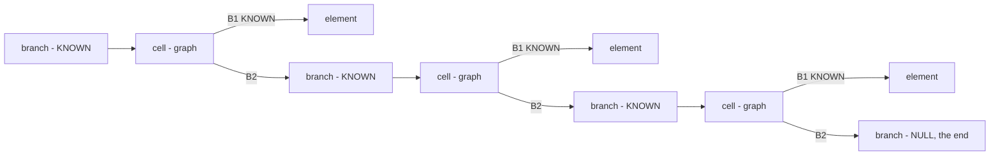
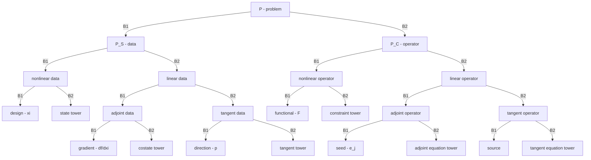
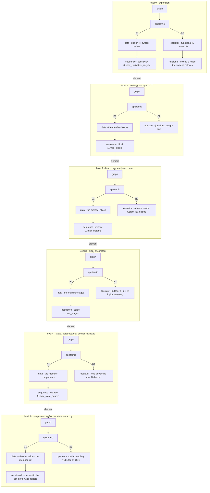

# The mathematics of the graph time integrator

This document completes the draft: the corrupted passages are restored,
the items the draft left unresolved are resolved and the resolution is
recorded, the claims that have since been demonstrated are marked so,
and the list of remaining work is made consistent with the source.

## 0. What is being built

One packed source under `application` and a set of configuration
files. `module_graph_time_integrator.f90` states the van der Pol
residual and the functional integrands as expressions, assembles what
`src/` provides, and prints one table selected by `--config=` and
overridden by `key=value` arguments. Columns run f, df/dnu, ... to the
configured derivative degree; rows are the homogeneous families, then
ordered pairs, then ordered triples of BDF, ABM and DIRK, at one order
or across orders as the configuration specifies. The former standalone
checks are demonstrations of the same executable: `--list-demos` names
them, `--demo=scheme_weights` runs one. `application/README.md` is the
user's entry point; this file is the mathematics underlying it.

## 1. The one structure and its views

There is one structure: the graph

    G = (B1, B2),        B in { NULL, UNKNOWN, KNOWN -> G },

with identity assigned once and never chosen. Everything else is a
view. A graph has no properties; it admits interpretations, and
each interpretation is a view or a map stored beside the structure:

    epistemic     the pair (B1, B2) read as (data, operator)
    relational    read as (carriers, relations)
    sequence      read as (element, rest) - the list below
    set           a declared extent, in the set store, O(1) objects
    label         the name of an identity; naming is not addressing
    value         the value stored at an identity, with a status

The sequence view is the kernel's list:

The view principle governs every level below: no level of the
construction is a new type. A tower, a block, a slice, a stage and a
component are one graph interpreted at five depths, and the evidence that
the abstraction is correct is that one traversal serves all of them.

## 2. The problem as a graph

The whole problem is one graph P = (P_S, P_C): data beside operator,
in that order, matching the epistemic view. The draft left unresolved whether
the second split of each half should be (primal, derived) or
(nonlinear, linear). The choice is resolved for (nonlinear, linear),
and the reason is a mathematical one: the tangent and the adjoint are
two orientations of the one operator linearised at the converged
primal state, so the natural split is the split by
linearity - the nonlinear half contains what is solved by iteration, the
linear half contains the two orientations of its derivative. The
(primal, derived) division is the same four quarters read
epistemically, and is retained as prose, not as structure.

The count is square by construction. For an equation of degree N there
are N+2 data blocks against N+2 operators: the design is never solved,
and the functional's own multiplier is fixed at one - exactly as
Figure 2 of the 2017 paper shows. The primal traversal is
nonlinear; the adjoint and tangent traversals are linear in the
operator assembled at the converged primal state, one along its edges
and one against them.

## 3. The hierarchy

The hierarchy is self-similar at every level:

    tower      B_1 =====> B_2 =====> B_3        blocks, one family and order each
    block      G_0 --> G_1 --> ... --> G_m      slices, one instant each
    slice      G_k = ( G_k^S , G_k^C )          data first, operator second
    sub-deck   G_k,1 --> ... --> G_k,s          the stages; one when not multistage
    degree     [ q , q' , ... , q^(N) ]         the components of one point

Each level is the same triple of views - its data contain a sequence
of members, its operator contains the relations among them - and the
final form of the levels, after the draft's candidates, is:

Three invariants of the hierarchy, each enforced by the code and checked by a
demonstration:

**Junctions are degenerate boundaries.** Boundaries between blocks
transport the state forward and the costate backward; the tower's outer
boundaries - the initial and terminal conditions - are the degenerate
case of a junction, not a separate mechanism. `chained_horizon` is the
demonstration: a chain across families whose every derivative agrees with a
difference of the one below, across the junctions.

**The startup preserves the order.** Only a self-starting block may be
first. With automatic order conservation a multistage startup block is
prepended before a multistep one - 2P slices for BDF of order P over an
equation of degree two, P-1 for ABM - so every row integrates the same
initial-value problem at its own formal order. The alternative is not
built and stops the program, because a table whose rows solve
different problems admits no comparison.

**The stage sub-deck is total, degenerate at one.** Every family
has stages, BDF and ABM at exactly one, so that all families are
traversed by identical code; that identity of traversal is the
evidence the abstraction is correct. It also makes the functional's
per-stage quadrature h_k sum over i of beta_i F_ki collapse to
h_k F_k without a family test: the multistep tableau weight is one.

## 4. The scheme as a product

Every weight of the scheme's operator separates as

    w  =  alpha(theta) * h_k^(d' - d),

the exponent being fixed by the two derivative degrees the edge joins
and by nothing else - not the family, not the order, not the position
in the history. The dimensionless factor depends on the steps only
through the scaled offsets

    theta_j = (t_k - t_(k-j)) / h_k,        theta_0 = 0,

with alpha_j the slope at zero of the j-th Lagrange basis function
through those offsets for a difference, and its integral over the last
step for a quadrature. The uniform grid is the degeneracy theta_j = j,
at which alpha collapses to the classical tables; this is checked
against the tabulated BDF-2 coefficients, reproduced exactly, and by
the `scheme_weights` and `family_coefficients` demonstrations on
non-uniform steps.

The product is edgewise over one shared topology, though its factors
are not independent: alpha is computed from the same steps tau scales
by. Both factors store their partials in the steps through the exact
arithmetic, so the product rule is applied by evaluation and the
weight's derivative in any step is exact - `grid_design_check` compares
the tables against three independent computations at every order. Entries
are immutable at a fixed design, which yields a direct check: incremental
and from-scratch construction must agree entry for entry.

## 5. Duality

At one slice the unknowns q, q', ..., q^(N) are dual to the rows that
determine them: the governing row R at the primary degree, and the
derived rows S, T, ... at the others. The multipliers lambda, psi, phi
are dual to R, S, T in the same pairing. The primal system has rows
indexed by constraint and columns by component; the adjoint is the
same matrix transposed - the same reads graph traversed against its
edges - and the tangent is the same matrix along them. The generic
(N+1)m block is solved rather than its Schur complement; the reduced
Newton system of the 2017 paper is recovered exactly by eliminating
the derived rows. Multiplications by one and additions of zero are
accepted, the purpose being characterisation rather than speed.

Two theorems of this duality are now implemented as checks:

**The costate of a sink.** An unknown read by no row but its own is a
sink of the block's reads graph; its column of the jacobian contains the
diagonal entry alone, so the costate equation J^T lambda = g gives

    J_ii lambda_i = g_i

exactly on it, and lambda_i = 0 wherever the functional does not read
the unknown either. Which unknowns are sinks is determined from the compiled
pattern, not declared, and the demonstration locates them where the
theory permits them and nowhere else: in a stage block, the arriving
instant's highest degree - the governing rows are located at the stages and
the next step reads the lower degrees - and in a multistep block,
none, the governing row at the same instant reading every degree.
`check = sinks` asserts the identity over every costate solve, at
every degree of the equation.

**One theorem, three forms.** The composition of derivatives
appears three times in the tower: as the product rule over subsets of
directions in the exact arithmetic, as the total derivative of a
composition over integer partitions with multinomial counts in the
chain rule, and as the derivative of a function of a quantity with stored derivatives
over set partitions in the elementary functions. All three are Faa di
Bruno's formula; the set-partition form is primitive, and the other
two are its restrictions - to singleton blocks, and to the symmetric
case where every direction is the same. That the three agree wherever
they overlap is checked by `function_identities` to five directions and
by the pass cross-checks over the whole derivative table.

## 6. Design as the parent notion

State and design are one kind of variable. They differ in two
attributes, not in kind: disposition - fixed or free - and whether the
operator ranged against them is square and closable. Solving is
minimisation: every solver in the tower is a minimizer attached to a
statement, and the primal march is the inner loop of the same minimisation the
outer design loop performs. Two refinements were taken from evidence
in the repository rather than from preference: disposition is stored as a
map keyed on identity, since it changes during a study and the value
map already stores per-identity status; and state is a composition
rather than a subtype, since only the description differs and the
directed-view audit showed what a one-concretion hierarchy costs. The
unification is of description and of gradient assembly, not of
traversal - the primal stays inner, the minimisation outer.

Retaining psi and phi as unknowns, rather than assuming them
zero, is what makes coefficient design assemblable at all: the partials
of S and T in the scheme's coefficients reach the gradient only
through them.

## 7. The consequences, their limits, and the criterion

Six revisions are required before the design demonstrations work, and
they are consequences of section 6, not choices:

1. The coefficient builder becomes a differentiable operation rather
   than a producer of data, since grid design needs the partial of
   alpha in the steps.
2. The quadrature weight becomes design-dependent, so df/dh_k contains
   an explicit F_k term beside the chained one.
3. The instants become design-dependent, so the partial of R in t must
   be declarable and chained - vanishing for van der Pol, which reads
   no explicit t.
4. A tower-level constraint is needed: a fixed duration and the order
   conditions have no slice to be stored at while the constraint deck is
   instant-indexed.
5. The coefficient graph stores per-entry provenance - computed from
   theta, or free - the two being exclusive.
6. Immutability becomes provenance-wise: a computed entry is immutable
   at fixed design, a free entry is a design.

Two limits are scope rather than defect: the number of steps and the
assignment of slices to blocks stay fixed, sizes varying; and
designing alpha is a choice between one tableau per block and
independent entries per slice. One caution is mathematical: joint grid
and coefficient design is redundant along the invariance of the
product - a change in alpha can be compensated by a power of h - so the problem
should be expected ill-conditioned until the duration or the order
conditions are imposed.

The acceptance criterion for the three design demonstrations is that
they differ only by which entries a configuration marks free. Any one
of them needing its own code path means the abstraction is not
justified.

## 8. The coordinate view

Below the hierarchy is the axis itself, and the same principle
applies to it. A coordinate is the uniform axis on [0, 1], identified
and labelled; every physical axis is its image under a mapping, and
the measure on the physical axis is the pushforward - the Lebesgue
measure on [0, T] is the uniform one at scale T, a probabilistic axis
is the image under the inverse distribution function, a spatial domain
is the image of the parametric square under the geometry. A grid is
the discretisation of a coordinate: a finite measure, points and
weights, and its two views are two kinds of the one map - the
partition, whose points are the instants and whose weights are the
steps, exact on piecewise constants; and the quadrature, whose points
are the Legendre nodes and whose weights are the rule's, exact on
polynomials of degree below twice the point count. Both are
implemented as kinds of the one grid type, and `assembled_tower`
demonstrates the exactness with a tolerance derived from the arithmetic.

Inside one instant the same view continues one level further: the
governing equation itself is a graph whose vertices are typed
operators and whose edges are the reads between them, evaluated over
the arithmetic that stores mixed derivatives. The march is the loop
over the blocks' reads graph, the block over its instants', and the
rule over its own - the hierarchy is reads graphs at every level,
and the adjoint at every level is the same loop against the edges.

## 9. Established, and open

Of the draft's gaps, the following are now built and demonstrated:
the traversal over a descriptor equation of any degree; coefficient
tables at any order on non-uniform steps, from the Lagrange
functionals; the Butcher tableaux and stage assembly; the
trajectory-level derivative recursion to any order by either pass;
the heterogeneous chains with order-preserving startup; the per-stage
functional quadrature; the adaptive grid, computed and then fixed; the
sink identity as a permanent check; and the quadrature kind of the
grid. Each has its demonstration in the table of
`application/README.md`, and every demonstration reports its departure
beside a tolerance derived from the arithmetic.

Open, in the order the mathematics suggests:

- the six consequences of section 7, and with them the three design
  demonstrations - grid design is built, coefficient design is not;
- several unknowns and algebraic constraints: the state as a vector,
  the layout instant x unknown x degree, which is what the
  differential-algebraic application requires;
- the spatial derivative as a vertex of the rule's own graph, its
  linear part compiled to the stencil;
- the probabilistic axis demonstrated: the same functional integrated by
  collocation on the quadrature kind and by the Taylor expansion in
  the design, the two discretisations of one coordinate compared on
  one problem.
