# Calculator Tower

A single calculator expression is used as a vertical demonstration of the entire framework:

\[
\boxed{(2+3)\times4=20}
\]

The physical **Casio fx-115ES** is the independent oracle. Every level exposes a different capability of the framework, but every level belongs to the same calculation and ultimately preserves the same truth.

---

## Concise summary

We are setting up **one canonical calculator problem** persist through the entire tower:

\[
\boxed{(2+3)\times4=20}
\]

Use symbolic slots rather than making numbers themselves structural objects:

\[
X=\{a,b,c,d,e\},\quad
O=\{+,\times\},\quad
P=\{\mathrm{in}_1,\mathrm{in}_2,\mathrm{out}\}
\]

with

\[
q(a)=2,\ q(b)=3,\ q(d)=4,\qquad q(c)=5,\ q(e)=20.
\]

Then each level gets the smallest possible test:

| Level | Calculator demo | Truth to verify |
|---|---|---|
| **0 Carrier** | Declare \(X,O,P\) | distinct identities; `member(local_index(x)) = x` |
| **1 Relation** | \(R\subseteq O\times X\times P\) | e.g. \((+,a,in_1),(+,c,out),(\times,c,in_1)\) exist |
| **2 Relation algebra** | Derive operation dependency by matching output→input | \(\boxed{+\rightarrow\times}\) and nothing else |
| **3 Graph** | \(G=(\{X,O,P\},\{R,\ldots\})\) | calculator is representable with **no vertex/edge assumptions** |
| **4 Graph calculus** | Topologically walk operation dependency | order must be \(\boxed{+,\times}\) |
| **5 Field calculus** | Put numeric field \(q:X\to\mathbb R\) on slots | known field: \(q(a)=2,q(b)=3,q(d)=4\); supports/subsets preserve indexing |
| **6 Discretization** | Compile relations into residual/stencil structure | \(r_c\) depends on \(\{a,b,c\}\); \(r_e\) on \(\{c,d,e\}\) |
| **7 Minimization** | Solve residual system | \(r=0\Rightarrow q(c)=5,\ q(e)=20\) |
| **8 Constitution** | Give operations their actual laws | \(+(x,y)=x+y,\quad\times(x,y)=xy\) |
| **9 Statement** | Ask: “evaluate \((2+3)4\)” | final answer \(\boxed{20}\), checked on your Casio |

The Level-1 relation would be simply

\[
R=
\left\{
\begin{array}{lll}
(+,a,in_1),&(+,b,in_2),&(+,c,out),\\
(\times,c,in_1),&(\times,d,in_2),&(\times,e,out)
\end{array}
\right\}.
\]

And the beautiful continuity is:

\[
\boxed{
\text{sets}
\rightarrow
\text{relations}
\rightarrow
\text{graph}
\rightarrow
\text{walk}
\rightarrow
\text{values}
\rightarrow
\text{equations}
\rightarrow
\text{solve}
\rightarrow
\text{meaning}
\rightarrow
20
}
\]

I would make this **`test/calculator-tower/`** and have one tiny test/demo per level. It could become the Rosetta Stone of the whole framework: a new user can stop at whatever level they understand, while the **same five value slots and two operations** continue all the way to the top.

---

# The persistent calculator object

The tower must not create a new example at every level. The same objects remain visible from bottom to top.

```text
value slots X                  operations O                  ports P

a       b       c       d       e          +       ×          in₁  in₂  out
│       │       │       │       │
2       3       5       4      20          physical values appear at Level 5
```

The expression has the structural flow

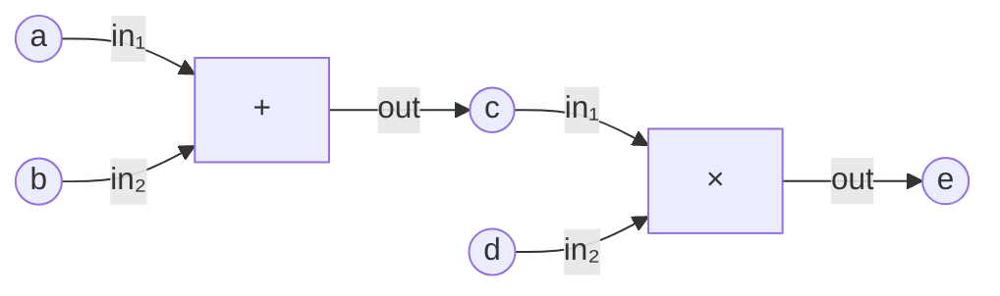

and the numerical realization

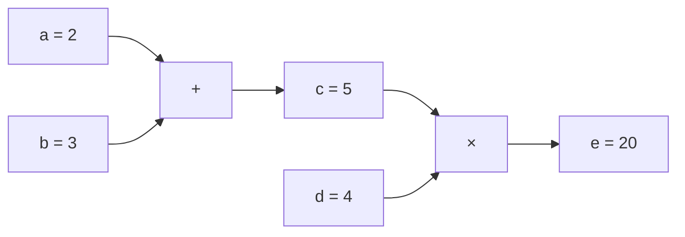

The first diagram is structural. The second appears only after values and operation laws have been supplied.

---

# Level 0 — Carriers

## Capability

Level 0 answers only:

> **What kinds of members may exist?**

Declare three independent member sets:

\[
X=\{a,b,c,d,e\},
\qquad
O=\{+,\times\},
\qquad
P=\{in_1,in_2,out\}.
\]

Nothing is connected yet. Nothing has a numerical value yet. The symbols `+` and `×` do not yet mean arithmetic.

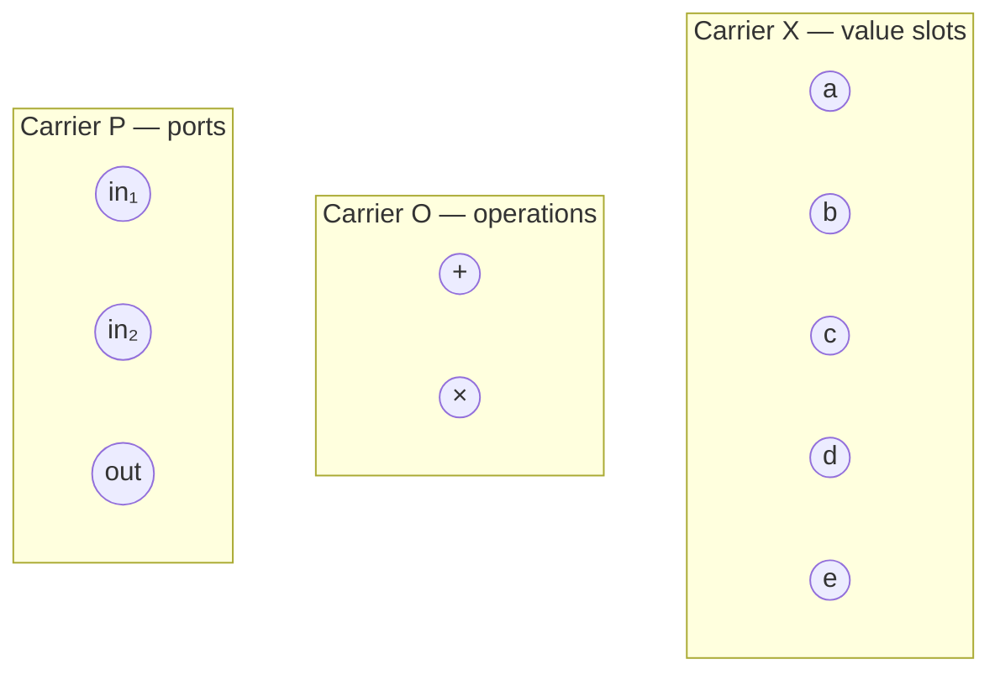

## Minimal verification

For every carrier member \(x\),

\[
\operatorname{member}(\operatorname{local\_index}(x))=x,
\]

and for every local index \(i\),

\[
\operatorname{local\_index}(\operatorname{member}(i))=i.
\]

Also verify that \(X\), \(O\), and \(P\) have distinct structural identities.

## What this proves

The framework can represent multiple independent domains without deciding that one is a vertex set or an edge set.

---

# Level 1 — Relations

## Capability

Level 1 answers:

> **How may members of the carriers be related?**

Introduce one ternary relation

\[
R_{\mathrm{flow}}\subseteq O\times X\times P.
\]

Its tuples are

\[
\begin{aligned}
(+,a,in_1),\qquad &(+,b,in_2),\qquad (+,c,out),\\
(\times,c,in_1),\qquad &(\times,d,in_2),\qquad (\times,e,out).
\end{aligned}
\]


The arrows are only a visual reading of the ternary tuples. The relation itself is not required to be an ordinary graph.

## Minimal verification

Test representative truths:

```text
R.has(+, a, in₁)   = true
R.has(+, c, out)   = true
R.has(×, c, in₁)   = true
R.has(×, a, in₁)   = false
```

Verify also:

- arity is exactly 3;
- domain 1 is \(O\);
- domain 2 is \(X\);
- domain 3 is \(P\);
- duplicate tuples do not change the relation.

## What this proves

The framework can represent a relationship whose meaning naturally needs more than two slots. No binary-incidence reduction is required.

---

# Level 2 — Relation algebra

## Capability

Level 2 answers:

> **What new relations can be derived from existing relations?**

The first useful derived relation is operation dependency.

An operation \(o_1\) precedes \(o_2\) when the output slot of \(o_1\) is an input slot of \(o_2\).

For this calculator,

\[
D\subseteq O\times O
\]

contains exactly

\[
\boxed{(+,\times)}.
\]

Conceptually,

\[
D
=
\pi_{O_1,O_2}
\left(
R_{\mathrm{out}}
\Join_X
R_{\mathrm{in}}
\right).
\]

**As implemented**, the derivation uses an equivalent smaller
factorization — natural join remains unearned:

```text
R_out3   = restrict_slot(R_flow, 3, {out})       two tuples
R_in3    = restrict_slot(R_flow, 3, {in₁,in₂})   four tuples
produces = project_slots(R_out3, [1,2])  ⊆ O×X   {(+,c), (×,e)}
consumes = project_slots(R_in3,  [2,1])  ⊆ X×O   {(a,+),(b,+),(c,×),(d,×)}
D        = compose_binary(produces, consumes)    consumes ∘ produces
```

which yields the same extension \(D=\{(+,\times)\}\) through
restriction + projection + binary composition
(`src/graph_relation_algebra.f90`).

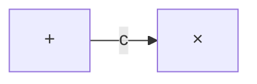

## Minimal verification

\[
D.has(+,\times)=\mathrm{true},
\]

while

\[
D.has(\times,+)=\mathrm{false},
\qquad
D.has(+,+)=\mathrm{false},
\qquad
D.has(\times,\times)=\mathrm{false}.
\]

## What this proves

Relations can generate useful structure through projection, restriction, join, permutation, and composition instead of requiring every derived concept to be stored independently.

---

# Level 3 — Relational graph

## Capability

Level 3 answers:

> **How do several carriers and relations coexist as one structure?**

Construct

\[
G=(\mathcal S,\mathcal R)
\]

with

\[
\mathcal S=\{X,O,P\},
\qquad
\mathcal R=\{R_{\mathrm{flow}},D\}.
\]

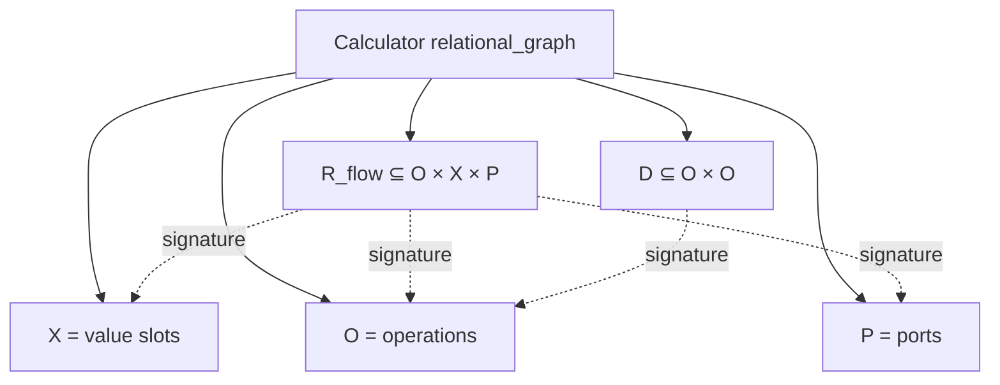

## Minimal verification

Verify:

- the graph owns exactly three carrier identities;
- it owns the flow relation and dependency relation;
- every relation slot points to a carrier owned by the graph;
- two relations may coexist over the same carrier;
- there is no concept of vertex or edge anywhere in the generic graph test.

A useful test assertion is simply that the entire calculator is representable by `relational_graph` without importing the ordinary-graph profile.

## What this proves

A graph is a structured collection of sets and relations, not a synonym for an ordinary \(V/E\) graph.

---

# Level 4 — Graph calculus

## Capability

Level 4 answers:

> **What graph-theoretic questions can be asked of the relational structure?**

Interpret the derived binary dependency relation \(D\) as a directed operation graph.

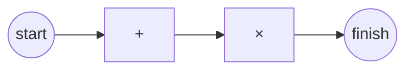

The topological order is

\[
\boxed{+,\times}.
\]

## Minimal verification

Verify:

```text
source operations = {+}
sink operations   = {×}
reachable(+, ×)   = true
reachable(×, +)   = false
topological walk  = [+, ×]
```

## What this proves

Traversal, reachability, ordering, components, and other graph notions arise only after a relation is given the appropriate graph interpretation.

---

# Level 5 — Field calculus

## Capability

Level 5 answers:

> **What values live on a member domain or one of its subobjects?**

Define a scalar field

\[
q:X\rightarrow\mathbb R.
\]

The known input support is

\[
K=\{a,b,d\}\hookrightarrow X
\]

with

\[
q(a)=2,\qquad q(b)=3,\qquad q(d)=4.
\]

The unknown support is

\[
U=\{c,e\}\hookrightarrow X.
\]

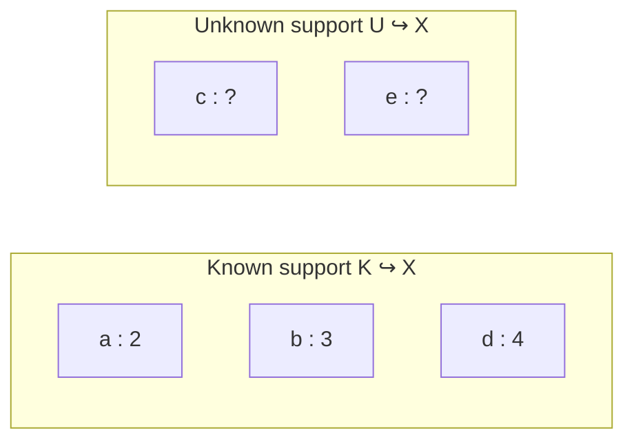

## Minimal verification

Verify:

- \(K\) and \(U\) are valid subobjects of \(X\);
- `local_index` round trips within each support;
- field values are stored in support enumeration order;
- querying \(q(a),q(b),q(d)\) returns \(2,3,4\);
- \(c,e\notin K\).

## What this proves

Values are separate from topology. A field is a function over an indexable domain; a support is a genuine subdomain \(S\hookrightarrow A\), not an edgeless graph.

---

# Level 6 — Discretization

## Capability

Level 6 answers:

> **How does structural dependency become a discrete equation layout?**

Introduce residual locations for the two computed slots:

\[
r_c,\qquad r_e.
\]

At this level, the important truth is dependency structure:

\[
r_c=r_c(q_a,q_b,q_c),
\]

\[
r_e=r_e(q_c,q_d,q_e).
\]

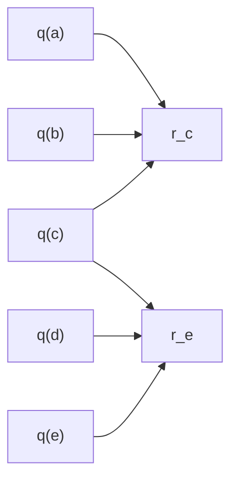

Equivalently, the structural Jacobian sparsity is

\[
\begin{array}{c|ccccc}
 & a&b&c&d&e\\ \hline
r_c & \times&\times&\times&&\\
r_e &&&\times&\times&\times
\end{array}
\]

## Minimal verification

Verify exactly:

```text
support(r_c) = {a,b,c}
support(r_e) = {c,d,e}
```

and no other dependency is present.

## What this proves

The framework can compile relational structure plus field domains into the discrete dependency pattern needed by residuals, Jacobians, tangents, and adjoints.

---

# Level 7 — Minimization

## Capability

Level 7 answers:

> **Given residual equations, can the framework drive them to zero?**

For the calculator demonstration, supply the tiny residual system

\[
r_c=q(c)-5,
\qquad
r_e=q(e)-4q(c).
\]

Starting from arbitrary guesses for \(q(c)\) and \(q(e)\), solve

\[
r(q)=0.
\]

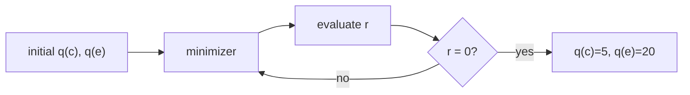

## Minimal verification

Require

\[
\|r\| \le \varepsilon
\]

and

\[
q(c)=5,\qquad q(e)=20
\]

to the chosen numerical tolerance.

The test of the minimization level is about solving the supplied residual. The residual's physical or arithmetic meaning belongs above this level.

## What this proves

The solver machinery is independent of whether its residual came from arithmetic, diffusion, elasticity, CFD, or any other constitution.

---

# Level 8 — Constitution

## Capability

Level 8 answers:

> **What do the operation symbols actually mean?**

Only now give `+` and `×` their laws:

\[
+(x,y)=x+y,
\]

\[
\times(x,y)=xy.
\]

These laws generate the calculator residuals

\[
r_c
=
q(c)-\left(q(a)+q(b)\right),
\]

\[
r_e
=
q(e)-q(c)q(d).
\]

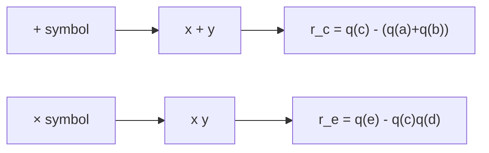

With the known field values,

\[
r_c=q(c)-5,
\qquad
r_e=q(e)-4q(c),
\]

which is exactly the residual system used by Level 7.

## Minimal verification

Evaluate at the expected solution:

\[
r_c(2,3,5)=0,
\]

\[
r_e(5,4,20)=0.
\]

## What this proves

Structure and algorithms existed before arithmetic meaning was attached. Constitution supplies model law, not topology and not solution strategy.

---

# Level 9 — Statement

## Capability

Level 9 answers:

> **What problem is actually being asked?**

The complete statement is simply:

\[
\boxed{\text{Evaluate }(2+3)\times4.}
\]

The statement chooses:

- the calculator graph;
- the known inputs \(2,3,4\);
- the arithmetic constitution;
- the requested output \(e\).

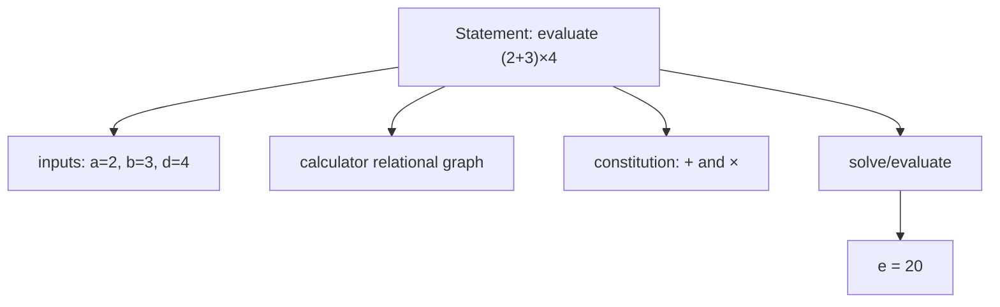

## Minimal verification

The framework must return

\[
\boxed{20}.
\]

Then enter exactly the same expression on the **Casio fx-115ES**:

```text
( 2 + 3 ) × 4 =
```

and verify that the physical calculator also reports

```text
20
```

## What this proves

The entire tower composes correctly.

The software and the independent physical oracle agree on the same mathematical statement.

---

# End-to-end view

The complete calculator tower can be read vertically:

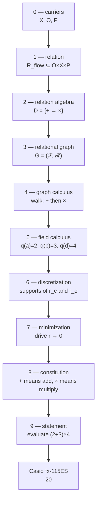

Or horizontally as the progression of mathematical commitments:

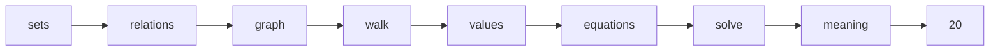

---

# Suggested test layout

```text
test/calculator-tower/
├── README.md
├── level-0-carrier/
│   └── test.f90
├── level-1-relation/
│   └── test.f90
├── level-2-relation-algebra/
│   └── test.f90
├── level-3-graph/
│   └── test.f90
├── level-4-graph-calculus/
│   └── test.f90
├── level-5-field-calculus/
│   └── test.f90
├── level-6-discretization/
│   └── test.f90
├── level-7-minimization/
│   └── test.f90
├── level-8-constitution/
│   └── test.f90
├── level-9-statement/
│   └── test.f90
└── run.sh
```

Each test should be intentionally tiny. It should import only what is legal at that level and below.

That gives the demonstration a second purpose beyond correctness:

\[
\boxed{\text{the calculator tower is also a dependency-stratification test}}
\]

If a lower-level calculator test needs to import a higher-level module, the tower boundary has been violated.

---

# Acceptance ladder

A successful run should read conceptually like:

```text
calculator tower
├── level 0  carriers .............. PASS
├── level 1  relation .............. PASS
├── level 2  relation algebra ...... PASS
├── level 3  relational graph ...... PASS
├── level 4  graph calculus ........ PASS
├── level 5  field calculus ........ PASS
├── level 6  discretization ........ PASS
├── level 7  minimization .......... PASS
├── level 8  constitution .......... PASS
├── level 9  statement ............. PASS
└── Casio fx-115ES oracle .......... 20
```

The most important invariant is not merely the final number.

It is that the **same calculator object gains one new mathematical capability at each level without changing its lower-level truths**.
