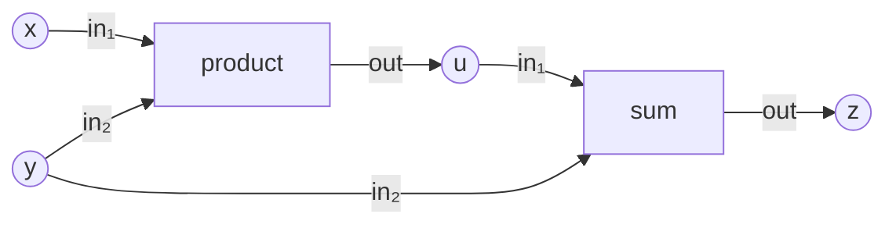
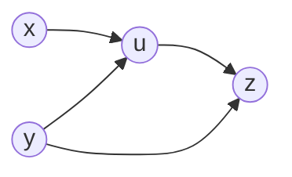

# Derivative Action Tower

The lowest-energy **derivative orbital client** of the core-math nucleus.
One persistent computation is used as the specimen for the entire future
tower:

\[
\boxed{u=xy,\qquad z=u+y}
\]

which, after constitution (a later gate), will mean \(z=xy+y\) at the base
point \(x=2,\ y=3\) — eventually \(u=6,\ z=9\). **Gate A computes neither.**

The tower's founding separation is:

\[
\boxed{\text{dependency structure}\neq\text{derivative action}}
\]

Gate A asks only:

> Can the existing relational substrate describe the complete STRUCTURE on
> which tangent and reverse derivative actions will later travel?

It stops deliberately before numerical differentiation. No derivative
value, seed, rule, or traversal exists anywhere in Gate A — and the gate
closed with

\[
\boxed{\text{production changes}=\text{NONE}}
\]

```text
Gate A   structural Levels 0–6 .......... PASS   (this document)
Gate B   numerical derivative action .... UNBUILT
Gate C   derivative statement ........... UNBUILT
```

---

## Why this specimen, and not z = xy

The direct product \(z=xy\) is too weak. In

\[
u=xy,\qquad z=u+y,
\]

the input \(y\) reaches the response \(z\) along **two structural
routes**:

```text
y ────────────────> z
 \
  └──> u ─────────> z
```

while \(x\) reaches \(z\) only through \(u\):

```text
x ──> u ──> z
```

This is the smallest example where future reverse propagation must
**accumulate** contributions at one input. Gate A exposes the topology
that will make that accumulation necessary later — without performing it.
The load-bearing consequence is the
[support-is-not-multiplicity](#support-is-not-multiplicity) observation.

---

## The ladder at a glance

| Level | Meaning | Core truth |
|---|---|---|
| 0 | carriers | \(V,O,P\) distinct symbolic domains |
| 1 | relation | ternary \(R_{\mathrm{flow}}\), six tuples, y consumed twice |
| 2 | relation algebra | \(D=\{(\mathrm{product},\mathrm{sum})\}\) **derived** |
| 3 | relational graph | one owned structure \(G=(\mathcal S,\mathcal R)\) |
| 4 | graph calculus | directed interpretation; walk \([\mathrm{product},\mathrm{sum}]\) |
| 5 | field calculus | base point on \(X\); computed \(C\) valueless; **no seeds** |
| 6 | derivative structure | \(A_V\), two-path truth, \(J_{ZX}=\{(z,x),(z,y)\}\), transpose view |
| 7–9 | *(Gate B / Gate C)* | **UNBUILT** — not designed here |

---

# The persistent structural object

```text
value slots V             operations O           ports P

x    y    u    z          product   sum          in₁  in₂  out
│    │
2    3                    base values appear at Level 5;
                          laws never appear in Gate A
```

The symbolic carriers are

\[
V=\{x,y,u,z\},
\qquad
O=\{\mathrm{product},\mathrm{sum}\},
\qquad
P=\{in_1,in_2,out\},
\]

and the structural relation is exactly

\[
R_{\mathrm{flow}}\subseteq O\times V\times P
\]

with six tuples:

\[
\begin{aligned}
(\mathrm{product},x,in_1),\qquad
&(\mathrm{product},y,in_2),\qquad
(\mathrm{product},u,out),\\
(\mathrm{sum},u,in_1),\qquad
&(\mathrm{sum},y,in_2),\qquad
(\mathrm{sum},z,out).
\end{aligned}
\]



> The diagram is only a visual interpretation of the ternary relation.
> The underlying object is not initially an ordinary graph, and below
> constitution `product` and `sum` are only members of \(O\).

At Level 5 the value carrier partitions into roles:

\[
V=X\;\dot\cup\;C,
\qquad
X=\{y,x\},
\qquad
C=\{u,z\},
\]

```text
V
├── X       independent inputs
│   ├── y = 3
│   └── x = 2
│
└── C       computed
    ├── u       no value yet
    └── z       no value yet
```

and at Level 6 the response is carved from the computed slots:

\[
Z=\{z\}\hookrightarrow C\hookrightarrow V.
\]

## When meaning enters (and when it does not)

```text
Levels 0–4        STRUCTURE ONLY — product/sum are symbols
Level 5           BASE VALUES — x=2, y=3; u/z uncomputed; NO seeds
Level 6           DEPENDENCY STRUCTURE — who can influence whom;
                  no derivative values
Gate B (unbuilt)  numerical derivative action
Gate C (unbuilt)  the derivative statement
```

---

# Level 0 — Carriers

**Capability.** What symbolic kinds of members may exist?

**Commitment.** Three independent `counted_set` declarations —
\(|V|=4\), \(|O|=2\), \(|P|=3\). The member constants
(`SLOT_X = 1`, …, in `common/derivative_assert.f90`) are enumeration
handles, not semantics.

**Verification.** Cardinalities; distinct identities by `same_as`; both
enumeration round trips,
\(\operatorname{member}(\operatorname{local\_index}(m))=m\) and
\(\operatorname{local\_index}(\operatorname{member}(i))=i\), on every
member; outsider rejection.

**Negative truth.**

```text
no relation      no graph        no field
no derivative    no tangent      no cotangent
no numerical law
```

**What this proves.** Nothing about a *derivative* application required a
new Level-0 ontology: the ordinary carriers suffice (Observation DA-0).

---

# Level 1 — Relation

**Capability.** How is the symbolic computation structurally wired?

**Commitment.** The six-tuple ternary \(R_{\mathrm{flow}}\), built via
`stored_relation('flow', [o, v, p], table)` — handed seven tuples with
one duplicate, holding six: a relation is a set. Signature answered by
identity, slot by slot. Not reduced to an ordinary graph: the three-way
fact *operation–slot–port* is the point.

**The wiring fact this specimen was chosen for**, stated as plain
structure:

```text
y is consumed TWICE  — (product, y, in₂) and (sum, y, in₂)
x is consumed once   — by product alone
```

**Verification.** Arity, identity-checked signature, exact six-member
extension, the fan-out truth, and meaningful absences — no operation
consumes its own output, \(z\) feeds nothing, a wrong-length tuple
belongs to nothing.

**Negative truth.** Derivative potential is completely **latent**:
\(R_{\mathrm{flow}}\) contains computation structure, not derivative
metadata, and looks exactly like ordinary computation structure because
it is ordinary computation structure (Observation DA-1).

---

# Level 2 — Relation algebra

**Capability.** What operation depends on what operation?

**Commitment.** The derived dependency

\[
\boxed{D=\{(\mathrm{product},\mathrm{sum})\}}\subseteq O\times O,
\]

earned — never written — through the certified road
(`src/graph_relation_algebra.f90`):

```text
R_out3   = restrict_slot(R_flow, 3, {out})       two tuples
R_in3    = restrict_slot(R_flow, 3, {in₁,in₂})   four tuples

produces = project_slots(R_out3, [1,2]) ⊆ O×V    {(product,u),(sum,z)}
consumes = project_slots(R_in3,  [2,1]) ⊆ V×O    {(x,product),(y,product),
                                                  (u,sum),(y,sum)}

D = compose_binary(produces, consumes)           consumes ∘ produces
```

using the repository's composition orientation
\(\texttt{compose\_binary}(R_{AB},R_{BC})=R_{BC}\circ R_{AB}\). The
witness: `product` produces \(u\) and `sum` consumes it. Note `consumes`
carries \(y\) twice — once toward each operation.

**Verification.** Restrictions and projections pinned by extension with
identity-checked domains; all four \(O\times O\) memberships pinned
(\((\mathrm{product},\mathrm{sum})\) present, the other three absent);
tuple-order invariance — the six facts handed backwards derive the same
\(D\), equal as sets in both directions.

**What this proves.** Operation dependency is generic relation algebra;
nothing derivative-specific has appeared (Observation DA-2).

---

# Level 3 — Relational graph

**Capability.** Can the symbolic derivative specimen live as one owned
relational structure?

**Commitment.**

\[
G=(\mathcal S,\mathcal R),
\qquad
\mathcal S=\{V,O,P\},
\qquad
\mathcal R=\{R_{\mathrm{flow}},D\},
\]

with \(D\) rederived before admission — the container infers nothing.

**Verification.** Three carriers and two relations owned by identity
(`holds_set`, and relation ownership composed locally from
`num_relations` / `relation_at` / `same_as`); the ternary flow survives
ownership unchanged (arity 3, six tuples); the dependency survives
(binary, one pair); signature closure — every relation slot resolves to
an owned carrier; graph identity — no identically stocked twin is \(G\).

**What ownership contributes here** (Observation DA-3): structural
closure and identity — no more. No tangent seat, no adjoint seat, no
derivative metadata was asked of the container, and no ordinary-graph
profile is imported to build it.

---

# Level 4 — Graph calculus

**Capability.** When the operation relation is interpreted directionally,
what execution structure appears?

**Commitment.** None structurally — the rung is an explicit
interpretation choice:

```text
graph-owned D
    ↓ directed_adjacency_view(g, d)
graph_algorithms: sources / sinks / reachable / topological_order
```

**Verification.**

```text
view domain               = O (nothing invented)
sources                   = {product}
sinks                     = {sum}
reachable(product, sum)   = true
reachable(sum, product)   = false
reachable(op, op)         = true   (zero-length path)
topological order         = [product, sum], exactly
```

**Negative truth** (Observation DA-4). Three concepts stay three:

\[
\boxed{\text{dependency relation}
\neq\text{directed interpretation}
\neq\text{derivative traversal}}
\]

This walk is computation order and nothing more. No tangent rides it; no
cotangent rides it backward; *forward mode* and *reverse mode* attach to
nothing at Gate A.

---

# Level 5 — Field calculus

**Capability.** What primal values exist, and which slots are computed
rather than seeded?

**Commitment.** The role partition and the base point:

\[
X=\{y,x\}\hookrightarrow V,
\qquad
C=\{u,z\}\hookrightarrow V,
\qquad
V=X\;\dot\cup\;C,
\]

\[
q_X:X\to\mathbb R,
\qquad
q_X=[3,2]
\quad\text{because the enumeration is } \{y,x\}.
\]

Declaration order is deliberately nonsemantic; storage follows domain
enumeration (\(y\)'s value stands first), and every read walks
`local_index`:

\[
q_X(y)=3,\qquad q_X(x)=2.
\]

Disjointness and coverage are proved together by the one-home law — for
every member of \(V\), `count([X.has(m), C.has(m)]) = 1`.

**Negative truths.**

\[
\boxed{\text{NO FIELD ON }C}
\]

\(u\) and \(z\) are not zero — they are **uncomputed**; no zero, NaN, or
sentinel pretends otherwise. And Gate A's own additions:

```text
NO tangent field        NO cotangent field
NO derivative seed      NO derivative value
```

Primal state uses the ordinary `field` on an ordinary domain — derivative
vectors have not yet earned a separate type, and no `tangent_field`,
`adjoint_field`, or `dual_field` was invented (Observation DA-5).

---

# Level 6 — Derivative structure

The Gate-A load-bearing level.

**Capability.** Before differentiating anything numerically, which
independent inputs can structurally influence the response?

## The response is a subdomain — no location relation

\[
Z=\{z\}\hookrightarrow C\hookrightarrow V.
\]

This is deliberately different from Learning. Learning required a
distinct residual-row carrier \(Y\) plus a location relation
\(L=\{(r,e)\}\) **because residual rows were not value slots**. Here the
response already *is* a value slot, so no location relation is invented
for symmetry's sake. The difference is architectural evidence
(Observation DA-6D): location relations are contextual, not universal.

## Direct value dependency

From \(R_{\mathrm{flow}}\), the same two participations as Level 2 —
\(I\subseteq V\times O\) (consumed) and \(Q\subseteq O\times V\)
(produced) — composed in the other order:

\[
A_V=Q\circ I=\texttt{compose\_binary}(I,Q)\subseteq V\times V,
\]

with the exact extension

\[
\boxed{A_V=\{(x,u),(y,u),(u,z),(y,z)\}}.
\]



Nothing is hard-coded in the construction; assertions alone name the
expected pairs.

## The two-path truth

Structurally required:

```text
(y,z) ∈ A_V          y → z is DIRECT
(y,u), (u,z) ∈ A_V   and y → u → z stands beside it

(x,z) ∉ A_V          x touches z in neither direction
reachable(x,z)       yet x reaches z — transitively, through u
```

\(y\) reaches \(z\) twice; \(x\) reaches it once, indirectly. This is
the first derivative-tower topology that future reverse numerical
propagation must respect. No path-count API was added — the existing
structural facts suffice.

## Structural Jacobian pattern

\(A_V\) is admitted to a small relational graph holding \(V\) and
interpreted as a directed value dependency. Then \(J_{ZX}\subseteq
Z\times X\) is **generated** by scanning response members against
independent-input members:

\[
(z_i,x_j)\in J_{ZX}
\iff
x_j\leadsto z_i,
\]

yielding

\[
\boxed{J_{ZX}=\{(z,x),(z,y)\}}
\]

materialized once as a `csr_relation` over \((Z,X)\)
(`src/graph_binary_relation.f90`). This is a structural Jacobian
**pattern** only — there is still no
\(\partial z/\partial x\) and no \(\partial z/\partial y\).

## Reverse structure

\[
J_{XZ}=J_{ZX}^{T}=\texttt{transpose\_of}(J_{ZX})
=\{(x,z),(y,z)\},
\]

a **borrowing, non-materialized view** of the same stored truth —
`materialized()` answers false on the view and true on the forward. No
second reverse pattern is stored; nothing is called a backprop graph;
no reverse numerical propagation occurs (Observation DA-6B).

## Support is not multiplicity

The pinned Gate-A observation (DA-6C), asserted in the test itself:

```text
J_ZX holds (z,y) ONCE        — a relation is a set
A_V holds TWO y-routes to z  — (y,z) direct, and (y,u)+(u,z)
```

\[
\boxed{\text{Jacobian sparsity/support does not encode contribution
multiplicity}}
\]

This is not a bug. It says that when Gate B earns numerical reverse
accumulation, that accumulation must operate over the computational
dependency/evaluation structure — it cannot merely scan the final
\(J\)-pattern and infer path contributions. Support says **who**
matters; the evaluation structure says **why and how often**.

## Verification

Exact extensions of \(I\), \(Q\), \(A_V\), \(J_{ZX}\), and the reverse
view, with identity-checked domains throughout; the two-path truths;
nothing flowing back out of the response; the support-vs-multiplicity
pins; and tuple-order invariance — the six facts handed backwards derive
the same \(A_V\), the same \(J_{ZX}\), and an identically answering
transpose view, equal as sets in both directions.

## What Level 6 does NOT contain

```text
product/sum derivatives        du, dz
dx/dy seeds                    bar_z, bar_u, bar_x, bar_y
Jv, J^T v                      chain rule, product rule
reverse accumulation           finite difference, complex step
automatic differentiation      gradient, adjoint solve
backpropagation                linearization operators
graph_pipeline                 GMRES, minimization
```

---

# Forward vs reverse structure

```text
forward                          reverse (transpose view)

    x ──> u ──┐                     z ──> x
    y ──> u   ├──> z                z ──> y
    y ────────┘
```

The forward pattern is \(J_{ZX}\); the reverse is its transpose view.

> This is reverse **dependency structure**, not reverse-mode
> differentiation.

Gate B must earn numerical \(Jv\) and \(J^T\bar y\) actions on top of
exactly this structural duality — and, per the support-vs-multiplicity
observation, over structure finer than the \(J\)-pattern alone.

---

# What Gate A proves / does not prove

## Proven

```text
a derivative specimen needs no new carrier ontology
derivative potential is latent in ordinary structural flow
operation dependency is generic relation algebra
the specimen lives as one owned relational structure
directed interpretation is explicit, and is not derivative traversal
primal base values use ordinary fields; computed slots stay valueless
the structural Jacobian pattern is derivable before any derivative exists
reverse support is one transpose view
support does not encode path multiplicity
all of it, with zero production changes
```

## Not proven — deliberately

```text
numerical tangent action Jv
numerical reverse action J^T v
derivative constitution (product rule, sum rule)
accumulation across multiple paths
gradients, adjoints, Hessians
any Gate-B/Gate-C design decision
```

Gate A also does **not** decide how this orbit crosses the upper nucleus
levels (minimization, constitution, statement). Gate A reached complete
derivative structure without minimization appearing at all
(Observation DA-6E) — what that means is a review question, not a
conclusion.

---

# The gate mechanisms

- **`run.sh`** — the frontier law, third client: first absent rung
  closes the frontier (`ABSENT`/`BLOCKED`), a genuine failure stops the
  ladder (`FAIL`/`SKIPPED`, nonzero exit). There is deliberately **no
  numerical result marker**: Gate A certifies structure, and fabricating
  a number would claim a derivative nothing has computed.

- **`check_imports.sh`** — the fail-closed import gate. Every source may
  `use` only its level's allowlist; a directory with sources but no
  allowlist fails. Forbidden everywhere at Gate A:
  `graph_minimization`, `class_graph_gmres`, and any legacy
  tangent/adjoint or linearization machinery.

`doc/derivative-walks-plan.md` (2026-08-02) is historical design
intuition only: no `class_graph_pipeline`, no vertex-stage ontology, and
no numerical walks exist in this tower. The relation-centered nucleus
had first right of refusal — and at Gate A it refused nothing.

---

# Code map

| Level | Test directory | Principal modules exercised (per the import gate) |
|---|---|---|
| 0 | `level-0-carrier/` | `graph_carrier` |
| 1 | `level-1-relation/` | + `graph_relation` |
| 2 | `level-2-relation-algebra/` | + `graph_relation_algebra` (D held as `class(relation)`) |
| 3 | `level-3-graph/` | + `graph_structure` |
| 4 | `level-4-graph-calculus/` | + `graph_profile`, `graph_algorithms` |
| 5 | `level-5-field-calculus/` | `graph_carrier`, `class_graph_field` — the smallest allowlist above ground |
| 6 | `level-6-derivative-structure/` | + `graph_binary_relation` (`csr_relation`, `transpose_of` earned), `graph_structure`, `graph_profile`, `graph_algorithms` |

Every level also imports `derivative_assert`
(`common/derivative_assert.f90`) — dependency-free constants and
assertion helpers, deliberately neither `calculator_assert` nor
`learning_assert`: this is an independent third client sharing no
fixture with the first two.

```text
test/derivative-action-tower/
├── README.md                       this document
├── NUCLEUS-OBSERVATIONS.md         the live evidence ledger
├── run.sh                          Gate-A frontier-law runner
├── check_imports.sh                fail-closed per-level allowlists
├── common/
│   └── derivative_assert.f90
├── level-0-carrier/                test.f90
├── level-1-relation/               test.f90
├── level-2-relation-algebra/       test.f90
├── level-3-graph/                  test.f90
├── level-4-graph-calculus/         test.f90
├── level-5-field-calculus/         test.f90
└── level-6-derivative-structure/   test.f90
```

No refusal executables exist at Gate A: every candidate refusal here
would duplicate a law already pinned by the calculator, learning, or
generic suites, and no derivative-specific invalid construction arose.

---

# Architectural context

This tower is one **orbital client** of the core-math nucleus — see
[Fractal Graph Architecture](../../FRACTAL-GRAPH-ARCHITECTURE.md) — the
first of the **derivative orbital family**, developed in forward
architectural mode: smallest meaningful application, one new truth per
level, reuse over speculation, every friction recorded rather than
fixed.

Observations feed the reverse-mode evidence ledger in
[`NUCLEUS-OBSERVATIONS.md`](NUCLEUS-OBSERVATIONS.md); they are not
automatically promoted into production abstractions. The calculator and
learning towers remain sealed acceptance oracles alongside this one.

---

# Status

```text
derivative action tower - Gate A
├── level 0  carriers ................ PASS
├── level 1  relation ................ PASS
├── level 2  relation algebra ........ PASS
├── level 3  relational graph ........ PASS
├── level 4  graph calculus .......... PASS
├── level 5  field calculus .......... PASS
├── level 6  derivative structure .... PASS
└── Gate A  structural derivative ..... PASS

Gate B   numerical derivative action ... UNBUILT
Gate C   derivative statement .......... UNBUILT
```

Gate A is complete and awaiting architectural review. The most important
Gate-A truth is not that \(J_{ZX}=\{(z,x),(z,y)\}\) can be derived — it
is that the implementation makes the distinction unmistakable:

\[
\boxed{J\text{-support says }y\text{ matters once,}
\quad\text{while the computation says why and how it matters — twice.}}
\]

That distinction is where the numerical derivative architecture will
begin to reveal itself.
