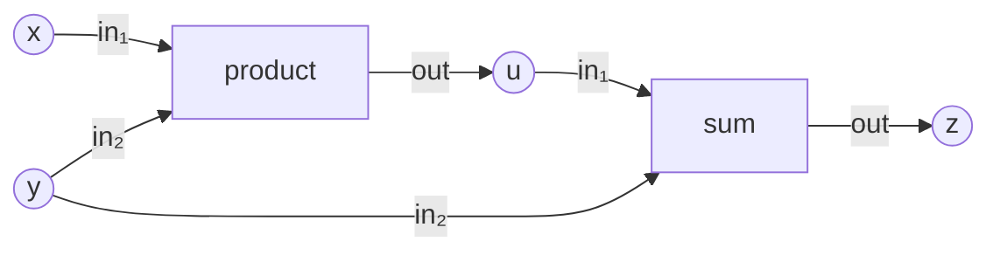
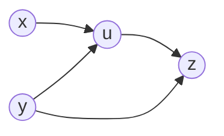

# Derivative Action Tower

The lowest-energy **derivative orbital client** of the core-math nucleus.
One persistent computation is used as the specimen for the entire future
tower:

\[
\boxed{u=xy,\qquad z=u+y}
\]

which, after constitution (a later gate), will mean \(z=xy+y\) at the base
point \(x=2,\ y=3\) — eventually \(u=6,\ z=9\). **Gate A computes neither.**

The tower's founding separation is:

\[
\boxed{\text{dependency structure}\neq\text{derivative action}}
\]

Gate A asks only:

> Can the existing relational substrate describe the complete STRUCTURE on
> which tangent and reverse derivative actions will later travel?

It stops deliberately before numerical differentiation. No derivative
value, seed, rule, or traversal exists anywhere in Gate A.

**Gate B** then asks:

> Can numerical **tangent** and **reverse** actions travel over the same
> constituted computation structure?

Its targets are the operators \(v\mapsto Jv\) and
\(\bar z\mapsto J^T\bar z\), sealed by the global duality law

\[
\boxed{\langle\bar z,Jv\rangle_Z=\langle J^T\bar z,v\rangle_X}
\]

with no adjoint solve, no minimization, and no Jacobian assembly.

**Gate C** asks the last question — what complete differentiation
problem is being asked — and answers it with a **field**, not a scalar:

\[
\boxed{Dz^T(1)=[3,3]\ \text{on}\ X=\{y,x\}},
\qquad
\text{with } z=9 \text{ beside it}.
\]

All three gates closed with

\[
\boxed{\text{production changes}=\text{NONE}}
\]

```text
Gate A   structural Levels 0–6 .......... PASS
Gate B   numerical derivative action .... PASS   (Level 8)
Gate C   derivative statement ........... PASS   (Level 9)
```

The tower is complete. Its certified path skips one nucleus level on
purpose:

\[
0\rightarrow1\rightarrow2\rightarrow3\rightarrow4\rightarrow5
\rightarrow6\rightarrow(7)\rightarrow8\rightarrow9
\]

— see [Level 7](#level-7--minimization-na-for-this-orbit).

---

## Why this specimen, and not z = xy

The direct product \(z=xy\) is too weak. In

\[
u=xy,\qquad z=u+y,
\]

the input \(y\) reaches the response \(z\) along **two structural
routes**:

```text
y ────────────────> z
 \
  └──> u ─────────> z
```

while \(x\) reaches \(z\) only through \(u\):

```text
x ──> u ──> z
```

This is the smallest example where future reverse propagation must
**accumulate** contributions at one input. Gate A exposes the topology
that will make that accumulation necessary later — without performing it.
The load-bearing consequence is the
[support-is-not-multiplicity](#support-is-not-multiplicity) observation.

---

## The ladder at a glance

| Level | Meaning | Core truth |
|---|---|---|
| 0 | carriers | \(V,O,P\) distinct symbolic domains |
| 1 | relation | ternary \(T_{\mathrm{flow}}\), six tuples, y consumed twice |
| 2 | relation algebra | \(D=\{(\mathrm{product},\mathrm{sum})\}\) **derived** |
| 3 | relational graph | one owned structure \(\Gamma=(\mathcal S,\mathcal P)\) |
| 4 | graph calculus | directed interpretation; walk \([\mathrm{product},\mathrm{sum}]\) |
| 5 | field calculus | base point on \(X\); computed \(C\) valueless; **no seeds** |
| 6 | derivative structure | \(A_V\), two-path truth, \(J_{ZX}=\{(z,x),(z,y)\}\), transpose view |
| 7 | minimization | **N/A — not inhabited** by this orbit as constituted |
| 8 | derivative constitution | primal laws + one local linearization; \(Jv\), \(J^T\bar z\), duality |
| 9 | statement | the whole question asked once; answer \([3,3]\) on \(X\) |

---

# The persistent structural object

```text
value slots V             operations O           ports P

x    y    u    z          product   sum          in₁  in₂  out
│    │
2    3                    base values appear at Level 5;
                          laws never appear in Gate A
```

The symbolic carriers are

\[
V=\{x,y,u,z\},
\qquad
O=\{\mathrm{product},\mathrm{sum}\},
\qquad
P=\{in_1,in_2,out\},
\]

and the structural relation is exactly

\[
T_{\mathrm{flow}}\subseteq O\times V\times P
\]

with six tuples:

\[
\begin{aligned}
(\mathrm{product},x,in_1),\qquad
&(\mathrm{product},y,in_2),\qquad
(\mathrm{product},u,out),\\
(\mathrm{sum},u,in_1),\qquad
&(\mathrm{sum},y,in_2),\qquad
(\mathrm{sum},z,out).
\end{aligned}
\]



> The diagram is only a visual interpretation of the ternary relation.
> The underlying object is not initially an ordinary graph, and below
> constitution `product` and `sum` are only members of \(O\).

At Level 5 the value carrier partitions into roles:

\[
V=X\;\dot\cup\;C,
\qquad
X=\{y,x\},
\qquad
C=\{u,z\},
\]

```text
V
├── X       independent inputs
│   ├── y = 3
│   └── x = 2
│
└── C       computed
    ├── u       no value yet
    └── z       no value yet
```

and at Level 6 the response is carved from the computed slots:

\[
Z=\{z\}\hookrightarrow C\hookrightarrow V.
\]

## When meaning enters (and when it does not)

```text
Levels 0–4        STRUCTURE ONLY — product/sum are symbols
Level 5           BASE VALUES — x=2, y=3; u/z uncomputed; NO seeds
Level 6           DEPENDENCY STRUCTURE — who can influence whom;
                  no derivative values
Level 7           N/A — this orbit does not inhabit minimization
Level 8 (Gate B)  CONSTITUTION + ACTION — product multiplies, sum
                  adds, each operation owes one local linearization;
                  Jv forward, J^T z̄ backward, duality sealed
Level 9 (Gate C)  THE STATEMENT — one question, selecting everything
                  below; the answer is a derivative field on X
```

---

# Level 0 — Carriers

**Capability.** What symbolic kinds of members may exist?

**Commitment.** Three independent `counted_set` declarations —
\(|V|=4\), \(|O|=2\), \(|P|=3\). The member constants
(`SLOT_X = 1`, …, in `common/derivative_assert.f90`) are enumeration
handles, not semantics.

**Verification.** Cardinalities; distinct identities by `same_as`; both
enumeration round trips,
\(\operatorname{member}(\operatorname{local\_index}(m))=m\) and
\(\operatorname{local\_index}(\operatorname{member}(i))=i\), on every
member; outsider rejection.

**Negative truth.**

```text
no relation      no graph        no field
no derivative    no tangent      no cotangent
no numerical law
```

**What this proves.** Nothing about a *derivative* application required a
new Level-0 ontology: the ordinary carriers suffice (Observation DA-0).

---

# Level 1 — Relation

**Capability.** How is the symbolic computation structurally wired?

**Commitment.** The six-tuple ternary \(T_{\mathrm{flow}}\), built via
`stored_relation('flow', [o, v, p], table)` — handed seven tuples with
one duplicate, holding six: a relation is a set. Signature answered by
identity, slot by slot. Not reduced to an ordinary graph: the three-way
fact *operation–slot–port* is the point.

**The wiring fact this specimen was chosen for**, stated as plain
structure:

```text
y is consumed TWICE  — (product, y, in₂) and (sum, y, in₂)
x is consumed once   — by product alone
```

**Verification.** Arity, identity-checked signature, exact six-member
extension, the fan-out truth, and meaningful absences — no operation
consumes its own output, \(z\) feeds nothing, a wrong-length tuple
belongs to nothing.

**Negative truth.** Derivative potential is completely **latent**:
\(T_{\mathrm{flow}}\) contains computation structure, not derivative
metadata, and looks exactly like ordinary computation structure because
it is ordinary computation structure (Observation DA-1).

---

# Level 2 — Relation algebra

**Capability.** What operation depends on what operation?

**Commitment.** The derived dependency

\[
\boxed{D=\{(\mathrm{product},\mathrm{sum})\}}\subseteq O\times O,
\]

earned — never written — through the certified road
(`src/relation_algebra.f90`):

```text
T_out3   = restrict_slot(T_flow, 3, {out})       two tuples
T_in3    = restrict_slot(T_flow, 3, {in₁,in₂})   four tuples

produces = project_slots(T_out3, [1,2]) ⊆ O×V    {(product,u),(sum,z)}
consumes = project_slots(T_in3,  [2,1]) ⊆ V×O    {(x,product),(y,product),
                                                  (u,sum),(y,sum)}

D = compose_binary(produces, consumes)           consumes ∘ produces
```

using the repository's composition orientation
\(\texttt{compose\_binary}(R_{AB},R_{BC})=R_{BC}\circ R_{AB}\). The
witness: `product` produces \(u\) and `sum` consumes it. Note `consumes`
carries \(y\) twice — once toward each operation.

**Verification.** Restrictions and projections pinned by extension with
identity-checked domains; all four \(O\times O\) memberships pinned
(\((\mathrm{product},\mathrm{sum})\) present, the other three absent);
tuple-order invariance — the six facts handed backwards derive the same
\(D\), equal as sets in both directions.

**What this proves.** Operation dependency is generic relation algebra;
nothing derivative-specific has appeared (Observation DA-2).

---

# Level 3 — Relational graph

**Capability.** Can the symbolic derivative specimen live as one owned
relational structure?

**Commitment.**

\[
\Gamma=(\mathcal S,\mathcal P),
\qquad
\mathcal S=\{V,O,P\},
\qquad
\mathcal P=\{T_{\mathrm{flow}},D\},
\]

with \(D\) rederived before admission — the container infers nothing.

**Verification.** Three carriers and two relations owned by identity
(`holds_set`, and relation ownership composed locally from
`num_relations` / `relation_at` / `same_as`); the ternary flow survives
ownership unchanged (arity 3, six tuples); the dependency survives
(binary, one pair); signature closure — every relation slot resolves to
an owned carrier; graph identity — no identically stocked twin is \(\Gamma\).

**What ownership contributes here** (Observation DA-3): structural
closure and identity — no more. No tangent seat, no adjoint seat, no
derivative metadata was asked of the container, and no ordinary-graph
profile is imported to build it.

---

# Level 4 — Graph calculus

**Capability.** When the operation relation is interpreted directionally,
what execution structure appears?

**Commitment.** None structurally — the rung is an explicit
interpretation choice:

```text
graph-owned D
    ↓ directed_adjacency_view(g, d)
graph_algorithms: sources / sinks / reachable / topological_order
```

**Verification.**

```text
view domain               = O (nothing invented)
sources                   = {product}
sinks                     = {sum}
reachable(product, sum)   = true
reachable(sum, product)   = false
reachable(op, op)         = true   (zero-length path)
topological order         = [product, sum], exactly
```

**Negative truth** (Observation DA-4). Three concepts stay three:

\[
\boxed{\text{dependency relation}
\neq\text{directed interpretation}
\neq\text{derivative traversal}}
\]

This walk is computation order and nothing more. No tangent rides it; no
cotangent rides it backward; *forward mode* and *reverse mode* attach to
nothing at Gate A.

---

# Level 5 — Field calculus

**Capability.** What primal values exist, and which slots are computed
rather than seeded?

**Commitment.** The role partition and the base point:

\[
X=\{y,x\}\hookrightarrow V,
\qquad
C=\{u,z\}\hookrightarrow V,
\qquad
V=X\;\dot\cup\;C,
\]

\[
q_X:X\to\mathbb R,
\qquad
q_X=[3,2]
\quad\text{because the enumeration is } \{y,x\}.
\]

Declaration order is deliberately nonsemantic; storage follows domain
enumeration (\(y\)'s value stands first), and every read walks
`local_index`:

\[
q_X(y)=3,\qquad q_X(x)=2.
\]

Disjointness and coverage are proved together by the one-home law — for
every member of \(V\), `count([X.has(m), C.has(m)]) = 1`.

**Negative truths.**

\[
\boxed{\text{NO FIELD ON }C}
\]

\(u\) and \(z\) are not zero — they are **uncomputed**; no zero, NaN, or
sentinel pretends otherwise. And Gate A's own additions:

```text
NO tangent field        NO cotangent field
NO derivative seed      NO derivative value
```

Primal state uses the ordinary `field` on an ordinary domain — derivative
vectors have not yet earned a separate type, and no `tangent_field`,
`adjoint_field`, or `dual_field` was invented (Observation DA-5).

---

# Level 6 — Derivative structure

The Gate-A load-bearing level.

**Capability.** Before differentiating anything numerically, which
independent inputs can structurally influence the response?

## The response is a subdomain — no location relation

\[
Z=\{z\}\hookrightarrow C\hookrightarrow V.
\]

This is deliberately different from Learning. Learning required a
distinct residual-row carrier \(Y\) plus a location relation
\(L=\{(r,e)\}\) **because residual rows were not value slots**. Here the
response already *is* a value slot, so no location relation is invented
for symmetry's sake. The difference is architectural evidence
(Observation DA-6D): location relations are contextual, not universal.

## Direct value dependency

From \(T_{\mathrm{flow}}\), the same two participations as Level 2 —
\(I\subseteq V\times O\) (consumed) and \(Q\subseteq O\times V\)
(produced) — composed in the other order:

\[
A_V=Q\circ I=\texttt{compose\_binary}(I,Q)\subseteq V\times V,
\]

with the exact extension

\[
\boxed{A_V=\{(x,u),(y,u),(u,z),(y,z)\}}.
\]



Nothing is hard-coded in the construction; assertions alone name the
expected pairs.

## The two-path truth

Structurally required:

```text
(y,z) ∈ A_V          y → z is DIRECT
(y,u), (u,z) ∈ A_V   and y → u → z stands beside it

(x,z) ∉ A_V          x touches z in neither direction
reachable(x,z)       yet x reaches z — transitively, through u
```

\(y\) reaches \(z\) twice; \(x\) reaches it once, indirectly. This is
the first derivative-tower topology that future reverse numerical
propagation must respect. No path-count API was added — the existing
structural facts suffice.

## Structural Jacobian pattern

\(A_V\) is admitted to a small relational graph holding \(V\) and
interpreted as a directed value dependency. Then \(J_{ZX}\subseteq
Z\times X\) is **generated** by scanning response members against
independent-input members:

\[
(z_i,x_j)\in J_{ZX}
\iff
x_j\leadsto z_i,
\]

yielding

\[
\boxed{J_{ZX}=\{(z,x),(z,y)\}}
\]

materialized once as a `csr_relation` over \((Z,X)\)
(`src/relation_binary.f90`). This is a structural Jacobian
**pattern** only — there is still no
\(\partial z/\partial x\) and no \(\partial z/\partial y\).

## Reverse structure

\[
J_{XZ}=J_{ZX}^{T}=\texttt{transpose\_of}(J_{ZX})
=\{(x,z),(y,z)\},
\]

a **borrowing, non-materialized view** of the same stored truth —
`materialized()` answers false on the view and true on the forward. No
second reverse pattern is stored; nothing is called a backprop graph;
no reverse numerical propagation occurs (Observation DA-6B).

## Support is not multiplicity

The pinned Gate-A observation (DA-6C), asserted in the test itself:

```text
J_ZX holds (z,y) ONCE        — a relation is a set
A_V holds TWO y-routes to z  — (y,z) direct, and (y,u)+(u,z)
```

\[
\boxed{\text{Jacobian sparsity/support does not encode contribution
multiplicity}}
\]

This is not a bug. It says that when Gate B earns numerical reverse
accumulation, that accumulation must operate over the computational
dependency/evaluation structure — it cannot merely scan the final
\(J\)-pattern and infer path contributions. Support says **who**
matters; the evaluation structure says **why and how often**.

## Verification

Exact extensions of \(I\), \(Q\), \(A_V\), \(J_{ZX}\), and the reverse
view, with identity-checked domains throughout; the two-path truths;
nothing flowing back out of the response; the support-vs-multiplicity
pins; and tuple-order invariance — the six facts handed backwards derive
the same \(A_V\), the same \(J_{ZX}\), and an identically answering
transpose view, equal as sets in both directions.

## What Level 6 does NOT contain

```text
product/sum derivatives        du, dz
dx/dy seeds                    bar_z, bar_u, bar_x, bar_y
Jv, J^T v                      chain rule, product rule
reverse accumulation           finite difference, complex step
automatic differentiation      gradient, adjoint solve
backpropagation                linearization operators
graph_pipeline                 GMRES, minimization
```

---

# Level 7 — Minimization: N/A for this orbit

Nucleus Level 7 — minimization — is **not inhabited** by the derivative
action orbit as currently constituted. Computing \(Jv\) and
\(J^T\bar z\) requires no residual to be driven to zero, nothing to
vary, and no solver.

There is deliberately **no** `level-7-minimization/` directory and no
empty placeholder test: that would confuse the map with the territory.
The runner prints the truth instead:

```text
level 7  minimization ............ N/A - not inhabited
```

This is the first experiment showing that **nucleus levels are available
radial contracts, not a compulsory application pipeline**. It means only
that this orbit, at this gate, does not need the minimization contract.
It does **not** mean minimization is globally unnecessary — a future
adjoint-solve or optimization orbit will inhabit it naturally
(Observation DA-7).

---

# Level 8 — Derivative constitution and numerical action

Gate B. The load-bearing question:

> Can numerical tangent and reverse actions travel over the same
> constituted computation structure?

## Primal constitution first

Only here do the symbols mean something, bound test-locally
(`level-8-derivative-constitution/derivative_constitution_fixture.f90`):

\[
\mathrm{product}(a,b)=ab,
\qquad
\mathrm{sum}(a,b)=a+b.
\]

The law table knows operation symbols and numbers — never `x`, `y`,
`u`, `z`, never a graph slot. Execution order is re-derived through the
certified road (\(T_{\mathrm{flow}}\to D\to\) graph \(\to\) view \(\to\)
`topological_order`), every operation's `in1`/`in2`/`out` is discovered
from \(T_{\mathrm{flow}}\) by uniqueness scan, and the primal executes
into the computed slots with availability flags (never zero-as-absent):

\[
u=6,\qquad z=9
\quad\text{at the base } x=2,\ y=3.
\]

## One local linearization, two actions

Each operation owes constitution exactly one more thing — its **local
linear shadow** at the primal inputs, a row of **port-relative**
coefficients:

\[
L_{\mathrm{product}}(a,b)=[\,b,\ a\,],
\qquad
L_{\mathrm{sum}}(a,b)=[\,1,\ 1\,].
\]

The Gate-B load-bearing design:

\[
\boxed{\text{one local linearization}
\rightarrow
\text{forward action and transpose action}}
\]

**Tangent** (forward, along the derived order):

\[
\dot q_{out}=L_o
\begin{bmatrix}\dot q_{in_1}\\ \dot q_{in_2}\end{bmatrix}.
\]

**Reverse** (backward, along the same order reversed):

\[
\begin{bmatrix}\bar q_{in_1}\\ \bar q_{in_2}\end{bmatrix}
\mathrel{+}= L_o^T\,\bar q_{out}.
\]

There is **no separate reverse derivative formula anywhere** — the
transpose action reads the same coefficients — and the local pairing
\(\langle\bar o,L_o v\rangle=\langle L_o^T\bar o,v\rangle\) is pinned
per operation at a nonsymmetric point.

## Incidence, not paths

The `+=` is architecturally essential. Numerical action occurs **per
operation/input-port incidence**: an operation is visited once, each
input port applies its local contribution, and contributions landing on
the same value slot **accumulate**. No path is ever enumerated. This
stays valid even for \(f(x,x)\), where both port incidences of one
operation land on one slot (Observation DA-8D).

The reverse accumulator starts at zero because zero is addition's
identity — the lawful start of an accumulator, not a sentinel (the
primal keeps separate availability flags).

Accumulation is **certified, not assumed**: a generic incidence counter
(naming no slot) shows \(y\) received exactly two contributions —
`sum.in2` and `product.in2` — while \(x\) and \(u\) received one each
and the response none.

## Seeds and results are ordinary fields

Testing DA-5's hypothesis: the tangent seed \(v_X\) is an ordinary
`field` on \(X\), the result \(Jv\) an ordinary field on \(Z\), the
reverse seed \(\bar z\) a field on \(Z\), the result \(J^T\bar z\) a
field on \(X\). No `tangent_field`, `cotangent_field`, or dual-number
type was needed (Observation DA-8C).

## The certified numbers

Primary base \(x=2,\ y=3\) (so \(u=6,\ z=9\)), seed
\(\dot y=-1,\ \dot x=4\):

\[
\dot u=3(4)+2(-1)=10,
\qquad
\boxed{Jv=\dot z=\dot u+\dot y=9}.
\]

Reverse seed \(\bar z=2\): through `sum`, \(\bar u=2,\ \bar y=2\);
through `product`, \(\bar x=3(2)=6,\ \bar y=2+2(2)=6\):

\[
\boxed{J^T\bar z=[6,6]\ \text{on } X=\{y,x\}}.
\]

Duality: \(\langle 2,9\rangle=18=[6,6]\cdot[-1,4]\).

**Secondary asymmetric base** \(x=4,\ y=2\) (where
\(\partial z/\partial x=2\neq 5=\partial z/\partial y\), so slot swaps
cannot hide): \(u=8,\ z=10\); seed \((\dot y,\dot x)=(5,-3)\) gives
\(\dot u=14,\ Jv=19\); reverse \(\bar z=-2\) gives
\(J^T\bar z=[-10,-4]\); duality \((-2)(19)=-38=[-10,-4]\cdot[5,-3]\).
Unit probes: \(\dot x=1\Rightarrow Jv=2\); \(\dot y=1\Rightarrow Jv=5\);
\(\bar z=1\Rightarrow J^T\bar z=[5,2]\) — the gradient row from one
backward pass. Same flow, same order, same laws, same evaluators; and
the whole set repeats under reversed tuple declarations.

## No full Jacobian

Gate B proves the **operators** \(v\mapsto Jv\) and
\(\bar z\mapsto J^T\bar z\). No matrix, dense or sparse, is assembled.
The structural \(J_{ZX}\) remains support only.

## What role does structural J play now?

Answered by construction, not assumption: the evaluators' signatures
take \(T_{\mathrm{flow}}\), the derived order, primal values, domains,
and the law table — **neither \(J_{ZX}\) nor its transpose is an
input**. The test separately re-derives reachability and confirms the
support agrees with where the action's incidence landed:

```text
numerical action     T_flow + order + primal + local linearizations
J_ZX / J_XZ          support/sparsity metadata — WHO can matter
incidence traversal  the action itself — HOW MUCH, and HOW OFTEN
```

\[
\boxed{\text{support and action are complementary views of
differentiation}}
\]

(Observation DA-8E.)

## Refusals

```text
unbound-law          a symbol no law binds cannot be evaluated
missing-port         an operation without exactly one slot on a
                     required port cannot be differentiated
primal-starvation    a law cannot run before its primal inputs exist
tangent-starvation   a tangent cannot be read before it is established
```

---

# Level 9 — The statement

Gate C. The last question:

> What complete differentiation problem is being asked?

## The statement

> Given the relational computation \(u=\mathrm{product}(x,y)\),
> \(z=\mathrm{sum}(u,y)\), constituted by \(\mathrm{product}(a,b)=ab\)
> and \(\mathrm{sum}(a,b)=a+b\), evaluate the primal and the derivative
> of the response \(z\) at \(x=2,\ y=3\).

It **selects** — it invents nothing:

```text
structure       T_flow, owned by GAMMA; D derived; order derived
base point      x = 2, y = 3 on X = {y,x}
constitution    the Level-8 laws and the ONE local linearization,
                reused, never redone
response        Z = {z}, a subdomain — no location relation
requested       the derivative of z with respect to X
```

Level 9 adds **no numerical law**: it imports `primal_execution`,
`tangent_action` and `reverse_action` from the Gate-B fixture and
composes them. There is no adapter — nothing here must satisfy a
legacy operation face, so none was written.

## The complete road

```text
T_flow
    ↓ derive
D
    ↓ owned by GAMMA, interpreted, sorted
execution order
    ↓ Level-8 primal constitution
z = 9
    ↓ the same Level-8 local linearization
    ├── tangent action  →  Jv
    └── reverse action  →  J^T z̄
    ↓
the derivative statement
```

## Graph ownership, proved by lifetime

The statement owns one relational model graph. It locates its flow
relation **inside** \(\Gamma\) by identity (`relation_at(k) % same_as`),
then destroys the external selector:

```text
external flow selector
        ↓ used to identify the graph-owned T_flow
graph-owned relation retained (a pointer into GAMMA)
        ↓
deallocate(flow)          the selector dies
        ↓
primal + both actions + duality still succeed
```

The dependency selector dies too, right after the directed view is
made — so even the execution order is read from graph-owned structure.
No `holds_relation` convenience was added; the ownership question is
composed from `num_relations` / `relation_at` / `same_as`, as
everywhere else in the repository.

\[
\boxed{\text{the final statement evaluates graph-owned structure,
not a temporary selector}}
\]

This is where the graph's role **changes with radius**: at Gate B no
evaluator takes a graph argument at all; at Gate C the graph is what
lets the model outlive the temporaries that built it
(Observations DA-8F, DA-9A).

## The answer is a field

The primary result is obtained by **one** reverse traversal with
\(\bar z=1\), returned as an ordinary `field` on \(X\):

\[
\boxed{Dz^T(1)=[3,3]\quad\text{on }X=\{y,x\}}
\]

read through `local_index`: \(\partial z/\partial y=3\) (\(=x+1\)),
\(\partial z/\partial x=3\) (\(=y\)). The primal \(z=9\) stands beside
it as a secondary truth.

Certified forward, one action per seed — no matrix assembled:

```text
y-basis seed [1,0]  →  J e_y = 3
x-basis seed [0,1]  →  J e_x = 3
```

each agreeing with the component the single reverse pass returned. For
this specimen one reverse traversal delivered the complete row while
forward mode needed one action per direction — stated as a fact about
this specimen, not as a complexity claim.

The returned field then **acts**: on \(v=[-1,4]\) the tangent action
answers \(Jv=9\), and the derivative field paired with the same \(v\)
answers 9 — it is the derivative linear functional. And the pairing
closes through the whole statement path:

\[
\langle 2,\,9\rangle_Z=18=\langle[6,6],[-1,4]\rangle_X.
\]

The asymmetric anti-hardcode witness (\(x=4,y=2\Rightarrow[5,2]\))
lives at [Level 8](#level-8--derivative-constitution-and-numerical-action)
and is not duplicated here: Level 9's job is composition, not
re-certifying every local numerical fact.

## The result marker

The tower's answer is a **real-valued vector**, so its marker is too —
exactly one line, serializing the computed field's own entries in
\(X\)'s enumeration order, at full round-trip precision:

```text
DERIVATIVE_RESULT =  3.0000000000000000E+00  3.0000000000000000E+00
```

No integer conversion exists anywhere on this path: the marker carries
the actual real field, not a rounded image of it. A derivative of
\(2.5\) would be reported as \(2.5\).

The contract lives in `check_marker.sh` and is self-tested before the
ladder runs. It requires exactly one marker carrying one **real
numeric token** per member of the independent domain — decimals,
leading/trailing points, and `e`/`E`/`d`/`D` exponents all admitted —
and it validates **shape and syntax only**, never values. The runner
then prints the tokens as the statement wrote them:

```text
└── derivative on X={y,x} ........... [3.0000000000000000E+00, 3.0000000000000000E+00]
```

No separate marker is emitted for \(z=9\); the primal remains an
asserted secondary truth.

## Tower results are heterogeneous, on purpose

```text
Calculator result:        scalar value        20
Learning result:          field component     w = 3
Derivative Action result: real derivative field  [3.0, 3.0] on X
```

Heterogeneity runs along **two** axes — shape *and* scalar type. The
earlier towers' markers are integral because their mathematics is, not
because markers are integral; borrowing their `nint()` for a derivative
would round the answer. No tower is contorted into another's output
shape or type (Observation DA-9B).

---

# Forward vs reverse structure

```text
forward                          reverse (transpose view)

    x ──> u ──┐                     z ──> x
    y ──> u   ├──> z                z ──> y
    y ────────┘
```

The forward pattern is \(J_{ZX}\); the reverse is its transpose view.

> This is reverse **dependency structure**, not reverse-mode
> differentiation.

Gate B must earn numerical \(Jv\) and \(J^T\bar y\) actions on top of
exactly this structural duality — and, per the support-vs-multiplicity
observation, over structure finer than the \(J\)-pattern alone.

---

# What the tower proves / does not prove

## Proven by Gate A

```text
a derivative specimen needs no new carrier ontology
derivative potential is latent in ordinary structural flow
operation dependency is generic relation algebra
the specimen lives as one owned relational structure
directed interpretation is explicit, and is not derivative traversal
primal base values use ordinary fields; computed slots stay valueless
the structural Jacobian pattern is derivable before any derivative exists
reverse support is one transpose view
support does not encode path multiplicity
```

## Proven by Gate B

```text
numerical tangent action Jv over the constituted structure
numerical reverse action J^T z̄ over the same structure, reversed
one local linearization serves both actions — no reverse formula
reverse accumulation is incidence-local +=, certified by event count
the global duality <z̄, Jv> = <J^T z̄, v>, at two bases, under unit
    seeds, and under reversed tuple order
derivative seeds/results are ordinary fields on ordinary domains
the structural J-pattern is support metadata, not the propagation
    itinerary
```

## Proven by Gate C

```text
one statement selects every truth below without collapsing them
the statement evaluates graph-owned structure, its selectors dead
a complete derivative statement returns a GRADIENT FIELD on its
    independent domain — not a scalar, not a matrix
the returned field acts as the derivative linear functional
one nucleus level may be legitimately uninhabited, and the tower
    still completes
all of it, with zero production changes
```

## Not proven — deliberately

```text
implicit-system adjoint          adjoint equation, adjoint solve
parameter sensitivity of an implicit residual
objective-functional adjoint     PDE adjoint, time-dependent adjoint
checkpointing                    automatic differentiation
finite-difference differentiation
complex-step differentiation
higher derivatives               Hessian-vector products
general n-ary derivative constitution
branching / control-flow differentiation
distributed derivative traversal
full Jacobian assembly (dense or sparse)
```

Most importantly:

\[
\boxed{\text{reverse derivative action}\neq\text{the adjoint method}}
\]

A reverse traversal of an explicit computation is not the solution of
an adjoint equation. The next orbit — the **Adjoint Tower** — must earn
that distinction; nothing here anticipates it.

---

# The gate mechanisms

- **`run.sh`** — the frontier law, third client: first absent rung
  closes the frontier (`ABSENT`/`BLOCKED`), a genuine failure stops the
  ladder (`FAIL`/`SKIPPED`, nonzero exit). Level 7 prints `N/A — not
  inhabited` and the frontier passes over it deliberately. After a full
  ladder the runner reads the derivative — fail closed — from Level 9's
  own output.

- **`check_marker.sh`** — the result contract, in one place: exactly
  one `DERIVATIVE_RESULT` marker, one finite **real** numeric token per
  member of the independent domain. `--selftest` runs it against a
  table of accepted forms (`3 3`, `2.5 -1.25`, `.5 2.`, `3e-4
  -2.5E+03`, `3.0D+00 -1.0D-02`) and refused ones (too narrow, too
  wide, non-numeric, no marker, two markers) before the ladder starts,
  so the shared grammar is proven, not assumed. The runner uses that
  same function on the real output — shape and syntax only, never
  values.

- **`check_imports.sh`** — the fail-closed import gate. Every source may
  `use` only its level's allowlist; a directory with sources but no
  allowlist fails. Forbidden everywhere at Gate A:
  `graph_minimization`, `class_graph_gmres`, and any legacy
  tangent/adjoint or linearization machinery.

`doc/derivative-walks-plan.md` (2026-08-02) is historical design
intuition only: no `class_graph_pipeline`, no vertex-stage ontology, and
no numerical walks exist in this tower. The relation-centered nucleus
had first right of refusal — and at Gate A it refused nothing.

---

# Code map

| Level | Test directory | Principal modules exercised (per the import gate) |
|---|---|---|
| 0 | `level-0-carrier/` | `graph_carrier` |
| 1 | `level-1-relation/` | + `relation_finitary` |
| 2 | `level-2-relation-algebra/` | + `relation_algebra` (D held as `class(relation)`) |
| 3 | `level-3-graph/` | + `graph_structure` |
| 4 | `level-4-graph-calculus/` | + `graph_profile`, `graph_algorithms` |
| 5 | `level-5-field-calculus/` | `graph_carrier`, `class_graph_field` — the smallest allowlist above ground |
| 6 | `level-6-derivative-structure/` | + `relation_binary` (`csr_relation`, `transpose_of` earned), `graph_structure`, `graph_profile`, `graph_algorithms` |
| 8 | `level-8-derivative-constitution/` | carriers/relations/algebra/structure/profile/algorithms + `class_graph_field` + `derivative_constitution_fixture` (own file; refusal suite); **no** binary storage, no solver |
| 9 | `level-9-statement/` | the same set, reusing the Level-8 fixture — no adapter, no new law, and `graph_minimization` / `class_graph_gmres` forbidden |

Every level also imports `derivative_assert`
(`common/derivative_assert.f90`) — dependency-free constants and
assertion helpers, deliberately neither `calculator_assert` nor
`learning_assert`: this is an independent third client sharing no
fixture with the first two.

```text
test/derivative-action-tower/
├── README.md                       this document
├── NUCLEUS-OBSERVATIONS.md         the live evidence ledger
├── run.sh                          frontier-law runner, fail-closed marker
├── check_imports.sh                fail-closed per-level allowlists
├── check_marker.sh                 the result contract + its self-test
├── common/
│   └── derivative_assert.f90
├── level-0-carrier/                test.f90
├── level-1-relation/               test.f90
├── level-2-relation-algebra/       test.f90
├── level-3-graph/                  test.f90
├── level-4-graph-calculus/         test.f90
├── level-5-field-calculus/         test.f90
├── level-6-derivative-structure/   test.f90
├── level-8-derivative-constitution/
│                                   derivative_constitution_fixture.f90
│                                   · test.f90 · refusal.f90
│                                   · check_refusals.sh
└── level-9-statement/              test.f90   (reuses the L8 fixture)
```

There is deliberately no `level-7-minimization/` directory — see
[Level 7](#level-7--minimization-na-for-this-orbit). Gates A and C carry
no refusal executables (every candidate would duplicate a law already
pinned below, or by the calculator, learning, or generic suites); Gate B
carries four derivative-specific refusals of its own.

---

# Architectural context

This tower is one **orbital client** of the core-math nucleus — see
[Fractal Graph Architecture](../../FRACTAL-GRAPH-ARCHITECTURE.md) — the
first of the **derivative orbital family**, developed in forward
architectural mode: smallest meaningful application, one new truth per
level, reuse over speculation, every friction recorded rather than
fixed.

Observations feed the reverse-mode evidence ledger in
[`NUCLEUS-OBSERVATIONS.md`](NUCLEUS-OBSERVATIONS.md); they are not
automatically promoted into production abstractions. The calculator and
learning towers remain sealed acceptance oracles alongside this one.

---

# Status

```text
derivative action tower
├── level 0  carriers ................ PASS
├── level 1  relation ................ PASS
├── level 2  relation algebra ........ PASS
├── level 3  relational graph ........ PASS
├── level 4  graph calculus .......... PASS
├── level 5  field calculus .......... PASS
├── level 6  derivative structure .... PASS
├── level 7  minimization ............ N/A - not inhabited
├── level 8  derivative action ....... PASS
├── level 9  statement ............... PASS
├── Gate A  structure ................ PASS
├── Gate B  numerical duality ........ PASS
├── Gate C  statement ................ PASS
└── derivative on X={y,x} ........... [3.0000000000000000E+00, 3.0000000000000000E+00]
```

**Complete.** The tower's result is the real derivative field
\([3,3]\) on \(X=\{y,x\}\) — serialized unrounded, as the field
stands — with \(z=9\) beside it, and Level 7 deliberately
uninhabited.

Gate A's central truth — the \(J\)-support says \(y\) matters once
while the computation says why and how it matters, twice — became Gate
B's central mechanism: one local linearization per operation, applied
per operation/input-port incidence, accumulating with `+=` where
incidences share a slot, sealed by

\[
\boxed{\langle\bar z,Jv\rangle_Z=\langle J^T\bar z,v\rangle_X}
\]

at two base points, under unit seeds, and under reversed tuple order.
Gate C then asked the whole question once, on graph-owned structure
whose selectors had already been destroyed, and answered with a field.
Three gates, ten rungs minus one, **zero production changes**.

The next orbit is the **Adjoint Tower**, which must earn what this one
deliberately did not claim: that reverse derivative action is not yet
the adjoint method.
