# Learning Tower

A single supervised-learning problem is used as a vertical demonstration of
the entire framework:

\[
\boxed{(x,y)=(2,6),\qquad \hat y = wx,\qquad w_0=0
\quad\Longrightarrow\quad w=3}
\]

Every level exposes a different capability of the framework, but every level
belongs to the same learning problem and ultimately preserves the same truth.

```text
PRIMARY tower result:
    learned parameter w = 3

SECONDARY proof:
    learned state can later be reused:
    x* = 4  ->  yhat* = 12
```

The inference `12` is not the tower's result. It is the first small proof
that learned state outlives training.

---

## Why a second vertical client

The calculator tower asked:

> can the core-math nucleus **compute**?

The learning tower asks:

> can the **same** nucleus **fit a parameter**?

The key result is not merely `w = 3`. It is that a materially different
vertical application inhabited the same lower mathematical substrate — the
carriers, relations, relation algebra, relational graph, views, algorithms,
fields, and minimizer that the calculator had already forced into
existence — and closed with

\[
\boxed{\text{production changes} = \text{NONE}}
\]

across the entire learning-tower experiment. No ML-specific production type
exists: no model, no layer, no tensor, no loss, no optimizer, no dataset.
Everything learning-specific lives in the tower's own test-local fixtures.

This does **not** prove the framework does arbitrary machine learning. What
it does and does not prove is stated precisely in
[What the tower proves / does not prove](#what-the-tower-proves--does-not-prove).

---

## The ladder at a glance

| Level | Learning meaning | Core truth |
|---|---|---|
| 0 | carriers | \(V,O,P\) distinct symbolic domains |
| 1 | structural flow | ternary \(T_{\mathrm{flow}}\subseteq O\times V\times P\), six tuples |
| 2 | relation algebra | \(D=\{(\mathrm{predict},\mathrm{error})\}\) **derived** |
| 3 | relational graph | one owned structure \(\Gamma=(\mathcal S,\mathcal P)\) |
| 4 | graph calculus | directed interpretation; walk \([\mathrm{predict},\mathrm{error}]\) |
| 5 | field calculus | observed / trainable / computed **roles by domain** |
| 6 | discretization | structural parameter→residual dependency \(J_\Theta=\{(r,w)\}\) |
| 7 | minimization | a supplied opaque residual can fit \(w\) |
| 8 | constitution | `predict` becomes \(\cdot\), `error` becomes \(-\); residual **generated** |
| 9 | statement | constituted model is trained; inference reuses learned state |

This table is only the summary. Each row is explained fully below.

---

# The persistent learning object

The tower must not create a new example at every level. The same objects
remain visible from bottom to top.

```text
value slots V                 operations O            ports P

w    x    ŷ    y    e         predict   error         in₁  in₂  out
│    │         │
0    2         6              numerical values appear at Level 5;
(initial)                     operation laws appear at Level 8
```

The symbolic carriers are

\[
V=\{w,x,\hat y,y,e\},
\qquad
O=\{\mathrm{predict},\mathrm{error}\},
\qquad
P=\{in_1,in_2,out\}.
\]

The structural relation is exactly

\[
T_{\mathrm{flow}}\subseteq O\times V\times P
\]

with the six tuples

\[
\begin{aligned}
(\mathrm{predict},w,in_1),\qquad
&(\mathrm{predict},x,in_2),\qquad
(\mathrm{predict},\hat y,out),\\
(\mathrm{error},\hat y,in_1),\qquad
&(\mathrm{error},y,in_2),\qquad
(\mathrm{error},e,out).
\end{aligned}
\]

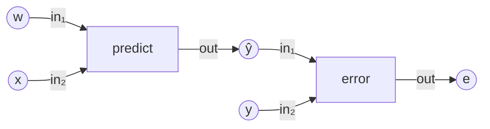

> The diagram is only a visual interpretation of the ternary relation.
> The underlying object is not initially an ordinary graph — and below
> Level 8, `predict` and `error` are only members of \(O\): they do not
> yet multiply or subtract anything.

## The value roles

At Level 5 the value carrier is partitioned extensionally into three
subdomains,

\[
V = K \;\dot\cup\; \Theta \;\dot\cup\; U,
\]

with

\[
K=\{y,x\},\qquad
\Theta=\{w\},\qquad
U=\{e,\hat y\}.
\]

```text
V
├── K       observed
│   ├── y = 6
│   └── x = 2
│
├── Theta   trainable
│   └── w = 0 initially
│
└── U       computed
    ├── e       no value yet
    └── yhat    no value yet
```

The declaration orders are deliberate and non-obvious:

```text
K = {y, x}          y first, then x
U = {e, yhat}       e first, then yhat
```

They matter because **storage follows domain enumeration**, not assumed
semantic or raw-member order. Every read of a value walks
`local_index`, never a raw member id.

The crucial Level-5 truth is prominent throughout the tower:

\[
\boxed{\text{There is no field on }U.}
\]

The computed slots are not zero. They are **uncomputed** — see
[Level 5](#level-5--field-calculus).

## When meaning enters

Each kind of meaning first exists at a specific rung, and never earlier:

```text
Levels 0–4
    STRUCTURE ONLY
    predict/error are symbols

Level 5
    VALUES APPEAR
    x = 2, y = 6, w0 = 0
    yhat/e still uncomputed

Level 6
    DEPENDENCY STRUCTURE
    which parameter can influence which residual
    still no derivative values

Level 7
    SUPPLIED NUMERICAL RESIDUAL
    solve an opaque R : Theta -> Y
    model laws still not constituted

Level 8
    CONSTITUTION
    predict becomes multiplication
    error becomes subtraction
    yhat/e are actually computed

Level 9
    STATEMENT
    the whole symbolic model drives fitting
```

---

# Level 0 — Carriers

## Capability

Level 0 answers only:

> **What symbolic kinds of members may exist?**

## New mathematical commitment

Three independent member sets:

\[
V=\{w,x,\hat y,y,e\},
\qquad
O=\{\mathrm{predict},\mathrm{error}\},
\qquad
P=\{in_1,in_2,out\}.
\]

Nothing is connected. Nothing has a numerical value. The symbols
`predict` and `error` do not mean multiplication or subtraction — they are
merely members of \(O\).

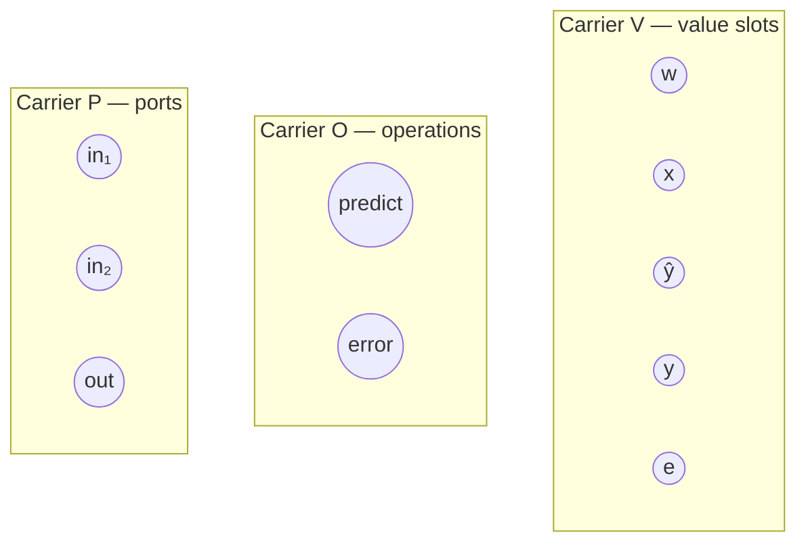

## Construction / implementation

Three `counted_set` declarations:

```fortran
v = counted_set('value-slots', 5)
o = counted_set('operations' , 2)
p = counted_set('ports'      , 3)
```

Members are enumerated by small integers (`SLOT_W = 1`, …,
`OP_PREDICT = 1`, …, named in `common/learning_assert.f90`), but the raw
integers are enumeration handles, **not** semantics: equal sizes and equal
integers buy nothing — carrier identity is structural (`same_as`), and every
association between a member and anything else goes through the carrier's
own maps.

## Minimal verification

- cardinalities: \(|V|=5\), \(|O|=2\), \(|P|=3\);
- distinct structural identities: \(V\neq O\neq P\) by `same_as`;
- both enumeration round trips, on every member of every carrier:

\[
\operatorname{member}(\operatorname{local\_index}(m))=m,
\qquad
\operatorname{local\_index}(\operatorname{member}(i))=i;
\]

- outsider rejection: `V.has(6)`, `V.has(0)`, `O.has(3)`, `P.has(4)` are
  all false.

## Required negative truth

```text
no relation
no graph
no field
no model law
no residual
no training
```

The import list is itself the proof: `learning_assert`, `graph_carrier`,
and nothing above.

## What this proves

The framework can represent multiple independent symbolic domains without
deciding that one is a vertex set or an edge set — and without giving
`predict` any meaning it has not earned.

---

# Level 1 — Relation

## Capability

Level 1 answers:

> **How are operation symbols, value slots, and ports related?**

## New mathematical commitment

One ternary relation:

\[
T_{\mathrm{flow}}\subseteq O\times V\times P
\]

with exactly the six tuples of the persistent object. This is the one
structural source of truth for the whole tower; every later structural fact
is derived from it.

## Construction / implementation

`stored_relation('flow', [o, v, p], table)` with:

```text
arity               = 3
ordered signature   = [O, V, P]   answered by identity, slot by slot
set semantics       = the test hands the constructor SEVEN tuples,
                      one duplicated on purpose; the relation holds SIX
foreign members     = refused (see Refusals)
```

The three-way fact is the point: *operation consumes/produces value slot at
port*. It is deliberately **not** reduced to an ordinary directed graph —
no binary-incidence encoding, no edge objects. A relation with three slots
stays a relation with three slots.

## Minimal verification

- arity is exactly 3, and each signature slot is the declared carrier
  **by identity**;
- `|T_flow| = 6` although seven tuples were handed in;
- all six expected tuples are members (six present in a six-element set:
  the extension is exact);
- structurally meaningful absences:

```text
(predict, y, in₁)  absent   the target never feeds predict
(error,   w, in₁)  absent   the parameter never feeds error
(error,   e, in₁)  absent   no operation consumes its own output
```

- a tuple of the wrong length belongs to nothing.

## Required negative truth

`predict` does not yet mean \(w\cdot x\); `error` does not yet mean
\(\hat y-y\). No neuron, layer, or network object anywhere. Structure
before meaning.

## What this proves

The framework can represent a relationship whose meaning naturally needs
more than two slots, with genuine set semantics and identity-checked
signatures.

---

# Level 2 — Relation algebra

## Capability

Level 2 answers:

> **What can be derived from \(T_{\mathrm{flow}}\) — without writing the
> answer down?**

## New mathematical commitment

The operation dependency

\[
\boxed{D=\{(\mathrm{predict},\mathrm{error})\}}
\subseteq O\times O
\]

exists because `predict` **produces** \(\hat y\) and `error` **consumes**
\(\hat y\). The pair is never written; it is earned.

## Construction / implementation

Define the structural port selectors as subobjects of \(P\):

```text
P_out = {out}
P_in  = {in₁, in₂}
```

then restrict, project, and compose
(`src/graph_relation_algebra.f90`):

```text
T_out3   = restrict_slot(T_flow, 3, P_out)      two tuples
T_in3    = restrict_slot(T_flow, 3, P_in)       four tuples

produces = project_slots(T_out3, [1,2])  ⊆ O×V
consumes = project_slots(T_in3,  [2,1])  ⊆ V×O
```

with exact extensions

\[
\mathrm{produces}=\{(\mathrm{predict},\hat y),(\mathrm{error},e)\},
\]

\[
\mathrm{consumes}=\{(w,\mathrm{predict}),(x,\mathrm{predict}),
(\hat y,\mathrm{error}),(y,\mathrm{error})\}.
\]

The `[2,1]` reversal in `consumes` is structural: it aligns the middle
domain \(V\) for composition. Using the repository's composition
orientation

\[
\texttt{compose\_binary}(R_{AB},R_{BC}) = R_{BC}\circ R_{AB},
\]

the dependency is

```text
D = compose_binary(produces, consumes)          consumes ∘ produces
```

held in the test as `class(relation)` — the learning client leans on the
relation abstraction, never the storage behind it.

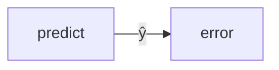

## Minimal verification

- both restrictions and both projections pinned **by extension**, not by
  count alone, with signature domains checked by identity;
- \(|D|=1\) and \(D.has(\mathrm{predict},\mathrm{error})\);
- meaningful absences:
  \(D.has(\mathrm{error},\mathrm{predict})\),
  \(D.has(\mathrm{predict},\mathrm{predict})\),
  \(D.has(\mathrm{error},\mathrm{error})\) are all false;
- **tuple-order invariance**: the six flow facts handed backwards derive
  the same \(D\) — equal as sets, checked in both directions, with the
  domains agreeing slot for slot. A relation cannot remember how it was
  typed.

## Required negative truth

`predict → error` is dependency, not yet execution: no directed-graph
interpretation, no walk, no numbers. Level 2 still does not know that
\(\hat y\) will one day be \(w\cdot x\).

## What this proves

Relation algebra derives facts; nothing downstream ever has to store what
the algebra can earn. The graph container (Level 3) will admit \(D\); it
does not infer it.

---

# Level 3 — Relational graph

## Capability

Level 3 answers:

> **How do the carriers and relations coexist as one owned structure?**

## New mathematical commitment

\[
\Gamma=(\mathcal S,\mathcal P),
\qquad
\mathcal S=\{V,O,P\},
\qquad
\mathcal P=\{T_{\mathrm{flow}},D\}.
\]

One relational model structure owns the learning schema.

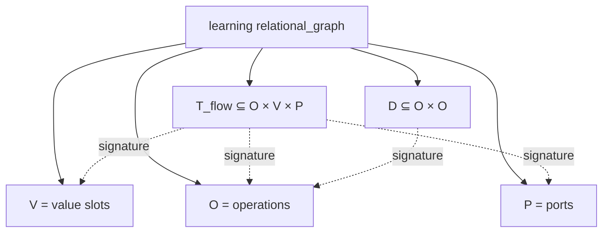

## Construction / implementation

\(D\) is derived once more by the Level-2 road and then **admitted** — the
container stores structure and re-derives nothing:

```fortran
g = relational_graph('learning',                        &
     & [held_set(v), held_set(o), held_set(p)],         &
     & [held_relation(flow), held_relation(d)])
```

(`src/graph_structure.f90`). Ownership truths:

```text
the graph owns materialized relations
relation signatures close over graph-owned member-set identities
duplicate set identity refused
duplicate relation identity refused
foreign relation domain refused
a borrowing / non-materialized view cannot be owned
```

Relation **identity** matters, not just signature: the ownership question
is answered by scanning `relation_at(k) % same_as(r)` — an identically
built twin is not the same relation, and an identically stocked twin graph
is not the same graph.

## Minimal verification

- three member sets and two relations owned, all by identity;
- **the ternary flow survives ownership unchanged**: arity 3, six tuples,
  representative members of both operations — nothing asks the native
  learning schema to become binary merely because it now lives inside
  something called a graph;
- the derived dependency survives too: binary, one tuple, both slots
  \(O\);
- signature closure: every slot of every owned relation resolves to an
  owned carrier;
- graph identity: \(\Gamma\) is itself, and no identically stocked twin is it.

## Required negative truth

\(D\) remains a plain relation in a graph: no directed edge, no source, no
walk — interpretation is Level 4's business. Still no number anywhere.
`relational_graph` remains free of vertex/edge vocabulary.

## What this proves

A graph is a structured collection of sets and relations, not a synonym
for an ordinary \(V/E\) graph — and the learning schema inhabits it
natively.

---

# Level 4 — Graph calculus

## Capability

Level 4 answers:

> **What graph-theoretic meaning may be *read* from the derived
> dependency?**

## New mathematical commitment

None structurally — and that is the philosophical point of the rung. The
relation `predict → error` has existed since Level 2. Only this rung
**chooses** to read it as directed execution:

\[
\boxed{\text{relation} \neq \text{directed-graph interpretation}}
\]

Interpretation is explicit, never automatic.

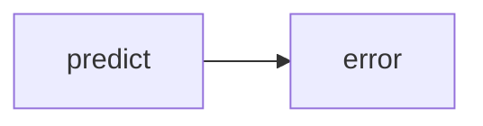

## Construction / implementation

```text
graph-owned D
    ↓ directed_adjacency_view(g, d)     borrows g's OWN relation;
    ↓                                   the external selector may die
graph_algorithms: sources / sinks / reachable / topological_order
```

The view (`src/graph_profile.f90`) locates the graph-owned relation that is
`same_as` the selector and borrows **that** — the test deallocates the
external selector `d` the moment the view exists, and every algorithm
(`src/graph_algorithms.f90`) still answers. Algorithms remain outside
storage; sources and sinks come back as `subset_set` subobjects of \(O\).

## Minimal verification

```text
view domain            = O        (the operations walked; nothing invented)
sources                = {predict}
sinks                  = {error}
reachable(predict, error) = true
reachable(error, predict) = false
reachable(op, op)         = true   (zero-length path)
reachable(outsider, ·)    = false
topological order         = [predict, error], exactly
```

## Required negative truth

Execution **order** has meaning; operation **laws** do not — `predict`
does not yet multiply, nothing is evaluated, nothing is trained, and the
word backprop appears nowhere. No neuron, no layer, no edge carrier: the
operations themselves are the domain walked.

## What this proves

Traversal, reachability, and ordering arise only after a relation is given
an explicit graph interpretation — and the interpretation borrows
graph-owned structure rather than copying it.

---

# Level 5 — Field calculus

## Capability

Level 5 answers:

> **What numerical values live on which domains?**

The first numbers enter the tower — and each has exactly one home.

## New mathematical commitment

Three role subdomains of \(V\),

\[
K=\{y,x\}\hookrightarrow V,
\qquad
\Theta=\{w\}\hookrightarrow V,
\qquad
U=\{e,\hat y\}\hookrightarrow V,
\]

which **partition** the value carrier,

\[
V=K\;\dot\cup\;\Theta\;\dot\cup\;U,
\]

and two fields:

\[
q_K:K\to\mathbb R,\quad q_K=[6,2],
\qquad
\theta_0:\Theta\to\mathbb R,\quad \theta_0=[0].
\]

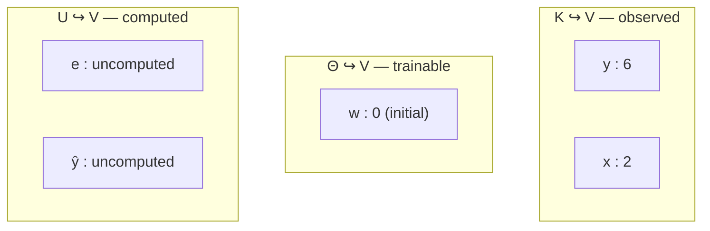

## Construction / implementation

The subdomains are `subset_set` subobjects
(`src/graph_carrier.f90`), declared in deliberately non-obvious orders:

```fortran
k     = subset_set('observed' , v, [SLOT_Y, SLOT_X])
theta = subset_set('trainable', v, [SLOT_W])
u     = subset_set('computed' , v, [SLOT_E, SLOT_YHAT])
```

The fields are the ordinary production `field` on those domains
(`src/class_graph_field.f90`):

```fortran
qk = field('observations', k)
call qk % set_real_vector([6.0_dp, 2.0_dp])    ! y first — K's order
```

Storage follows the **domain enumeration**: `y`'s value stands first
because \(K\) declared `y` first, and every read walks
`K % local_index(...)` / `Theta % local_index(...)`, never a raw member
id.

**The one-home law.** Disjointness and coverage are proved together by one
local scan — for every member \(m\) of \(V\),

```text
count([K.has(m), Θ.has(m), U.has(m)]) = 1
```

## Minimal verification

- exact extensions and embeddings of \(K,\Theta,U\), and the one-home law;
- \(q_K\): domain is \(K\) **by identity**, two entries, one component,
  \(y=6\) and \(x=2\) via `local_index`, and storage order pinned;
- \(\theta_0\): domain is \(\Theta\) by identity, one entry, \(w=0\) — and
  that zero means **initial**, nothing else, nowhere else;
- observed and trainable are distinguished **by domain alone**:
  \(q_K\)'s domain is not \(\Theta\); \(\theta_0\)'s domain is not \(K\).

## Required negative truth

\[
\boxed{\text{NO } q_U \text{ exists.}}
\]

The computed slots receive **no field at all** — no empty field, no zero
field, no NaN field, no sentinel field. Not constructing a field is a
stronger truth than constructing an empty one: any fabricated number on
\(U\) would be a lie the rest of the tower had to remember, whereas the
subdomain alone says "computed later" perfectly.

Roles are expressed by **domain**, not by ML-specific subclasses: there is
no `data_field`, no `parameter_field`, no tensor. One general field type,
three subdomains — the existing production field abstraction required no
learning-specific extension.

The model law is still unspoken: knowing \(x=2\) is not knowing what
`predict` does with it.

## What this proves

Values are separate from topology, and **role is a property of the domain,
not of the value's type**. The general carrier/subset/field machinery
expresses observed/trainable/computed without new production concepts.

---

# Level 6 — Discretization / structural dependency

## Capability

Level 6 answers:

> **Which trainable parameters can *structurally* influence which training
> residuals?**

This is dependency information only — a structural Jacobian **pattern**.
It is not derivative evaluation, not gradient computation, not
backpropagation, and it needs no data values: no `2`, `6`, or `0` appears
anywhere in the derivation. Dependency structure belongs to the **model**,
not to one data instance.

## New mathematical commitment

A residual-row carrier and one location fact:

\[
Y=\{r\},
\qquad
\boxed{L=\{(r,e)\}\subseteq Y\times V}.
\]

\(L\) is **the only new architect-owned fact of the rung** — residual row
\(r\) is located at value slot \(e\). Everything else is derived.

## Construction / implementation

**Direct value dependency.** From \(T_{\mathrm{flow}}\) derive input and
output participation — the same two projections Level 2 built, composed in
the other order:

\[
I\subseteq V\times O:
\quad
I=\{(w,\mathrm{predict}),(x,\mathrm{predict}),
(\hat y,\mathrm{error}),(y,\mathrm{error})\},
\]

\[
Q\subseteq O\times V:
\quad
Q=\{(\mathrm{predict},\hat y),(\mathrm{error},e)\},
\]

\[
A=Q\circ I
=\texttt{compose\_binary}(I,Q)
\subseteq V\times V,
\]

with exactly

\[
A=\{(w,\hat y),(x,\hat y),(\hat y,e),(y,e)\},
\qquad |A|=4.
\]

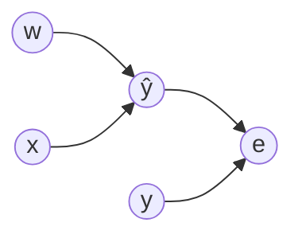

The critical distinction:

\[
(w,e)\notin A
\qquad\text{but}\qquad
w\leadsto e,
\]

— `w` influences `e` **transitively**, through \(\hat y\), never by
adjacency. \(A\) is admitted to a small relational graph holding \(V\),
interpreted by `directed_adjacency_view`, and walked by `reachable`.

**The trainable dependency.** \(J_\Theta\subseteq Y\times\Theta\) is
generated — never written — from three ingredients:

```text
Theta  +  L  +  reachability in A
```

For each row of \(Y\), its home is read **from \(L\)** by scanning \(V\)
in declaration order (exactly one home, or refusal); each
\(\theta\in\Theta\) is included iff `reachable(θ, home)`. The result is

\[
\boxed{J_\Theta=\{(r,w)\}}
\]

— but the pair \((r,w)\) appears only in assertions, never in the
construction path. The generated pairs are materialized as a
`csr_relation` over \((Y,\Theta)\) (`src/graph_binary_relation.f90`): this
is the rung that genuinely earns binary materialization and transpose.

**The reverse structure.**

\[
J_\Theta^T\subseteq\Theta\times Y
\]

is `transpose_of(J_Θ)` — a **borrowing view** of the same stored truth,
holding \((w,r)\), with `materialized()` answering false (the fail-closed
root default; a view is deliberately not a materialized citizen). There is
no second CSR relation, no reverse pair list, no separately stored
backpropagation graph:

```text
J_Theta
   ↓ transpose view
J_Theta^T
```

One dependency description serves both directions.

## Minimal verification

- \(I\), \(Q\), \(A\) pinned by exact extension with identity-checked
  domains; \((w,e)\) and \((e,w)\) both absent;
- reachability: \(w,x,\hat y,y\) all reach \(e\); \(e\) reaches nothing
  back; the pinned chain \((w,\hat y)\in A\), \((\hat y,e)\in A\),
  \((w,e)\notin A\), \(w\leadsto e\) distinguishes direct relation from
  transitive influence;
- \(L\) holds its one fact and the home is read back from it;
- \(|J_\Theta|=1\) with \(|Y|=|\Theta|=1\) — one membership proves the
  complete extension; domains are \(Y\) and \(\Theta\) by identity;
- the trainable support \(S_r=\{w\}\) composed locally by scanning
  \(\Theta\), embedded in \(\Theta\) (a subset of a subset);
- \(J_\Theta^T\) holds \((w,r)\), exactly one pair, and is **not**
  materialized;
- tuple-order invariance: the six flow facts handed backwards derive the
  same \(A\) and the same \(J_\Theta\), as sets, in both directions.

## Required negative truth

```text
no dr/dw
no gradient
no chain rule
no backprop
no numerical perturbation
no training data values
```

## What this proves

Structural derivative information **precedes** derivative values: from
topology alone, the tower derives that residual \(r\) depends on trainable
\(w\), and obtains the reverse structure as a view of the same fact. This
section is the conceptual bridge into a future Derivative Action tower,
which must earn numerical \(Jv\) and \(J^T\bar y\) actions separately.

---

# Level 7 — Minimization

## Capability

Level 7 answers only:

> **Given a supplied residual map depending on a trainable parameter, can
> the existing minimizer vary that parameter until the residual
> vanishes?**

This is the first rung where the parameter **changes**.

## New mathematical commitment

None from the model — deliberately. The residual formula

\[
R(w)=x_{\mathrm{data}}\,w-y_{\mathrm{data}},
\qquad\text{primary data } (2,6):\quad R(w)=2w-6,
\]

is **test-local oracle data supplied from above the frontier**. Level 7
does not derive it from \(T_{\mathrm{flow}}\); `predict` and `error`
remain lawless members of \(O\). The solver sees only an opaque

\[
R:\Theta\to Y.
\]

This mirrors calculator Level 7, where the residual equations were
supplied before arithmetic was constituted. The rung certifies
minimization independently of constitution.

## Construction / implementation

The in-file fixture module `learning_residual_fixture` defines
`affine_learning_residual` extending the legacy `graph_operation` face
(`graph_grammar`), constructed **parametrically**:

```text
affine_learning_residual(Theta, Y, x_data, y_data)
```

so the literals `2`, `6`, `3` never appear inside the map. It reads \(w\)
through `Theta % local_index(SLOT_W)` and answers a field whose domain is
\(Y\).

The domains are distinct by identity —
\(\Theta=\{w\}\), \(Y=\{r\}\), \(\lnot\,\Theta.same\_as(Y)\) — equal
cardinality is not domain identity. The minimizer's square-family
requirement is equal value **dimensions**, not shared identity.

The legacy operation host is deliberately irrelevant scenery: a
seven-vertex `stored_graph` whose vertex count matches nothing —

```text
|host vertices| = 7,  |Theta| = 1,  host.vertex_set() not same_as Theta
```

— proving *trainable parameter ≠ graph vertex*: minimization is
domain-driven, not host-driven. (See
[Nucleus observations](#nucleus-observations-from-learning), Observation E.)

The solver is the ordinary GMRES citizen (`class_graph_gmres`), which
inherits `attach` / `constant` / `solve` from the minimizer base
(`graph_minimization` is therefore not even imported):

```text
solver.attach(oracle, host, Theta)
solver.domain(host)  same_as Theta      the answer lives on Θ
oracle.domain(host)  same_as Y          the residual lives on Y
```

**The affine split.** The existing minimizer measures

\[
g=R(0)=-6,
\qquad
\mathrm{matvec}(w)=R(w)-R(0)=2w,
\qquad
rhs=-g=6,
\]

so solving \(\mathrm{matvec}(w)=rhs\) is exactly \(2w=6\). No Jacobian
matrix and no coefficient `2` is handed to GMRES — it discovers the linear
action by applying the opaque residual through the minimizer's own road.
This rung invokes `solve(rhs, w_state, achieved)` directly; Level 9 will
use the stronger operation-face composition.

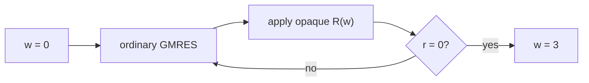

## Minimal verification

- \(g=[-6]\), one entry — the oracle and the minimizer agree about the
  affine decomposition — and \(rhs=6\);
- from \(w_0=0\): achieved residual below \(10^{-10}\) and
  \(|w-3|<10^{-9}\), read through \(\Theta\)'s enumeration;
- the parameter actually **moved**: \(3\neq 0\);
- direct confirmation at the oracle itself: \(|R(w_{\mathrm{learned}})|
  < 10^{-9}\);
- **anti-hardcode witness**: the same fixture type and the same
  attach/constant/solve path, handed \((x,y)=(4,8)\) from \(w_0=0\), fits

\[
w=2.
\]

The machinery solves \(xw=y\); it never recites \(3\). The witness stays
secondary: no datasets, no batches, no training-set abstraction — the
persistent problem remains \((2,6)\to 3\).

## Required negative truth

- the formula \(2w-6\) is never derived from \(T_{\mathrm{flow}}\) here;
- Level-6 \(J_\Theta\) is deliberately **not** consumed by the solver:
  structural sparsity and numerical operator action remain distinct;
- no gradient, no SGD, no backpropagation, no autodiff. GMRES is not "the
  learner": the existing residual minimizer fits the trainable parameter.

## What this proves

Exact supervised parameter fitting for an attainable square residual
equation — one parameter, one residual — through solver machinery that is
completely independent of where its residual came from.

---

# Level 8 — Constitution

## Capability

Level 8 answers:

> **What numerical laws do the symbolic operations obey — and can those
> laws plus the existing structure GENERATE the residual Level 7 was
> handed as an oracle?**

No solver runs at this rung. No parameter changes. Level 8 evaluates a
model; it does not train it.

## New mathematical commitment

Only now bind:

\[
\mathrm{predict}(a,b)=ab,
\qquad
\mathrm{error}(a,b)=a-b.
\]

The law table is the exact place where numerical meaning enters the tower
— and it sees an operation **symbol** and two numbers, nothing else. Any
unbound symbol refuses. No slot name is encoded in any law: structure
chooses the operands.

## The learning evaluation semantics

This rung differs **fundamentally** from calculator Level 8, and the
difference is a deliberate architectural truth:

```text
Calculator:
    outputs are UNKNOWN STATE
    residual = q(out) - law(inputs)

Learning:
    outputs are COMPUTED
    the law executes INTO the out slot
    residual = value at the slot located by L
```

In the learning tower there is no independent \(q(e)\). Evaluation is:

\[
\hat y \;=\; \mathrm{predict}(w,x),
\qquad
e \;=\; \mathrm{error}(\hat y,y),
\qquad
r \;=\; \text{value at } L\text{'s home} \;=\; e = wx-y.
\]

Never \(q(e)-(\hat y-y)\). The residual rule is complete: *the value at
the home*.

## Construction / implementation

The fixture `learning_constitution_fixture`
(`level-8-constitution/learning_constitution_fixture.f90`, reused by
Level 9) exposes:

```text
apply_law(op, a, b)                      the law table
slot_for_port(flow, V, op, port)         uniqueness scan against T_flow
located_slot(located, V, row)            uniqueness scan against L
generated_residual(...)                  the constituted evaluation
```

parameterized by the abstract contracts `class(relation)` and
`class(member_set)` — no learning singleton, no stored-type demands.

**Execution order is derived, never handed over.** The test walks the
certified lower road once more:

```text
T_flow → restrict/project/compose → D → graph-owned → 
directed_adjacency_view → topological_order → [predict, error]
```

and the evaluator *receives* that order.

**The workspace.** Evaluation uses a test-local ephemeral workspace
indexed through `V % local_index`, with a **separate availability flag**:

```text
available = false everywhere
seed K      by K's enumeration      y, x    become available
seed Theta  by Θ's enumeration      w       becomes available
yhat, e:    NO value, and no zero/NaN/sentinel pretending otherwise
```

Then for each operation in the derived order, the evaluator discovers
`in1`/`in2`/`out` from \(T_{\mathrm{flow}}\) by uniqueness scan, demands
both inputs **available**, requires the output to land in \(U\) (the
test-local learning schema law: operations produce the slots Level 5
classified as computed), executes the law into the out slot, and marks it
available:

```text
   predict:  w, x available   ──▶  ŷ becomes available
   error:    ŷ, y available   ──▶  e becomes available
```

— but none of those slot names appears in the evaluator logic; the facts
live in \(T_{\mathrm{flow}}\) and \(L\).

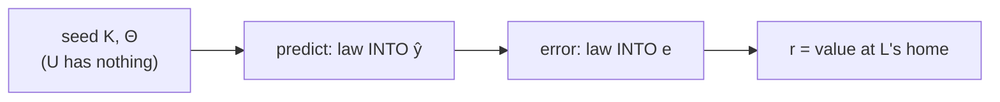

The Level-5 statement remains true — *before* evaluation, \(U\) owns no
numbers. Level 8 adds: *during* evaluation, laws **compute** numbers on
\(U\). A meaningful progression, not a contradiction, and no persistent
field on \(U\) is ever instantiated.

## Minimal verification

- the law table, certified independently:
  \(\mathrm{predict}(3,2)=6\), \(\mathrm{error}(6,6)=0\),
  \(\mathrm{error}(4,6)=-2\) (signed, not a distance);
- the generated map, probed off-solution with observed \([6,2]\):

\[
w=0\Rightarrow r=-6,\qquad
w=1\Rightarrow r=-4,\qquad
w=-1\Rightarrow r=-8,\qquad
w=3\Rightarrow r=0,
\]

  reproducing exactly the map \(r(w)=2w-6\) that Level 7 received
  opaquely — the formula lives in assertions and comments, never in
  `generated_residual`;
- intermediates at \(w=3\): the laws computed \(\hat y=6\) and \(e=0\) on
  the computed domain — produced, never preseeded;
- **topology preservation**: the structural support is re-derived exactly
  as Level 6 derived it (A from the flow, reachability to the home read
  from \(L\)) and compared with the trainable slots the constituted
  evaluation actually **read** — both are \(\{w\}\), extensionally, with
  no numerical perturbation anywhere:

\[
\boxed{\text{meaning added}\neq\text{topology changed}}
\]

- **second data witness**: same flow, same laws, same evaluator, handed
  observations \((y,x)=(8,4)\): \(w=2\Rightarrow r=0\),
  \(w=1\Rightarrow r=-4\). Data is not constitution;
- tuple-order invariance: the six facts handed backwards, their **own**
  derived \(D\) and order, generate the identical residual at \(w=-2\)
  and the identical trainable support.

## Refusals

- `unbound-law`: a symbol no law binds cannot be evaluated;
- `starved-input`: handing the evaluator the wrong order
  `[error, predict]` dies loudly — \(\hat y\) is demanded before any law
  has produced it. **Computed values cannot be silently fabricated.**

## Required negative truth

No solver runs. No parameter changes. No derivative rules — no
\(\partial\,\mathrm{predict}/\partial w=x\), no chain rule, no gradient,
no autodiff. Level 6 proved reverse dependency *structure*; this rung adds
forward numerical *laws* only.

## What this proves

The same structural substrate drives **forward computation of previously
valueless slots**: structure chooses every operand, constitution supplies
only laws, and the supplied Level-7 oracle becomes a generated Level-8
map.

---

# Level 9 — Statement

## Capability

Level 9 asks the only question left:

> **What complete learning problem is being asked?**

The statement is: given the observation \((x,y)=(2,6)\) and the model
structure with its constitution and residual location, learn \(w\) from
\(w_0=0\) such that \(r=0\). The statement **selects** lower-level truths;
it invents none.

## The complete path

```text
T_flow
    ↓
derive D
    ↓
graph owns structure
    ↓
derive execution order
    ↓
Level-8 law/evaluator
    ↓
compute yhat and e
    ↓
L chooses residual home
    ↓
R : Theta -> Y
    ↓
ordinary minimizer
    ↓
learned state on Theta
```

There is no Level-7 affine oracle anywhere in this path:
`learning_residual_fixture` is not imported. That oracle was an earlier,
independent minimizer certification below the frontier.

## Construction / implementation

The adapter `constituted_learning_residual`
(`level-9-statement/constituted_residual_fixture.f90`) is an adapter
**only** — Level-8 semantics wearing the legacy `graph_operation` face so
the ordinary solver can drive them. Its entire numerical act is one
delegation to `learning_constitution_fixture::generated_residual`. It
contains no law, no slot name, no order literal, no \(2w-6\).

**Graph ownership, proved by lifetime.** The adapter is constructed from
the graph plus an external flow selector; it scans
`g % relation_at(k) % same_as(selector)` to find the **graph-owned** flow,
retains that citizen, and refuses if the graph does not own it. Then:

```text
external flow selector
    ↓ used to identify graph-owned flow
graph-owned relation retained
    ↓
external selector deallocated
    ↓
training still succeeds
```

The final statement acts on the model structure owned by \(\Gamma\), not on a
temporary.

**The solve, through the operation face.** The ordinary GMRES citizen is
attached with the seven-vertex compatibility host (still nobody's
trainables) and the explicit unknown domain \(\Theta\). The affine
constant is evaluated **through the entire constituted model**:

\[
g=R(0)=[-6],
\qquad
rhs=-g
\]

placed on a field over \(Y\), and the solve is the composition path

```text
solver % apply(host, [rhs field on Y], solution)
```

— the minimizer participates as an ordinary operation: a residual-domain
field in, a trainable-domain field out. Its internal state starts from
zero, so \(w_0=0\) is the statement's own initial parameter, never
injected.

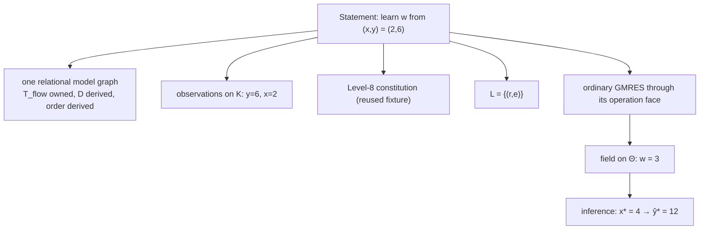

## Minimal verification

- the derived order is \([\mathrm{predict},\mathrm{error}]\);
- the solver answers on \(\Theta\) and the residual on \(Y\), by identity
  — and \(Y\) is not \(\Theta\);
- \(g=[-6]\) through the full model;
- the solution is a **field on \(\Theta\)**, by identity — the learned
  parameter is not a graph vertex, an operation, a computed slot, or a
  residual row — and

\[
\boxed{w=3}
\]

  read only through `Theta % local_index(SLOT_W)`, with the literal 3
  standing only in final assertions;
- the parameter moved: 3 is not the initial 0;
- **the full symbolic model judges its own learned solution**: the
  returned field is fed back through the constituted residual adapter and
  \(\|R(3)\|<10^{-9}\) — not the Level-7 oracle, not the explicit formula;
- **structure does not mutate during training**: six flow facts, the one
  derived dependency, and the three role extensions are held intact both
  before and after the solve. Training changes a **value**; it does not
  rewrite model topology.

## Post-training inference

Inference is a separate statement, and the distinction matters:

```text
Training:    observed x,y  +  trainable w  +  error residual  ->  fit w
Inference:   learned w     +  new x*                          ->  yhat*
```

A target \(y\) is needed for **training** error. A target is not needed to
**predict**. Inference therefore does not run through the full training
residual, and no retraining occurs.

Structure still chooses the prediction operands: the ports of `predict`
are discovered from the **graph-owned** flow through the Level-8
`slot_for_port` helper —

```text
predict.in1 = w        predict.in2 = x        predict.out = yhat
```

— the roles decide which value stands where (the trainable slot carries
the learned state; the other carries the fresh input), and the **same
Level-8 law** computes:

\[
\hat y_\ast=\mathrm{predict}(3,4)=12.
\]

No hard-coded `3*4` formula, no second constitution.

## The result marker

After all assertions succeed, Level 9 writes exactly one marker,

```text
LEARNING_RESULT = 3
```

computed from the solution field via `Theta % local_index(SLOT_W)`, never
from a literal. The runner is fail-closed: it requires exactly one marker,
parses the value from Level 9's own output, and prints

```text
└── learned parameter ........... 3
```

The tower's primary result is the learned parameter **3**, not the
inference 12.

## What this proves

The entire tower composes: one relational model drives derivation,
constitution, fitting, and inference, and the learned state is an ordinary
field on the trainable domain, reusable after training ends.

---

# End-to-end view

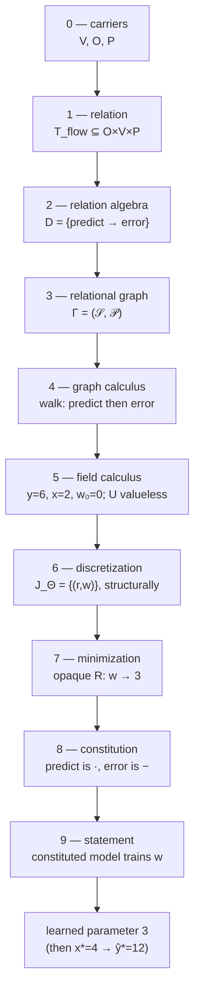

Or horizontally as the progression of mathematical commitments:

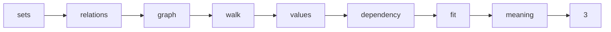

---

# What the tower proves / does not prove

## Proven (for this tiny problem)

```text
relational model structure
derived execution dependency
domain-based observed/trainable/computed roles
structural trainable-to-residual dependency
transpose reverse structure
opaque residual minimization
test-local constitution
structure-driven execution of computed slots
full constituted parameter fitting
post-training reuse of learned state
```

The entire learning tower closed without a single ML-specific production
abstraction.

## Not proven

```text
general nonlinear optimization
overdetermined least squares
datasets
batches
epochs
SGD
Adam
gradient descent
automatic differentiation
numerical backpropagation
deep neural networks
general ML framework
```

The tower learns one parameter by solving an attainable residual equation.
It does not yet implement gradient-based ML training. The reason this
problem fits the current minimizer is exactness: one parameter, one
residual — the existing square contract applies.

---

# Structure vs numerical meaning

One of the tower's central lessons:

\[
\boxed{\text{structure first}\neq\text{numerical law}}
\]

Each object in the tower is exactly one of the two:

```text
T_flow:                structural fact
D:                     derived structural fact
A:                     value dependency structure
J_Theta:               derivative sparsity structure
L:                     residual location structure

q_K / theta:           numerical values
predict/error laws:    constitution
GMRES action:          numerical solve
```

Levels 0–4 and 6 are purely structural. Levels 5 and 7 introduce values
without laws. Level 8 introduces laws without solving. Level 9 composes.
No object ever plays both roles at once.

---

# Forward vs reverse structure

Level 6 exposes both directions of the same dependency:

```text
forward                          reverse (transpose view)

    w                                residual r
    ↓                                    ↓
   yhat                                  w
    ↓
    e
    ↓
residual r
```

The forward pattern is \(J_\Theta=\{(r,w)\}\); the reverse is
\(J_\Theta^T\), a **transpose view of the same stored truth** — never a
separately authored reverse graph.

> This is reverse **dependency structure**, not reverse-mode
> differentiation.

A future Derivative Action / Adjoint tower must earn numerical forward
action \(Jv\) and reverse action \(J^T\bar y\) on top of exactly this
structural duality. Nothing here claims those results.

---

# The vertical dependency philosophy

Every level is understandable without importing knowledge from a higher
level — and the tests enforce it mechanically:

```text
Level 2 knows the dependency relation D
but not directed execution.

Level 4 chooses the directed interpretation.

Level 5 knows the values x, y, w
but not the predict/error laws.

Level 6 knows J_Theta sparsity
but no derivative values.

Level 7 can solve an opaque residual
without knowing its symbolic origin.

Level 8 generates the residual
but does not solve.

Level 9 composes the whole statement.
```

Two mechanisms hold the stratification:

- **`run.sh` — the frontier law.** The first absent rung reports `ABSENT`
  and closes the frontier; everything above reports `BLOCKED`, unexecuted.
  A genuine failure reports `FAIL` and everything above `SKIPPED` with a
  nonzero exit. After a full ladder, the learned parameter is read —
  fail-closed — from Level 9's own output; nothing numerical is encoded in
  the runner.

- **`check_imports.sh` — the import gate.** Every learning source may
  `use` only the framework modules its level has been explicitly granted;
  a directory with sources but no allowlist fails closed. If a lower-level
  test needs a higher-level module, the tower boundary has been violated —
  mechanically.

---

# Code map

| Level | Test directory | Principal modules exercised (per the import gate) |
|---|---|---|
| 0 | `level-0-carrier/` | `graph_carrier` |
| 1 | `level-1-relation/` | + `graph_relation` (with refusal suite) |
| 2 | `level-2-relation-algebra/` | + `graph_relation_algebra` (D held as `class(relation)`) |
| 3 | `level-3-graph/` | + `graph_structure` (`graph_binary_relation` granted for the view refusal **only**) |
| 4 | `level-4-graph-calculus/` | + `graph_profile`, `graph_algorithms` (binary storage stays forbidden) |
| 5 | `level-5-field-calculus/` | `graph_carrier`, `class_graph_field` — the smallest allowlist above ground |
| 6 | `level-6-discretization/` | + `graph_binary_relation` (`csr_relation`, `transpose_of` earned), `graph_structure`, `graph_profile`, `graph_algorithms` |
| 7 | `level-7-minimization/` | `graph_carrier`, `graph_grammar`, `class_graph_field`, `class_graph`, `class_graph_gmres` + in-file `learning_residual_fixture` |
| 8 | `level-8-constitution/` | carriers/relations/algebra/structure/profile/algorithms, `class_graph_field` + `learning_constitution_fixture` (own file; refusal suite) |
| 9 | `level-9-statement/` | + `graph_grammar`, `class_graph`, `class_graph_gmres`, both fixtures (`constituted_residual_fixture.f90`) |

Every level also imports `learning_assert`
(`common/learning_assert.f90`) — the tower's dependency-free constants and
assertion helpers, deliberately **not** shared with `calculator_assert`:
the learning tower is an independent second client and shares no fixture
with the first. `gmres` inherits the minimizer face, so
`graph_minimization` is never directly imported by any learning test.

```text
test/learning-tower/
├── README.md
├── run.sh                          frontier-law runner, fail-closed marker
├── check_imports.sh                per-level allowlists, fail-closed
├── common/
│   └── learning_assert.f90
├── level-0-carrier/                test.f90
├── level-1-relation/               test.f90 · refusal.f90 · check_refusals.sh
├── level-2-relation-algebra/       test.f90
├── level-3-graph/                  test.f90 · refusal.f90 · check_refusals.sh
├── level-4-graph-calculus/         test.f90
├── level-5-field-calculus/         test.f90
├── level-6-discretization/         test.f90
├── level-7-minimization/           test.f90 (in-file learning_residual_fixture)
├── level-8-constitution/           learning_constitution_fixture.f90 · test.f90
│                                   · refusal.f90 · check_refusals.sh
└── level-9-statement/              constituted_residual_fixture.f90 · test.f90
```

---

# Refusals

The architecture is defined as much by what must die as by what must
pass. Each refusal below is script-checked: the case must die **and die
for its stated reason** — the message is verified, not merely the nonzero
exit.

| Rung | Case | Refused because |
|---|---|---|
| 1 | `arity` | each tuple has exactly one part per slot |
| 1 | `member` | a tuple names a member its domain does not hold |
| 1 | `undeclared` | a signature refers to declared domains only |
| 3 | `foreign` | a relation must relate the graph's own member sets |
| 3 | `dupset` | a graph holds each domain once |
| 3 | `duprel` | a graph holds each relation once |
| 3 | `view` | a view cannot be owned |
| 8 | `unbound-law` | no law binds this operation symbol |
| 8 | `starved-input` | an operation was scheduled before its inputs exist |

The Level-3 `view` case is refused for **ownership/lifetime** — a
borrowing view offered for ownership — not for being binary or transposed;
it is the one place a lower learning rung touches the binary module, and
only to build the view.

Further negative truths are asserted inline rather than as refusal
executables: Level 6 pins `.not. materialized()` on the transpose view;
Level 8's evaluator error-stops if an operation output is not in \(U\) or
a residual home was never computed; Level 9's adapter refuses a state that
does not live on \(\Theta\) and a graph that does not own the selected
flow. Levels that would only duplicate a lower rung's refusal carry none.

---

# Test-local fixtures stay test-local

Three learning-specific abstractions exist, and all three live inside the
tower:

```text
learning_residual_fixture         Level 7's opaque affine oracle
learning_constitution_fixture     Level 8's law table + evaluator
constituted_learning_residual     Level 9's operation-face adapter
```

They remained test-local because **one client has not earned a production
ML abstraction**:

\[
\boxed{\text{real caller first}\rightarrow\text{abstraction later}}
\]

In particular, calculator and learning share a visible constitution
*pattern* (a law table plus uniqueness slot discovery), but they differ in
**evaluation policy** — unknown-state residual \(q(out)-\mathrm{law}\)
versus computed-slot execution \(r=\mathrm{value}(home)\). A common
production constitution API today would conflate operation law, evaluation
policy, state-vs-computed role, and residual statement. That promotion
waits for more evidence (see Observation D below).

---

# Why production did not change

`production changes = NONE` is not a boast; it has a precise architectural
meaning:

> The calculator had already forced the lower mathematical abstractions
> into existence. Learning then acted as a second independent inhabitation
> test. Every learning-specific concept was expressible through existing
> general mathematics plus test-local constitution and adapters.

Carriers and subsets expressed the roles; relations and algebra expressed
the model's structure and its derived dependency; the relational graph
owned it; views and algorithms interpreted and walked it; the general
field held the values; the existing minimizer fit the parameter.

What this does **not** imply:

> It does not prove the nucleus is finished. Higher-radius towers may
> expose missing contracts.

That caveat is the point of the radial development discipline described
next.

---

# Architectural context

The learning tower is one **orbital application tower** of the core-math
**nucleus** — see
[Fractal Graph Architecture](../../FRACTAL-GRAPH-ARCHITECTURE.md). It was
developed in **forward architectural mode**, outward through the same 0–9
radial contracts as the calculator: smallest meaningful application, one
new truth per level, reuse over speculation, and every architectural
friction recorded rather than immediately fixed.

Observations exposed by this tower are **evidence** for later
reverse-mode refinement of the nucleus; they are not automatically
promoted into new production abstractions. Both sealed towers remain the
acceptance oracles for any such refinement.

---

# Nucleus observations from Learning

## Observation A — roles are domains, not ML field subclasses

`observed`, `trainable`, and `computed` were represented entirely through
subdomains (`subset_set`) of one value carrier. No `data_field`,
`parameter_field`, or tensor type was required — the general field on a
general domain sufficed.

```text
computed field role
    ──does not require──▶ fabricated storage
```

## Observation B — structural derivative information precedes derivative values

\(J_\Theta\) was derived at Level 6 — from \(\Theta\), \(L\), and
reachability in \(A\) — before any derivative arithmetic existed anywhere.
Dependency structure belongs to the model, not to a differentiation
engine.

## Observation C — forward/reverse structural dependency is one truth

\(J_\Theta^T\) is a transpose **view** of the same stored dependency, not
a separately authored reverse graph.

```text
Level-6 dependency
    ──transpose view──▶ reverse structure
```

## Observation D — computation policy matters

Calculator and learning use the same lower structural road but diverge at
constitution:

```text
calculator:  unknown output state      residual = q(out) - law(inputs)
learning:    computed output state     law executes INTO out; r = value(home)
```

Two clients, two evaluation policies. A common production constitution
abstraction is therefore still **premature** — promoting one now would
conflate law, policy, role, and statement.

## Observation E — the graph host appears locally unused in minimization

At Levels 7 and 9 the legacy `graph_operation` face requires a graph host;
the tests deliberately supply a seven-vertex graph unrelated to every
learning domain, and the mathematics never touches it.

Recorded strictly as an **observation**, per the fractal discipline:

```text
At the tested radius the legacy host did not participate numerically.
That does not establish whether graph context is necessary or
unnecessary at larger radius.
```

Local unnecessity does not imply global unnecessity — graph-as-operand,
graph-as-context, and graph-as-ownership-environment are different
questions. No removal is recommended here; higher-radius towers must
speak first.

## Observation F — learning was a second zero-production-change client

Two materially different vertical applications — computing and fitting —
now inhabit one substrate unchanged. This is evidence of substrate
generality, and only that: it is not evidence that every future orbit
will fit without new contracts.

---

# Status

```text
learning tower
├── level 0  carriers ........... PASS
├── level 1  relation ........... PASS
├── level 2  relation algebra ... PASS
├── level 3  relational graph ... PASS
├── level 4  graph calculus ..... PASS
├── level 5  field calculus ..... PASS
├── level 6  discretization ..... PASS
├── level 7  minimization ....... PASS
├── level 8  constitution ....... PASS
├── level 9  statement .......... PASS
└── learned parameter ........... 3
```

**Sealed.** The tower's primary mathematical result is the learned
parameter \(w=3\), with the post-training inference
\(x_\ast=4\Rightarrow\hat y_\ast=12\) as its secondary proof. Level 9
emits the single fail-closed marker

```text
LEARNING_RESULT = 3
```

computed from the solution field on \(\Theta\); `run.sh` requires exactly
one such marker and parses the displayed result from it. The most
important invariant is not the final number: it is that the **same
learning object gains one new mathematical capability at each level
without changing its lower-level truths — and without changing
production at all**.
