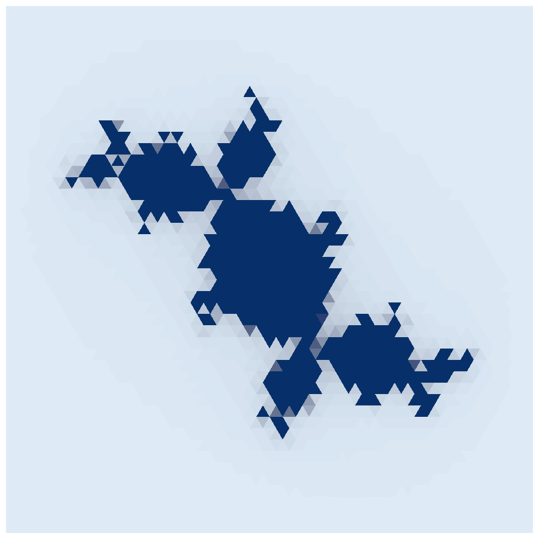
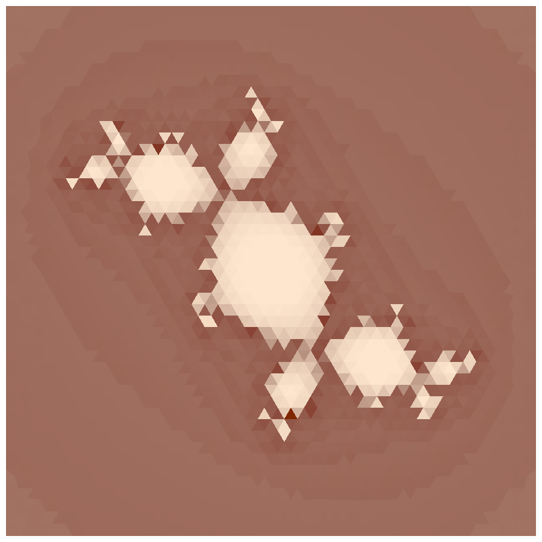
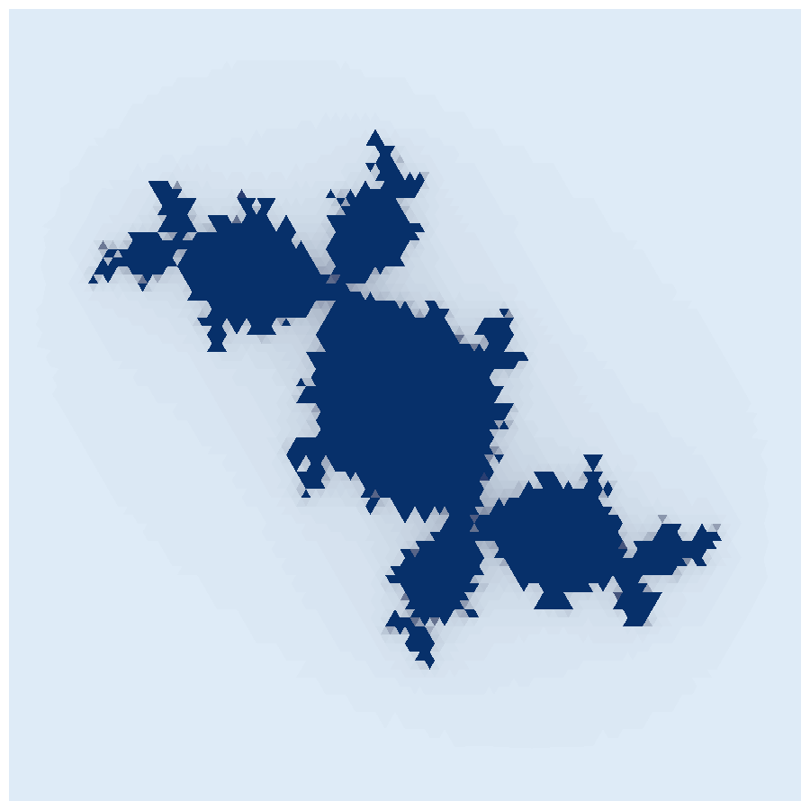
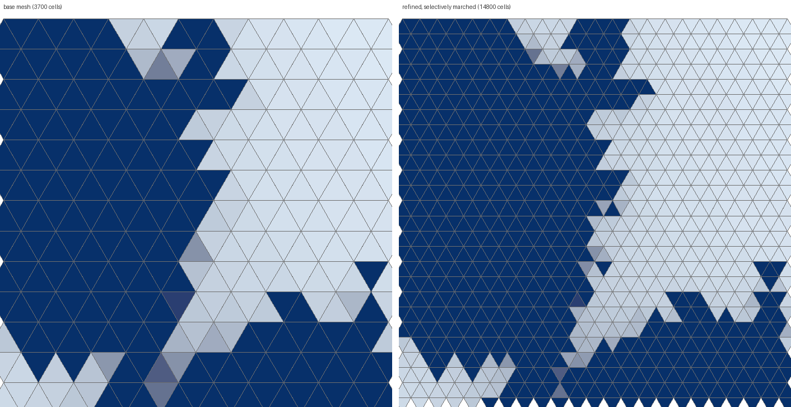
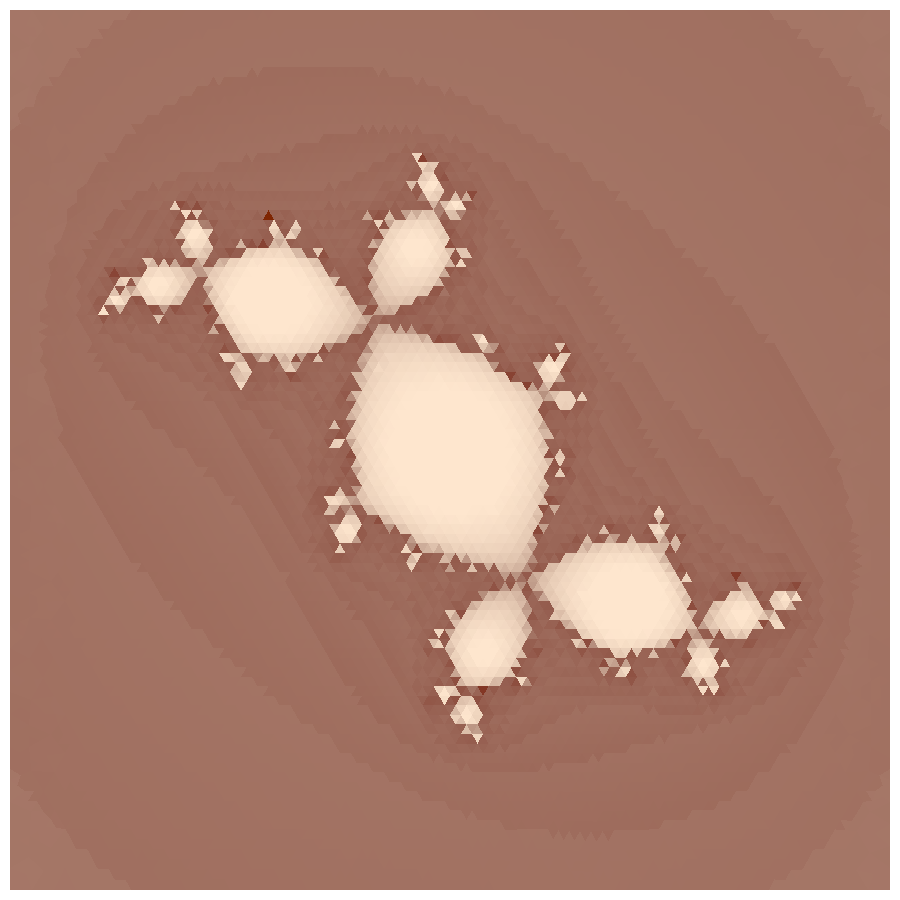

# Adjoint-Based Adaptive Mesh Refinement, Demonstrated on an Escape-Time Fractal

*A technical note on the `test/mandelbrot` verification case.*

## 1. Introduction

Here is a question worth asking of any simulation code: after you have
computed an answer, do you know *where your answer is fragile*? Not how
accurate it is on average — where, exactly, another dollar of computing
would buy the most accuracy. The adjoint method answers that question, and
it answers it for every cell of the mesh at once, for the price of a
single extra sweep.

This note demonstrates the complete machinery on a problem where you can
*see* the answer: an escape-time fractal (the Julia set of the Douady
rabbit) computed not by a fractal program, but by the ordinary
finite-volume solver stack — mesh, assembler, time integrator, writer. The
demonstration runs the full adaptive loop

    march  ──▶  adjoint  ──▶  flag  ──▶  refine  ──▶  march  ──▶  ...

with the number of cycles and the flagging fraction read from a plain
text configuration file, and every claim is checked against an
independent oracle inside the test.

Why a fractal? Because it is the most honest stress test of a sensitivity
method we could find. Its solution has three sharply distinct regimes —
dead calm, moderate, and genuinely chaotic — and the interesting one is a
boundary of measure zero. If the adjoint machinery is right, it must find
that boundary on its own, with nobody telling it where the fractal is.
And you can check the result by eye.

## 2. Motivation

Uniform mesh refinement is a losing game. Refine a 2d mesh k times
uniformly and you pay 4^k, whether or not the extra cells are doing
anything for you. In most problems worth solving, the action is
concentrated — a shock, a boundary layer, a crack tip — and refining the
calm regions is money burned. The whole art is *knowing where the action
is*, and the adjoint gives that knowledge a precise form: the derivative
of the answer you care about with respect to every input, computed
backward, all at once.

The framework already had every ingredient: a mesh that is a graph, a
time integrator that is literally a chain of steps, a reverse walk over
any directed graph (`accumulate_adjoint`), and a mesh that can refine
itself. This demonstration is those parts assembled into the standard
adaptive loop — and finding out, quantitatively, how well the assembled
loop targets.

## 3. Mathematics

### 3.1 The fractal as an ordinary differential equation

The escape-time iteration everyone knows is

    z_{k+1} = z_k^2 + c,        z, c complex.

Now watch this. Write the ordinary differential equation

    dz/dt = z^2 + c - z

and take one forward Euler step of size h = 1:

    z_new = z + h (z^2 + c - z) = z^2 + c.

The z cancels *exactly*. The stepper is not approximating the fractal
map — each step **is** the map, to the last bit. So the entire classical
theory of escape times rides on our ordinary solver stack with no
approximation error to argue about, and any disagreement between the
marched fractal and a hand-written loop is a bug, not a discretization
effect. (The test exploits this mercilessly: check 3 demands the marched
escape counts equal a plain loop *cell for cell*, and they do — 3700 of
3700.)

Split z = u + iv. The complex square mixes u and v, so per cell this is
a two-variable coupled system — in this codebase's terms, the first
physics law whose coupling graph has an edge:

    (u) ───── (v)        dS_u/dv = +2v,   dS_v/du = -2v.

One practical guard: once |z| > 2 the orbit provably never returns (the
classical escape bound), so the law freezes such a cell — source and
Jacobian both zero. This keeps escaped orbits from squaring their way to
overflow, and, as we will see, it is precisely what keeps the adjoint
finite.

### 3.2 The objective and its adjoint

Choose a single number to care about — the final energy of the field:

    J = 1/2 Σ_cells  vol_c · |z_c(T)|².

We want dJ/dz₀ for every cell: how the answer moves if a cell *starts*
somewhere slightly different. Doing this by finite differences costs one
extra full march per cell — 3700 marches. The adjoint does all of them in
one backward sweep, and the mechanism is nothing more than the chain rule
organized sensibly.

Each Euler step is a map z_{k+1} = Φ(z_k) with Jacobian

    dΦ/dz = I - dS/dq   (a 2×2 block per cell, frozen to I once escaped).

Seed the last time level with λ_T = dJ/dz_T = vol·z_T, then walk the step
chain backward:

    λ_{k-1} = (dΦ/dz at z_{k-1})ᵀ λ_k.

What arrives at the first level is λ₁ = dJ/dz₀ — for every cell,
simultaneously. The wonderful structural fact is that the code for this
walk was *already in the graph library*: the time integrator inherits
from a chain graph (step 1 → step 2 → … → step 41), and
`accumulate_adjoint` walks any directed graph backward applying a
caller-supplied rule per edge. The test's rule is "multiply by the
transposed step Jacobian" — eight lines — and the transient adjoint
falls out of graph machinery written for entirely different purposes.
When a design is right, this is what it feels like.

### 3.3 What the sensitivity must look like

Before running anything, the mathematics makes three predictions.

- **Inside the set**: orbits fall into an attracting cycle; products of
  Jacobians contract; λ shrinks toward zero exponentially. After 40
  steps: sensitivities around 10⁻³⁵.
- **On the boundary**: the dynamics is chaotic; the same products grow
  exponentially; these cells dominate everything.
- **Far outside**: a few moderate factors, then frozen identity steps.
  Middling values.

A span of thirty-plus orders of magnitude, with the maximum glued to a
measure-zero boundary — either the machinery reproduces this or it is
wrong. It reproduces it: the measured span is 9.9×10⁻³⁶ to 1.6×10³.

## 4. Problem setup

- **Mesh**: an unstructured triangular mesh, 3700 cells
  (`square-tri-40.msh`), stretched over the window [-1.6, 1.6]² of the
  complex plane. Each cell's centroid is its z₀.
- **March**: 40 forward Euler steps of size 1 (so 41 time levels), the
  Julia constant c = (-0.123, 0.745).
- **Adjoint**: one backward sweep per cycle, as above.
- **Tagging**: rank cells by η = |dJ/dz₀|, flag the top fraction
  (default one quarter; the threshold is found by bisection on the
  count).
- **Refinement**: split every triangle into four; children of parent v
  sit at indices 4(v-1)+1 … 4v. Only the children of flagged parents are
  recomputed; all other children inherit the parent's answer.
- **Cycles**: the loop march → adjoint → flag → refine repeats
  `refinement_cycles` times.

All of it is driven by a plain text file, `paint.cfg`, in the same
keyword-per-line format the library's `class_config` uses for its solver
examples:

    mesh              ../square-tri-40.msh
    constant          -0.123  0.745
    window            1.6
    patience          40
    flag_fraction     0.25
    refinement_cycles 2

Six checks run against independent oracles: the coupling graph's shape;
the law's Jacobian against finite differences; the marched fractal
against a plain loop; the adjoint against finite differences of a
re-marched J; the flagging quality against a fully-computed fine level;
and the cycle-to-cycle recession of the sensitivity measures.

## 5. Observed results

### 5.1 The painting and its sensitivity

The escape-time painting: dark cells never escape within 40 steps (the
set), light cells escape fast. Verified identical, cell by cell, with a
plain `z → z² + c` loop.

The adjoint's view of the same field (log scale; darker = more
sensitive). Every prediction of §3.3 is visible: the interior of every
lobe is the *palest* region (sensitivities ~10⁻³⁵ — the answer there is
utterly settled), the far field is medium, and the darkest cells draw a
thin, connected ridge tracing the boundary of the set. **Nobody told the
code where the fractal is.** The backward sweep found it because that is
where the derivative information concentrates.

The adjoint itself is certified before being trusted: on two probe
cells, λ₁ agrees with central finite differences of a re-marched J to a
relative error of 2×10⁻⁷. (The probes must be chosen where a finite
difference can converge at all — near the boundary the linear regime is
smaller than machine epsilon, which is not a flaw of the adjoint but the
definition of chaos. The test probes at moderate sensitivity, and says
why in its banner.)

### 5.2 The flags, and the refined painting

The top quarter by sensitivity (925 of 3700 cells, red). It is a band
wrapped around the set's boundary, plus a few arcs just outside where
cells escape late. Lobe interiors: untouched. Far field: untouched.

The adaptively computed fine painting (14800 cells, of which only the
flagged parents' 3700 children were marched). The set's edge is visibly
finer-grained than the base painting.

A crop straddling the boundary, mesh edges drawn, base beside refined.
Every triangle is geometrically split into four on the right, but only in
the transition band do the four children carry four different answers —
elsewhere they wear their parent's color, which is why the refined
painting *looks* coarse away from the boundary. Four small triangles
painted one color are indistinguishable from one big triangle. That is
selective computation doing exactly what it promises.

### 5.3 The numbers

Judged against marching *all* 14800 fine cells:

| quantity | value |
|---|---|
| fine cells wrong under pure inheritance | 1456 of 14800 |
| fine cells wrong after marching the flagged quarter | 388 |
| share of the energy error held by the flagged quarter | **61.8%** |
| targeting ratio vs. a random quarter (25%) | **2.5×** |

And across the refinement cycles (cycle 2 re-runs the whole loop on the
14800-cell canvas):

| measure | cycle 1 → 2 |
|---|---|
| bulk sensitivity (geometric mean of η) | fell **3.7×** |
| dual-weighted error estimate Σ η·√vol | fell **1.4×** |
| peak sensitivity | *rose* 1.5× |

The cycle-2 sensitivity field: the same portrait, sharper — the ridge is
thinner and more filamented, the interior paler still.

## 6. Discussion

**How the adjoint selected cells.** Purely by magnitude of dJ/dz₀. No
geometric heuristic, no gradient detector, no knowledge of fractals
anywhere in the loop. The concentration on the boundary is *emergent*:
chaotic orbits amplify perturbations, attracting orbits kill them, and
the backward sweep simply reports the arithmetic.

**How cells were tagged.** By bisecting a threshold τ until the
configured fraction of cells satisfies η ≥ τ. Fraction-based tagging
(rather than an absolute tolerance) keeps the work per cycle predictable
and is robust against η's enormous dynamic range; an absolute tolerance
is a one-line change and the config file has room for it.

**How cells were refined.** The mesh machinery refines conformingly and
*uniformly* — every triangle into four, with a deterministic parent-child
numbering. The selectivity lives in the computation: only flagged
parents' children are marched; the rest inherit. For this problem that
splits cleanly because the cells are uncoupled (no flux, so no cell needs
a neighbor to march), and the compute cost is exactly proportional to
cells marched.

**What refinement issues arose.** The classical headache of local
refinement — hanging nodes, where a split face meets an unsplit one and
the two-cells-per-face assembly breaks — *cannot arise here*, for two
stacked reasons: the mesh only refines uniformly (so the fine mesh is
conforming by construction), and the fractal law has no flux (so even a
nonconforming interface would have had nothing to transmit). We are
honest that this is the problem setup doing us a favor: the moment this
loop is pointed at a flux-coupled law on a *locally* refined mesh, the
closure problem is real and must be solved in the mesh machinery, not
dodged.

**What a first-order indicator cannot see.** The flagged quarter captures
61.8% of the energy error, not 100%, and the reason is worth stating
plainly: between escape rings the frozen energy jumps discontinuously,
and no derivative sees across a jump. This is the same wall adjoint
refinement hits at shocks in compressible flow. 2.5× better than blind
is what first-order information honestly buys here; the test asserts the
ratio, not a fantasy.

**Why the peak sensitivity rises while everything else falls.** A finer
canvas lands centroids ever closer to the boundary, and chaotic
amplification grows faster with proximity than cell volume shrinks. So
the *bulk* sensitivity falls (3.7×, essentially the volume factor), the
*error estimate* falls (1.4× — first-order convergence, limited by the
jumps), and the *ridge* sharpens upward. The sensitivity field is
converging to what it should be: zero almost everywhere, singular on the
fractal boundary. The test asserts the receding measures and reports the
sharpening one, with the reason in its banner.

## 7. Conclusion

The complete adjoint-based adaptive refinement loop — solve, adjoint,
tag, refine, repeat, driven by a config file — runs on the ordinary
solver stack and is verified end to end: the forward march is *exact*
against the analytic map, the adjoint is certified against finite
differences, the tagging measurably targets 2.5× better than blind
effort, and the sensitivity measures recede cycle over cycle exactly as
the mathematics says they must. The demonstration also maps the honest
limits: derivative blindness at jumps, and finite-difference blindness in
chaos — both understood, both documented in the checks themselves.

## 8. Future work: selective refinement with non-conforming interfaces

The one piece of machinery this loop still lacks is *selective mesh
refinement*: splitting only the flagged triangles and solving on the
smaller adapted mesh. That is where the efficiency compounds — uniform
refinement pays 4^k per cycle while the fractal's boundary band grows
like 2^k, and for flux-coupled physics selective computation is not even
an option, because every solve spans the whole mesh. Getting there needs
one of two closures at the coarse-fine seam: conforming closure (split
neighbors of split cells — red-green refinement — keeping every face
two-celled), or genuine non-conforming interfaces, where a coarse face
faces several fine ones and the flux across the seam is assembled
conservatively from the pieces. The refinement tree then replaces the
fixed four-children numbering, and the transfer of solutions between
levels rides the same parent map the current test already uses for
inheritance. The indicator, the tagging, and the cycle driver in this
demonstration carry over unchanged.

## Appendix: reproducing everything

    cd test/mandelbrot
    bash run.sh          # builds the library, runs all six checks,
                         # writes the .vtu fields (paint.cfg drives it)
    python3 render.py    # renders every .vtu to the .png figures above
